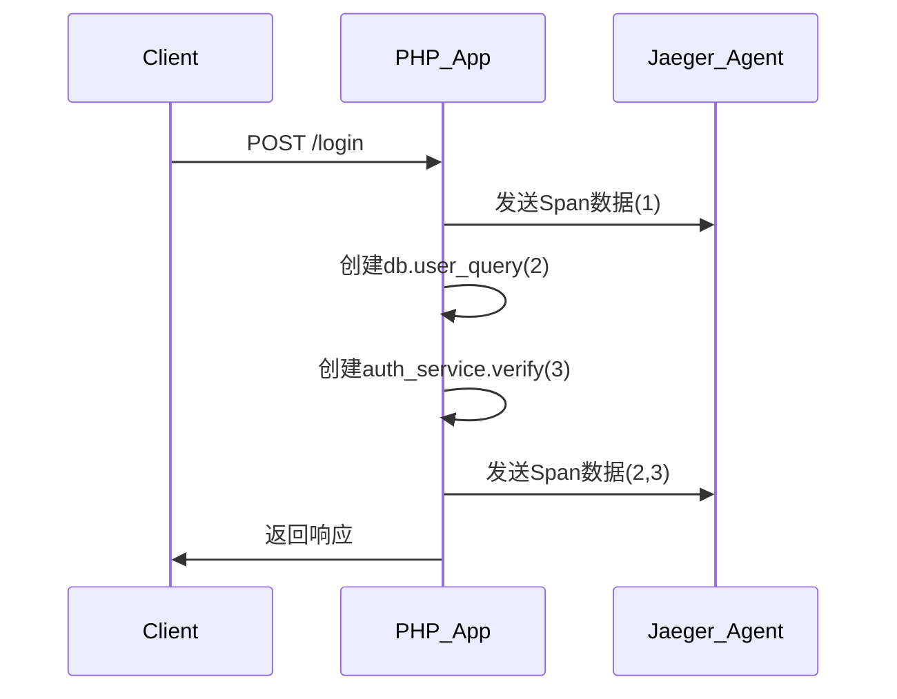

# PHP客户端集成

## 介绍

Jaeger是一个开源的分布式追踪系统，用于监控和排查微服务架构中的请求链路。PHP客户端集成允许你将Jaeger的追踪能力嵌入到PHP应用中，帮助分析请求在不同服务间的流转情况。本文将指导你从零开始完成集成。

:::note 适用场景
- 微服务调用链分析
- 性能瓶颈定位
- 生产环境故障排查
:::

## 前置条件

1. 已安装PHP 7.2+环境
2. Composer依赖管理工具
3. 运行中的Jaeger Collector服务（默认地址 `http://localhost:14268`）

## 安装客户端库

通过Composer安装官方推荐的Jaeger PHP客户端：

```bash
composer require jonahgeorge/jaeger-client-php
```

## 基础配置

### 1. 初始化Tracer

创建 `tracer.php` 配置文件：

```php
<?php
require_once 'vendor/autoload.php';

use Jaeger\Config;
use OpenTracing\GlobalTracer;

$config = new Config(
    [
        'sampler' => [
            'type' => 'const',
            'param' => true,
        ],
        'logging' => true,
        'local_agent' => [
            'reporting_host' => 'localhost',
            'reporting_port' => 6831,
        ]
    ],
    'your-service-name'
);
$tracer = $config->initializeTracer();
GlobalTracer::set($tracer);
```

### 2. 创建第一个Span

```php
$span = $tracer->startSpan('example-operation');
$span->setTag('http.method', 'GET');

// 模拟业务逻辑
usleep(100000);

$span->finish();
```

## 实际案例：HTTP请求追踪

### 场景描述
追踪一个处理用户登录的API请求，包含数据库查询和外部服务调用。

```php
// 在入口文件顶部初始化追踪
require 'tracer.php';

// 示例控制器方法
function login() {
    global $tracer;
    
    $scope = $tracer->startActiveSpan('login.request');
    $span = $scope->getSpan();
    
    try {
        // 标记请求参数
        $span->setTag('auth.username', $_POST['username']);
        
        // 数据库查询（子Span）
        $dbScope = $tracer->startActiveSpan('db.user_query');
        // 模拟数据库操作
        usleep(50000);
        $dbScope->close();
        
        // 调用外部服务
        $apiScope = $tracer->startActiveSpan('auth_service.verify');
        // 模拟API调用
        usleep(80000);
        $apiScope->close();
        
        echo "Login successful!";
    } finally {
        $scope->close();
        $tracer->flush();
    }
}
```

### 追踪数据流



## 高级配置

### 采样率控制

修改配置中的采样器，以下示例设置50%采样率：

```php
'sampler' => [
    'type' => 'probabilistic',
    'param' => 0.5,
],
```

### 自定义日志记录

```php
$span->log([
    'event' => 'user_verification',
    'result' => 'success',
    'processing_time' => 120ms
]);
```

## 常见问题

:::warning 性能注意事项
- 生产环境避免100%采样（`const: true`）
- 对于高流量服务，推荐使用远程采样配置
:::

:::caution Span生命周期
务必确保每个Span都调用`finish()`或`close()`，否则会导致内存泄漏和追踪数据不完整。
:::

## 总结

通过本文你学会了：
- 安装Jaeger PHP客户端库
- 配置基础Tracer实例
- 创建Span记录关键操作
- 实现多层级追踪（HTTP请求→数据库→外部服务）
- 调整采样策略优化性能

## 扩展练习

1. 尝试将追踪集成到现有框架（如Laravel中间件）
2. 创建一个包含3个层级Span的订单处理流程
3. 在Jaeger UI中对比不同采样率的效果

## 附加资源

- [Jaeger官方文档](https://www.jaegertracing.io/docs/)
- [OpenTracing PHP API规范](https://github.com/opentracing/opentracing-php)
- [Jaeger PHP客户端GitHub](https://github.com/jonahgeorge/jaeger-client-php)