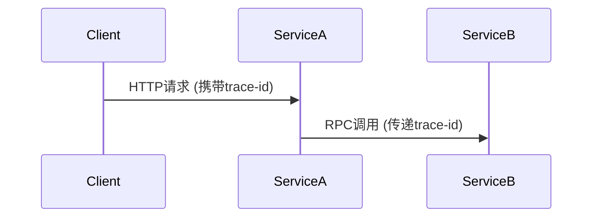

# Ruby客户端集成

## 介绍

Jaeger是一个开源的分布式追踪系统，用于监控和排查微服务架构中的复杂事务。通过集成Jaeger的Ruby客户端，开发者可以轻松收集和可视化请求在多个服务间的流转路径。本指南将帮助初学者完成从基础配置到实际应用的完整流程。

:::note 关键概念
- **Span**：代表一个独立的工作单元（如HTTP请求）
- **Trace**：由多个Span组成的有向无环图（DAG）
- **Context Propagation**：跨服务传递追踪上下文
:::

## 前置条件

1. 已安装Ruby 2.5+环境
2. 运行中的Jaeger Collector（本地可运行 `docker run -p 14268:14268 jaegertracing/all-in-one`）

## 基础集成步骤

### 1. 添加依赖

在Gemfile中添加官方客户端库：

```ruby
gem 'jaeger-client'
gem 'opentracing'
```

然后执行 `bundle install`

### 2. 初始化配置

创建配置文件 `config/jaeger.rb`：

```ruby
require 'jaeger/client'

Jaeger::Client.build(
  service_name: 'my-ruby-app',
  reporter: Jaeger::Reporters::RemoteReporter.new(
    sender: Jaeger::HttpSender.new(url: 'http://localhost:14268/api/traces')
  ),
  sampler: Jaeger::Samplers::Const.new(true) # 全量采样
)
```

### 3. 创建追踪示例

在控制器中添加简单追踪：

```ruby
# app/controllers/home_controller.rb
def index
  tracer = OpenTracing.global_tracer
  span = tracer.start_span('homepage_request')
  
  # 业务逻辑...
  sleep 0.1
  
  span.set_tag('http.status_code', 200)
  span.finish
end
```

## 进阶用法

### 跨进程上下文传播



实现代码示例：

```ruby
# 客户端发送请求时注入上下文
headers = {}
tracer.inject(span.context, OpenTracing::FORMAT_RACK, headers)
HTTP.headers(headers).get('http://service-b/api')

# 服务端提取上下文
span_ctx = tracer.extract(OpenTracing::FORMAT_RACK, env)
span = tracer.start_span('service_b', child_of: span_ctx)
```

### 错误处理

:::caution 重要提示
始终确保span被关闭，避免内存泄漏
:::

```ruby
span = tracer.start_span('dangerous_operation')
begin
  raise 'Something went wrong'
rescue => e
  span.set_tag('error', true)
  span.log(event: 'error', message: e.message)
ensure
  span.finish
end
```

## 实际案例：电商订单追踪

模拟订单创建流程：

```ruby
def create_order
  tracer = OpenTracing.global_tracer
  
  # 创建父span
  span = tracer.start_span('create_order')
  
  # 记录重要参数
  span.set_tag('user_id', current_user.id)
  span.set_tag('items_count', params[:items].size)
  
  # 子操作1：库存检查
  check_inventory(span)
  
  # 子操作2：支付处理
  process_payment(span)
  
  span.finish
end

def check_inventory(parent_span)
  tracer.start_span('inventory_check', child_of: parent_span) do |span|
    InventoryService.check(params[:items])
    span.log(event: 'inventory_verified')
  end
end
```

## 总结与练习

### 核心要点
- 通过 `jaeger-client` gem 快速集成
- 使用 `start_span` 创建追踪点
- 通过 `set_tag` 和 `log` 添加诊断信息
- 必须调用 `finish` 结束span

### 练习建议
1. 在现有Ruby项目中添加简单接口追踪
2. 模拟微服务调用链（至少2个服务）
3. 尝试在Jaeger UI中筛选特定错误标签

### 扩展资源
- [Jaeger Ruby Client GitHub](https://github.com/salemove/jaeger-client-ruby)
- [OpenTracing API 文档](https://github.com/opentracing/opentracing-ruby)
- [分布式追踪模式](https://microservices.io/patterns/observability/distributed-tracing.html)