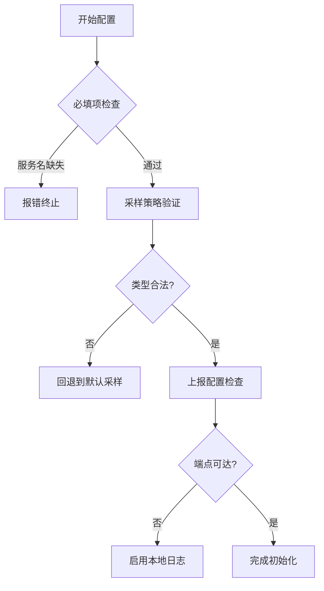

# Jaeger 客户端配置选项

## 介绍

Jaeger客户端配置是分布式追踪系统的关键环节，它决定了数据如何收集、采样和传输到Jaeger后端。本文将详细介绍常见的配置选项，帮助初学者快速掌握客户端调优技巧。

:::note 什么是客户端配置？
Jaeger客户端配置是一组参数，用于控制：
- 采样率（哪些请求需要追踪）
- 上报方式（如何发送追踪数据）
- 元数据标记（如何丰富追踪信息）
:::

## 基础配置选项

### 1. 服务名称配置

服务名称是Jaeger追踪中最基础的标识符：

```javascript
const { initTracer } = require('jaeger-client');

const tracer = initTracer({
  serviceName: 'my-awesome-service', // 必填项
}, {});
```

### 2. 采样配置

采样策略决定了哪些请求会被记录：

```javascript
{
  sampler: {
    type: 'probabilistic',
    param: 0.1, // 10%的采样率
  }
}
```

常用采样类型：
- `const`：全采样(1)或不采样(0)
- `probabilistic`：概率采样(0.1表示10%)
- `ratelimiting`：限流采样(如每秒2个)

### 3. 上报器配置

控制如何发送追踪数据到收集器：

```javascript
{
  reporter: {
    logSpans: true, // 是否在控制台打印日志
    collectorEndpoint: 'http://jaeger-collector:14268/api/traces',
    flushIntervalMs: 1000, // 批量上报间隔
  }
}
```

## 高级配置选项

### 4. 标签与进程标签

为所有span添加元数据：

```javascript
{
  tags: {
    'hostname': require('os').hostname(),
    'version': '1.0.0'
  }
}
```

### 5. 批量上报配置

优化网络传输性能：

```javascript
{
  reporter: {
    agentHost: 'jaeger-agent',
    agentPort: 6832,
    maxPacketSize: 65000 // UDP包大小限制
  }
}
```

## 实战案例

### 电商应用配置示例

```javascript
const tracer = initTracer({
  serviceName: 'checkout-service',
  sampler: {
    type: 'ratelimiting',
    param: 5 // 每秒最多5个请求
  },
  reporter: {
    collectorEndpoint: 'https://jaeger.prod.internal/api/traces',
    user: 'api-user',
    password: 'secure-password'
  },
  tags: {
    'environment': process.env.NODE_ENV,
    'datacenter': 'aws-us-east-1'
  }
});
```

## 配置验证流程图



## 常见问题

:::caution 配置陷阱
1. UDP vs HTTP：生产环境建议使用HTTP上报
2. 采样率过高会导致存储压力
3. 进程标签不要包含敏感信息
:::

## 总结

通过合理配置Jaeger客户端，你可以：
- 控制追踪数据量
- 优化网络传输
- 丰富上下文信息
- 适应不同环境需求

## 扩展学习

推荐练习：
1. 尝试为开发环境配置100%采样率
2. 为生产环境配置1%概率采样
3. 添加自定义业务标签（如用户ID）

官方资源：
- [Jaeger Client GitHub](https://github.com/jaegertracing/jaeger-client-node)
- [配置参数文档](https://www.jaegertracing.io/docs/latest/client-features/)