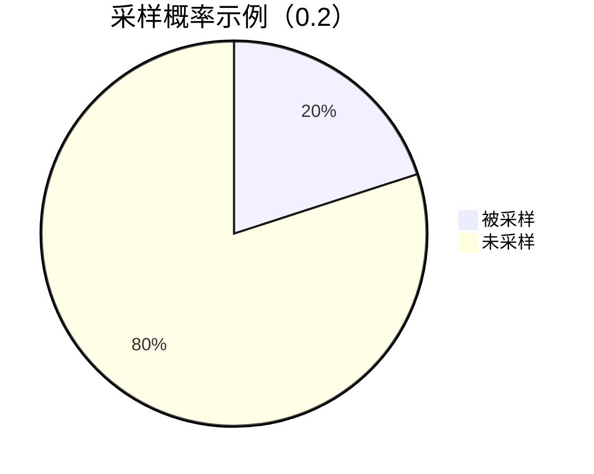

# 采样类型介绍

在分布式系统中，追踪（Tracing）是理解服务间调用关系的关键工具。Jaeger作为流行的分布式追踪系统，通过**采样策略**控制收集的追踪数据量，平衡系统开销与数据完整性。本文将介绍Jaeger支持的采样类型及其适用场景。

## 什么是采样？

采样指从大量请求中选择部分请求进行完整追踪记录的过程。例如，在每秒处理1000次请求的系统中，若采样率为0.1%，则每秒只记录1次请求的完整追踪数据。合理采样可减少存储和计算资源消耗，同时保留关键信息。

:::tip 为什么需要采样？
- 降低存储成本
- 减少网络传输开销
- 避免分析工具过载
:::

## Jaeger 采样类型

### 1. 恒定采样（Constant Sampling）
最简单的策略，固定采样率对所有请求生效。

**配置示例**（Jaeger客户端配置）：
```go
config := &jaegercfg.Configuration{
  Sampler: &jaegercfg.SamplerConfig{
    Type:  "const",
    Param: 1, // 1=全采样，0=不采样
  },
}
```

**适用场景**：
- 开发环境调试
- 低流量服务

:::caution 注意
生产环境慎用`Param: 1`，可能造成性能问题！
:::

### 2. 概率采样（Probabilistic Sampling）
按概率随机采样，参数为采样概率（0~1）。



**配置示例**：
```go
{
  Type:  "probabilistic",
  Param: 0.3, // 30%采样率
}
```

**实际案例**：
电商系统在促销期间使用0.1的概率采样，既捕捉典型请求又控制数据量。

### 3. 速率限制采样（Rate Limiting Sampling）
控制每秒最大采样数，适合流量波动大的系统。

```go
{
  Type:  "rateLimiting",
  Param: 10, // 每秒最多10条追踪
}
```

**输入输出示例**：
```
输入：每秒100次请求
输出：前10次请求被采样（均匀分布）
```

### 4. 自适应采样（Adaptive Sampling）
动态调整采样率，结合系统负载和业务优先级（需Jaeger后端支持）。

## 如何选择采样策略？

| 策略类型       | 适用阶段   | 优点               | 缺点               |
|----------------|------------|--------------------|--------------------|
| 恒定采样       | 开发/测试  | 简单直接           | 无法扩展           |
| 概率采样       | 生产环境   | 资源消耗可预测     | 可能错过重要请求   |
| 速率限制采样   | 高流量生产 | 保护后端系统       | 突发流量可能丢数据 |
| 自适应采样     | 复杂生产   | 智能平衡           | 配置复杂           |

## 实战建议

1. **开发环境**：使用恒定采样+全采样
   ```yaml
   jaeger:
     sampler:
       type: const
       param: 1
   ```

2. **生产环境**推荐组合：
   - 基础服务：概率采样（0.01-0.1）
   - 支付核心链路：单独配置更高采样率

## 总结

采样策略的选择需要综合考虑：
- 业务重要性
- 系统资源
- 数据分析需求

:::note 进阶练习
1. 在本地Jaeger中对比不同采样率的效果
2. 尝试为/login和/checkout配置不同采样率
:::

**延伸阅读**：
- [Jaeger官方文档：采样配置](https://www.jaegertracing.io/docs/latest/sampling/)
- 《分布式追踪：实践手册》第4章
``` 

注意：实际使用时请移除代码块外部的