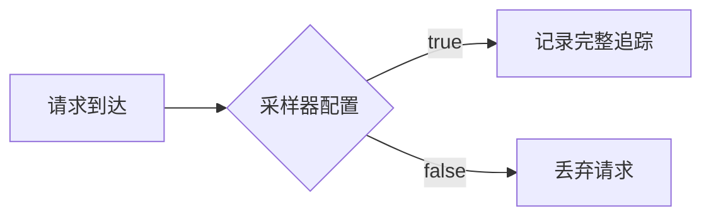

## 什么是常量采样器？

常量采样器（Constant Sampler）是Jaeger分布式追踪系统中最简单的采样策略之一。它的核心特点是**始终返回固定的采样决策**，要么对所有请求采样（`true`），要么完全不采样（`false`）。这种策略适用于测试环境或对采样率有严格要求的场景。

:::note 关键特性
- 非概率性：决策完全由预定义值决定
- 零开销：不需要运行时计算
- 确定性结果：相同配置下所有请求得到相同处理
:::

## 工作原理

常量采样器通过简单的布尔逻辑工作：



## 配置方式

### 基础配置示例

在Jaeger客户端中配置常量采样器（以Go语言为例）：

```go
import (
    "github.com/uber/jaeger-client-go/config"
)

func main() {
    cfg := config.Configuration{
        Sampler: &config.SamplerConfig{
            Type:  "const", // 指定常量采样器
            Param: 1,       // 1=true（采样），0=false（不采样）
        },
    }
    // 初始化追踪器...
}
```

### 参数说明
| 参数 | 值 | 效果 |
|------|----|------|
| Type | `"const"` | 指定使用常量采样器 |
| Param | `1` | 采样所有请求 |
| Param | `0` | 不采样任何请求 |

## 实际应用场景

### 场景1：开发环境调试
```go
// 开发环境配置：采样所有请求
devConfig := &config.SamplerConfig{
    Type:  "const",
    Param: 1,
}
```
**为什么有用**：开发时需要查看所有请求的完整追踪路径。

### 场景2：性能测试
```go
// 压测环境配置：关闭采样
perfConfig := &config.SamplerConfig{
    Type:  "const",
    Param: 0,
}
```
**优势**：避免采样开销影响性能测试结果准确性。

:::caution 生产环境注意事项
常量采样器在生产环境中使用时：
- 设为`true`可能导致存储爆炸
- 设为`false`会丢失所有监控数据
- 通常建议结合[动态采样策略](/path/to/other-samplers)使用
:::

## 与其他采样器对比

| 采样器类型 | 是否动态 | 计算开销 | 适用场景 |
|------------|----------|----------|----------|
| 常量 | 否 | 无 | 测试/调试 |
| 概率 | 否 | 低 | 常规生产 |
| 限流 | 是 | 中 | 高负载系统 |
| 自适应 | 是 | 高 | 智能采样 |

## 常见问题解答

### Q: 常量采样会降低系统性能吗？
A: 当设为`true`时，会增加存储和网络开销，但采样决策本身没有计算成本。

### Q: 如何临时修改采样策略？
```bash
# 通过环境变量动态覆盖（Jaeger客户端支持）
JAEGER_SAMPLER_TYPE=const JAEGER_SAMPLER_PARAM=0 go run main.go
```

## 总结

常量采样器作为Jaeger中最基础的采样策略：
- ✅ 优点：配置简单、零计算开销、结果确定
- ❌ 缺点：缺乏灵活性
- 🏆 最佳实践：适合非生产环境或明确知道采样需求的场景