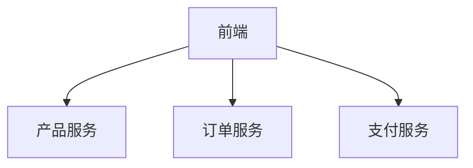

## 介绍

基于操作的采样（Operation-based Sampling）是Jaeger中的一种高级采样策略，它允许你根据不同的操作（如API端点、服务方法等）设置不同的采样率。这种策略特别适用于微服务架构，其中某些关键操作可能需要100%采样，而其他非关键操作可以降低采样频率以节省资源。

## 为什么需要基于操作的采样？

在分布式系统中：
1. 高频操作（如健康检查）会产生大量追踪数据
2. 关键业务操作（如支付流程）需要完整追踪
3. 不同操作可能有不同的调试需求

传统统一采样策略无法满足这些差异化需求，而基于操作的采样提供了细粒度控制。

## 基本配置

Jaeger通过采样器配置文件实现基于操作的采样。以下是一个基础示例：

```json
{
  "service_strategies": [
    {
      "service": "payment-service",
      "operation_strategies": [
        {
          "operation": "/api/payment",
          "probabilistic": 1.0
        },
        {
          "operation": "/api/status",
          "probabilistic": 0.01
        }
      ]
    }
  ],
  "default_strategy": {
    "probabilistic": 0.1
  }
}
```

:::note 配置说明
- `service_strategies`: 按服务定义策略
- `operation_strategies`: 服务内的操作特定策略
- `default_strategy`: 未匹配操作的默认策略
:::

## 策略类型

Jaeger支持多种采样策略组合使用：

1. **概率采样（Probabilistic）**
   ```json
   { "probabilistic": 0.5 }
   ```
   表示50%的请求会被采样

2. **速率限制（Rate Limiting）**
   ```json
   { "rate_limiting": 10 }
   ```
   每秒最多采样10个请求

3. **复合策略（Combined）**
   ```json
   {
     "operation": "/api/search",
     "probabilistic": 0.8,
     "rate_limiting": 100
   }
   ```

## 实际案例：电商平台采样策略

假设我们有一个电商平台，包含以下服务：



对应的采样配置可能是：

```json
{
  "service_strategies": [
    {
      "service": "product-service",
      "operation_strategies": [
        {
          "operation": "/api/products/search",
          "probabilistic": 0.2
        },
        {
          "operation": "/api/products/{id}",
          "probabilistic": 0.5
        }
      ]
    },
    {
      "service": "payment-service",
      "operation_strategies": [
        {
          "operation": "/api/payment/process",
          "probabilistic": 1.0
        }
      ]
    }
  ],
  "default_strategy": {
    "probabilistic": 0.1
  }
}
```

:::tip 实际考虑
1. 支付流程需要100%采样用于审计
2. 产品搜索可以降低采样率（高频但低价值）
3. 单个产品查询保持中等采样率
:::

## 动态加载配置

在生产环境中，你可能需要动态更新采样策略而不重启服务。Jaeger客户端支持通过HTTP端点获取配置：

```go
import (
	"github.com/jaegertracing/jaeger-client-go/config"
	"github.com/jaegertracing/jaeger-client-go"
)

func main() {
	cfg := config.Configuration{
		Sampler: &config.SamplerConfig{
			Type:              "remote",
			SamplingServerURL: "http://jaeger-agent:5778/sampling",
		},
	}
	tracer, closer, _ := cfg.NewTracer()
	defer closer.Close()
}
```

## 最佳实践

1. **关键路径全采样**：支付、订单创建等关键业务
2. **高频操作低采样**：健康检查、状态监控
3. **开发环境差异**：开发环境可提高采样率
4. **监控采样效果**：定期检查采样数据是否满足需求

:::caution 注意事项
1. 过高采样率会影响系统性能
2. 过低采样率可能导致重要追踪丢失
3. 确保采样策略与业务需求对齐
:::

## 总结

基于操作的采样提供了：
- 按操作类型的细粒度控制
- 关键业务的高保真追踪
- 系统资源的合理利用

## 扩展学习

1. 尝试为你的服务配置不同的操作采样策略
2. 使用Jaeger UI比较不同采样率的效果
3. 阅读Jaeger官方文档中的[采样策略](https://www.jaegertracing.io/docs/sampling/)章节