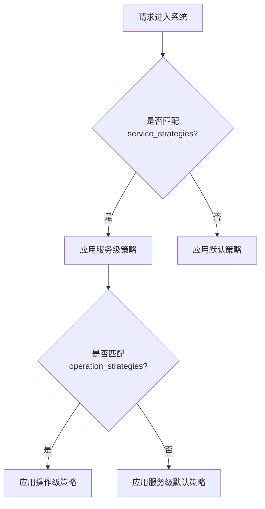

# 自定义采样策略

## 介绍

在分布式系统中，Jaeger作为一款流行的追踪工具，通过**采样策略**决定哪些请求的追踪数据需要被记录。默认策略（如固定比例采样）可能无法满足复杂场景需求，而**自定义采样策略**允许你根据业务规则（如HTTP方法、路径等）动态调整采样率，平衡监控精度与系统负载。

## 为什么需要自定义采样？

- **降低存储成本**：高频接口（如健康检查）可降低采样率
- **关键业务保障**：支付接口等关键路径保持100%采样
- **调试效率**：为特定用户或测试环境开启全量采样

## 策略配置基础

Jaeger支持通过JSON文件定义采样策略。以下是一个基础模板：

```json
{
  "default_strategy": {
    "type": "probabilistic",
    "param": 0.1
  },
  "service_strategies": [
    {
      "service": "checkout-service",
      "type": "ratelimiting",
      "param": 10
    }
  ]
}
```

| 字段                | 说明                          |
|---------------------|-----------------------------|
| `default_strategy`  | 未匹配服务时的默认策略            |
| `service_strategies`| 按服务名配置的特定策略            |
| `type`              | 策略类型（probabilistic/ratelimiting等）|
| `param`            | 参数值（如概率值0.1=10%采样）      |

## 策略类型详解

### 1. 概率采样（Probabilistic）

```json
{
  "type": "probabilistic",
  "param": 0.01  // 1%采样率
}
```

**适用场景**：均匀采样，适合流量稳定的服务

### 2. 限速采样（Rate Limiting）

```json
{
  "type": "ratelimiting",
  "param": 100   // 每秒最多100条追踪
}
```

**适用场景**：保护后端存储不被突发流量冲垮

### 3. 动态策略（Per-operation）

```json
{
  "operation_strategies": [
    {
      "operation": "/api/payment",
      "type": "probabilistic",
      "param": 1.0  // 支付接口全量采样
    }
  ]
}
```

:::tip 操作名匹配
Jaeger会自动标准化URL路径（如`/api/user/123` → `/api/user/:id`）
:::

## 实战案例

### 电商平台配置示例

```json
{
  "default_strategy": { "type": "probabilistic", "param": 0.05 },
  "service_strategies": [
    {
      "service": "payment-service",
      "type": "probabilistic",
      "param": 1.0
    },
    {
      "service": "product-service",
      "operation_strategies": [
        {
          "operation": "GET /product/:id",
          "type": "probabilistic",
          "param": 0.8
        }
      ]
    }
  ]
}
```

### 策略生效流程



## 部署策略

1. 将JSON保存为`sampling.json`
2. 启动Jaeger时指定策略文件：
   ```bash
   jaeger-all-in-one --sampling.strategies-file=sampling.json
   ```
3. 或在Kubernetes中通过ConfigMap挂载

:::caution 热加载限制
策略文件修改后需要重启Jaeger组件才能生效
:::

## 验证策略

通过Jaeger UI的`/sampling`端点可查看当前策略：

```bash
curl http://jaeger-collector:14268/sampling?service=payment-service
```

## 总结

关键要点：
- 通过分层策略实现精细化控制
- 关键业务路径建议全量采样（param=1.0）
- 高频低价值接口可降低采样率
- 始终保留default_strategy作为兜底

## 扩展练习

1. 为你的用户服务配置：
   - `/login` 接口50%采样
   - 其他接口10%采样
2. 使用限速策略保护邮件服务（上限5条/秒）
3. 比较不同策略下的存储占用差异

## 延伸阅读

- [Jaeger官方采样文档](https://www.jaegertracing.io/docs/latest/sampling/)
- 《分布式追踪：原理与实践》第三章
- OpenTelemetry采样规范对比