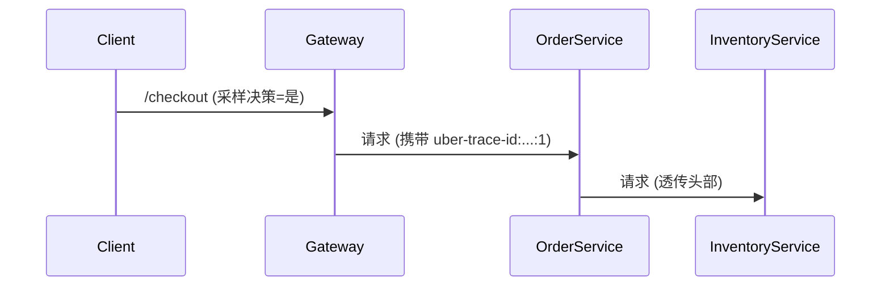

# 采样决策传播

## 介绍

在分布式系统中，追踪（Tracing）是理解请求在多个服务间流转的关键工具。Jaeger 作为流行的分布式追踪系统，通过**采样决策传播**（Sampling Decision Propagation）机制，确保一个请求的采样状态在其经过的所有服务中保持一致。本文将从基础概念讲起，逐步解析这一机制的原理和实现方式。

---

## 什么是采样决策传播？

采样决策传播是指：当一个请求进入系统时，**第一个接触的服务**（通常是入口服务，如 API 网关）会决定是否对该请求进行采样（即记录追踪数据），并将这一决策传递给后续的所有服务。这样，整个调用链要么全部被采样，要么全部不被采样，避免数据不完整。

:::note 为什么需要采样？
在高流量的生产环境中，记录所有请求的追踪数据会消耗大量资源。采样策略（如固定速率采样、动态采样）帮助我们在资源消耗和数据完整性之间取得平衡。
:::

---

## 工作原理

### 1. 采样决策的生成
入口服务根据配置的采样策略（如 `probabilistic`）决定是否采样。例如：
```go
// 示例：Jaeger 客户端配置概率采样（50% 采样率）
sampler := jaeger.NewProbabilisticSampler(0.5)
tracer, _ := jaeger.NewTracer(
    "my-service",
    sampler,
    jaeger.NewNullReporter(),
)
```

### 2. 决策的传递
决策通过 HTTP 头（如 `uber-trace-id`）或 RPC 上下文传递给下游服务。例如：
```
uber-trace-id: 1a2b3c4d5e6f7g8h:1a2b3c4d5e6f7g8h:0:1
```
末尾的 `1` 表示“已采样”，`0` 表示“未采样”。

### 3. 下游服务的响应
下游服务解析头部并遵循相同的采样决策，不再重复决策。

---

## 实际案例

假设一个电商系统的请求流程：
1. **API 网关**收到 `/checkout` 请求，决定采样（概率 50%）。
2. 网关调用 **订单服务**，并在 HTTP 头中传递 `uber-trace-id: ...:1`。
3. 订单服务调用 **库存服务**，透传相同的头部。
4. 所有相关 Span（网关、订单、库存）要么全部记录，要么全部忽略。



---

## 代码示例

以下是一个 Python 服务的示例，展示如何读取和传递采样决策：
```python
from flask import Flask, request
import opentracing

app = Flask(__name__)
tracer = opentracing.global_tracer()

@app.route('/process', methods=['POST'])
def process():
    # 从 HTTP 头中提取追踪上下文
    span_ctx = tracer.extract(
        format=opentracing.Format.HTTP_HEADERS,
        carrier=request.headers
    )
    
    # 创建子 Span（继承父 Span 的采样决策）
    with tracer.start_span('process-data', child_of=span_ctx) as span:
        span.log_kv({'event': 'data_processed'})
        return "Done"
```

---

## 常见问题

:::caution 决策不一致的风险
如果某个服务错误地覆盖了采样头部，会导致调用链数据不完整。务必使用官方客户端库，避免手动修改头部。
:::

---

## 总结

- 采样决策传播确保分布式调用链的追踪数据完整性。
- 决策由入口服务生成，通过上下文（如 HTTP 头）传递。
- 所有服务必须尊重并透传原始决策。

---

## 扩展练习

1. 使用 Jaeger 官方示例（如 HotROD）观察采样决策的传递过程。
2. 尝试在本地环境中配置一个概率采样率为 10% 的服务链，并验证采样结果。