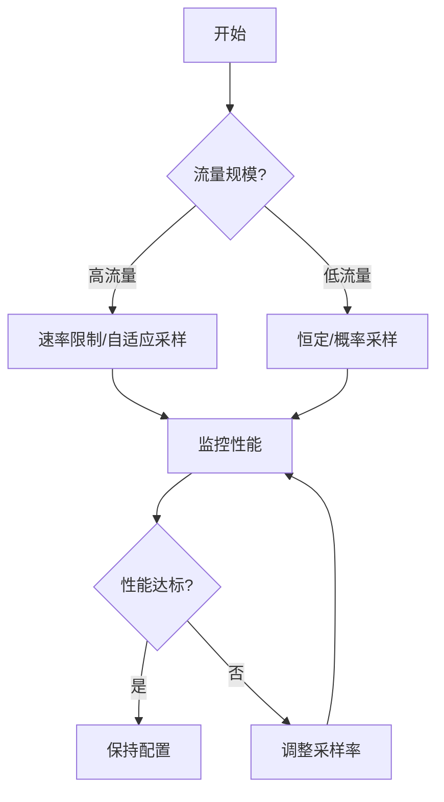

# 采样性能影响

Jaeger 是一个分布式追踪系统，用于监控和排查微服务架构中的性能问题。采样（Sampling）是 Jaeger 的核心功能之一，它决定了哪些请求的追踪数据会被收集和分析。选择合适的采样策略对系统性能和资源消耗有直接影响。

## 什么是采样？

采样是指从大量请求中选择一部分进行追踪记录的过程。由于记录所有请求的追踪数据会带来巨大的存储和计算开销，采样可以在保证关键信息不丢失的前提下，减少系统负担。

## 常见的采样策略

Jaeger 支持多种采样策略，每种策略对性能的影响不同：

1. **恒定采样（Constant Sampling）**
   - 固定比例采样（如 100% 或 1%）。
   - 简单但可能在高流量时产生大量数据。

2. **概率采样（Probabilistic Sampling）**
   - 按概率随机采样（如 0.1 表示 10% 的请求被采样）。
   - 适合中等流量场景。

3. **速率限制采样（Rate Limiting Sampling）**
   - 限制每秒采样的最大请求数（如每秒最多 100 条）。
   - 适合高流量场景，避免突发流量导致系统过载。

4. **自适应采样（Adaptive Sampling）**
   - 根据系统负载动态调整采样率。
   - 平衡性能和数据完整性，但实现复杂。

## 采样策略的性能影响

### 恒定采样的性能影响
- **优点**：配置简单，适合调试或低流量场景。
- **缺点**：在高流量时可能产生大量数据，增加存储和网络开销。

```yaml
# 示例：恒定采样配置（采样率 100%）
sampling:
  strategies:
    - type: const
      param: 1
```

### 概率采样的性能影响
- **优点**：通过降低采样率减少资源消耗。
- **缺点**：可能遗漏重要请求的追踪数据。

```yaml
# 示例：概率采样配置（采样率 10%）
sampling:
  strategies:
    - type: probabilistic
      param: 0.1
```

### 速率限制采样的性能影响
- **优点**：避免突发流量导致系统过载。
- **缺点**：可能在高流量时丢失大量数据。

```yaml
# 示例：速率限制采样配置（每秒最多 100 条）
sampling:
  strategies:
    - type: rate-limiting
      param: 100
```

### 自适应采样的性能影响
- **优点**：动态调整采样率，平衡性能和数据完整性。
- **缺点**：实现复杂，需要额外监控和调优。

```yaml
# 示例：自适应采样配置（需结合具体实现）
sampling:
  strategies:
    - type: adaptive
      param: 
        min_samples_per_second: 10
        max_samples_per_second: 1000
```

## 实际案例

### 案例 1：电商平台的采样策略
一个电商平台在促销期间流量激增，使用速率限制采样（每秒最多 1000 条）避免存储过载，同时确保关键请求（如支付流程）被完整追踪。

### 案例 2：内部开发环境的采样策略
在开发环境中，使用恒定采样（100%）以便调试和排查问题，尽管会生成大量数据，但开发环境的存储压力较小。

## 如何选择合适的采样策略？

1. **评估流量规模**：高流量场景优先考虑速率限制或自适应采样。
2. **明确需求**：调试时使用恒定采样，生产环境使用概率或自适应采样。
3. **监控和调整**：根据实际性能数据动态调整采样率。



## 总结

采样策略的选择直接影响 Jaeger 的性能和资源消耗。初学者应从简单策略（如恒定或概率采样）开始，逐步根据实际需求调整。高流量场景下，速率限制或自适应采样更能平衡性能和数据完整性。

:::tip 练习
1. 在本地 Jaeger 环境中配置不同的采样策略，观察对存储和性能的影响。
2. 模拟高流量场景，测试速率限制采样的效果。
:::

## 附加资源
- [Jaeger 官方文档 - 采样策略](https://www.jaegertracing.io/docs/latest/sampling/)
- 《分布式追踪：原理与实践》 - 深入讲解采样策略的设计与实现。