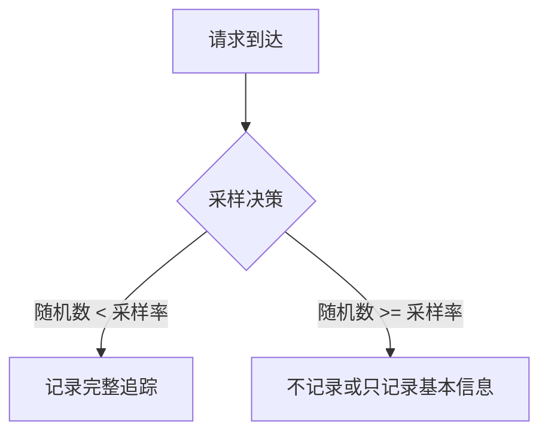

# 概率采样器

## 介绍

概率采样器（Probabilistic Sampler）是Jaeger中一种简单但高效的采样策略，它通过固定概率决定是否记录请求的追踪数据。这种采样器非常适合高流量系统，可以在减少存储开销的同时，保留有代表性的追踪样本。

在分布式系统中，记录每一个请求的追踪数据可能会产生巨大的开销。概率采样器通过随机采样来解决这个问题，只记录一部分请求的完整追踪信息。

## 工作原理

概率采样器的核心思想非常简单：对于每一个请求，生成一个随机数，如果这个随机数小于预设的采样概率，则记录该请求的追踪数据；否则忽略。

数学表达式可以表示为：
```
采样决策 = (随机数 < sampling_rate)
```

其中：
- `sampling_rate` 是预设的采样概率（0到1之间）
- `随机数` 是均匀分布在[0,1)区间的随机值

## 配置概率采样器

在Jaeger客户端中，可以这样配置概率采样器：

```go
import (
	"github.com/uber/jaeger-client-go"
	"github.com/uber/jaeger-client-go/config"
)

func initTracer() (opentracing.Tracer, io.Closer, error) {
	cfg := config.Configuration{
		Sampler: &config.SamplerConfig{
			Type:  jaeger.SamplerTypeProbabilistic,
			Param: 0.1, // 10%的采样率
		},
		Reporter: &config.ReporterConfig{
			LogSpans: true,
		},
	}
	return cfg.New("my-service-name")
}
```

:::note
采样率(`Param`)应该根据你的系统负载和存储容量谨慎选择。通常生产环境会使用0.01(1%)到0.1(10%)之间的值。
:::

## 实际案例

假设你有一个电商网站，每天处理100万次请求。如果记录所有请求的追踪数据：

1. 每天会产生100万条追踪记录
2. 存储成本会非常高
3. 大多数请求可能是相似的（如产品浏览）

使用概率采样器（如1%采样率）：

1. 每天只记录约1万条追踪记录
2. 仍能捕捉到各种类型的请求模式
3. 存储成本降低99%

## 采样决策流程



## 优缺点分析

### 优点
- 实现简单，开销低
- 不需要维护状态
- 适合高流量系统
- 分布式一致性：相同采样率下，所有服务会做出相同的采样决策

### 缺点
- 可能错过重要但低频的请求
- 不适用于需要保证特定类型请求都被记录的场景
- 采样率需要手动调整

## 高级话题：分布式一致性

Jaeger的概率采样器在分布式系统中有一个重要特性：对于给定的追踪ID，所有服务会做出相同的采样决策。这是通过使用追踪ID作为随机数种子实现的：

```
采样决策 = (traceID % 10000) < (sampling_rate * 10000)
```

这意味着：
1. 要么整个追踪链被记录
2. 要么整个追踪链被跳过
3. 不会出现部分服务记录而其他服务不记录的情况

## 总结

概率采样器是Jaeger中最简单的采样策略，适合大多数高流量系统。它通过固定概率减少追踪数据量，同时保留了请求的统计代表性。

关键要点：
- 使用固定概率决定是否记录追踪
- 配置简单，只需设置采样率
- 适合高流量、对存储敏感的系统
- 保持分布式一致性

## 进一步学习

1. 尝试在你的Jaeger客户端中实现不同采样率，观察采样效果
2. 比较概率采样器与其他采样策略（如速率限制采样器）的差异
3. 思考：在什么场景下概率采样器可能不是最佳选择？

:::tip 练习
修改上面的代码示例，实现一个采样率为5%的概率采样器，并思考：
1. 这个采样率下，每天100万请求会记录多少条追踪？
2. 如果需要捕捉至少一个错误请求（假设错误率0.1%），采样率应该设为多少？
:::