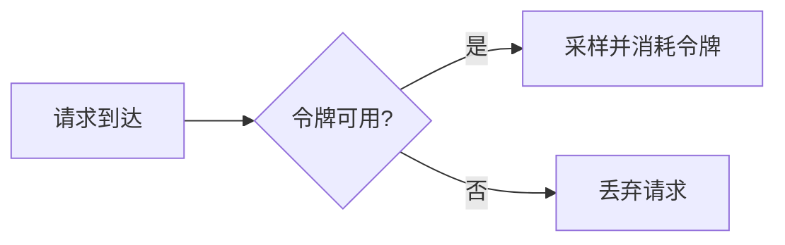

# 速率限制采样器

## 介绍

速率限制采样器（Rate Limiting Sampler）是Jaeger中一种常用的采样策略，它通过**固定速率**控制追踪数据的采集频率。这种采样器特别适用于需要平衡系统负载和数据完整性的场景，比如高流量服务中限制每秒采样的追踪数量。

:::note 关键特点
- **固定速率**：例如每秒最多采样5条追踪。
- **动态适应**：自动丢弃超出限制的请求，避免系统过载。
- **轻量级**：基于令牌桶算法实现，开销极低。
:::

## 工作原理

速率限制采样器内部使用**令牌桶算法**：
1. 令牌桶以固定速率（如每秒2个）生成令牌。
2. 每次需要采样时，消耗一个令牌。
3. 如果令牌不足，则放弃本次采样。



## 配置示例

在Jaeger客户端中配置速率限制采样器（以Java为例）：

```java
import io.jaegertracing.Configuration;
import io.jaegertracing.Configuration.SamplerConfiguration;

SamplerConfiguration samplerConfig = SamplerConfiguration.fromEnv()
    .withType("ratelimiting")
    .withParam(2); // 每秒最多2条追踪

Configuration config = new Configuration("my-service")
    .withSampler(samplerConfig);
```

:::tip 参数说明
- `type`: 必须设为 `"ratelimiting"`
- `param`: 整数，表示每秒允许的最大采样数
:::

## 实际案例

### 场景：电商订单服务
假设你的订单服务每秒处理100个请求，但只需监控异常和关键路径：
1. 配置速率限制为每秒5次采样。
2. 正常流量下仅记录少量代表性请求。
3. 当出现错误（如HTTP 500）时，通过[自适应采样](https://jaegertracing.io)补充采集。

### 输出效果
```plaintext
2023-01-01T12:00:00.000Z - Sampled (令牌可用)
2023-01-01T12:00:00.150Z - Sampled
2023-01-01T12:00:00.300Z - Discarded (令牌不足)
2023-01-01T12:00:01.000Z - 新令牌生成，恢复采样
```

## 与其他采样器对比

| 采样器类型       | 配置参数      | 最佳场景               |
|------------------|-------------|-----------------------|
| 恒定采样         | 0.01(1%)    | 低流量精确分析         |
| 速率限制         | 5(req/sec)  | 高流量系统保护         |
| 自适应采样       | 动态规则     | 混合关键业务监控       |

## 总结

速率限制采样器是控制Jaeger资源占用的利器：
- ✅ 防止高流量时产生过多追踪数据
- ✅ 保证基本监控能力不中断
- ❌ 不适合需要完整记录低频错误的场景

## 扩展练习

1. 在本地Jaeger中尝试以下配置：
   ```yaml
   sampler:
     type: ratelimiting
     param: 3
   ```
2. 使用压力测试工具（如`wrk`）观察采样效果。
3. 思考：如果同时设置速率限制和概率采样会怎样？

## 延伸阅读
- [Jaeger官方文档 - 采样](https://jaegertracing.io/docs/latest/sampling/)
- 《分布式追踪：原理与实践》第4章