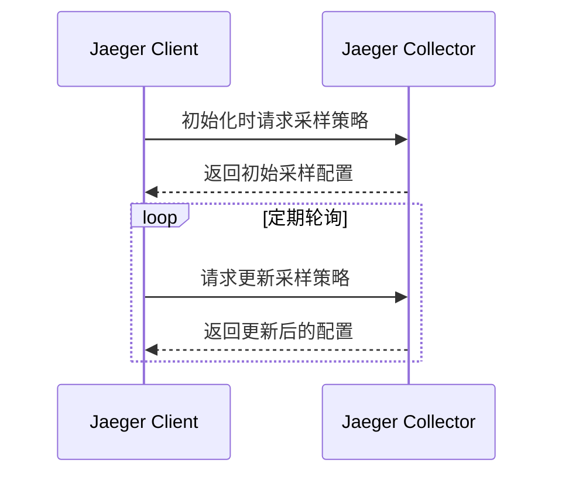
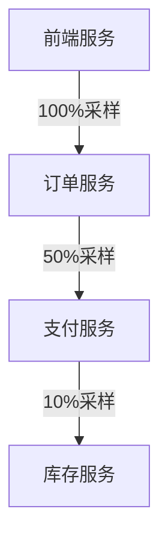

# 远程控制采样器

## 介绍

远程控制采样器（Remote-Controlled Sampler）是Jaeger分布式追踪系统中的一种动态采样策略。与静态采样策略不同，它允许Jaeger客户端从Jaeger后端（如Collector）获取实时采样配置，并根据服务负载或业务需求动态调整采样率。这种机制特别适用于大规模分布式系统，能够在保证关键数据收集的同时减少不必要的性能开销。

:::tip 为什么需要动态采样？
- **流量波动**：系统可能在高峰期需要降低采样率以减少开销
- **业务优先级**：某些关键服务可能需要100%采样
- **调试需求**：临时提高特定操作的采样率进行问题排查
:::

## 工作原理

远程控制采样器通过以下流程工作：



1. 客户端启动时向Collector请求初始采样策略
2. Collector返回JSON格式的采样配置
3. 客户端定期（默认1分钟）轮询更新策略

## 配置示例

以下是一个典型的远程采样器配置示例（使用Jaeger Java客户端）：

```java
import io.jaegertracing.Configuration;
import io.jaegertracing.internal.samplers.RemoteControlledSampler;

Configuration.SamplerConfiguration samplerConfig = new Configuration.SamplerConfiguration()
    .withType("remote") // 指定远程采样
    .withParam(1) // 初始采样率（在获取远程配置前使用）
    .withManagerHostPort("jaeger-collector:5778"); // Collector地址

Configuration config = new Configuration("my-service")
    .withSampler(samplerConfig);
```

## 采样策略配置

Jaeger Collector使用JSON格式定义采样策略。以下是策略文件示例：

```json
{
  "service_strategies": [
    {
      "service": "payment-service",
      "type": "probabilistic",
      "param": 0.5
    },
    {
      "service": "user-service",
      "type": "rateLimiting",
      "param": 10
    }
  ],
  "default_strategy": {
    "type": "probabilistic",
    "param": 0.1
  }
}
```

- `service_strategies`: 针对特定服务的采样策略
- `default_strategy`: 默认策略（未匹配服务时使用）
- 策略类型：
  - `probabilistic`: 概率采样（0.1表示10%采样率）
  - `rateLimiting`: 速率限制（如10表示每秒最多10条trace）

## 实际应用场景

### 场景1：电商大促期间



1. 大促期间对订单和支付服务提高采样率
2. 非核心服务（如推荐服务）保持低采样率
3. 大促结束后自动恢复默认配置

### 场景2：故障排查

1. 开发人员报告支付服务异常
2. 通过配置中心临时将支付服务的采样率提高到100%
3. 收集足够数据后分析问题
4. 问题解决后恢复原始采样率

## 总结

远程控制采样器提供了动态调整采样策略的能力，具有以下优势：

- **灵活性**：无需重启服务即可调整采样率
- **精确控制**：可以针对特定服务设置不同策略
- **资源优化**：在高负载时自动降低采样率

:::caution 注意事项
- 确保Collector的高可用性，否则客户端会回退到初始采样率
- 轮询间隔不宜过短（默认1分钟通常足够）
- 生产环境建议同时配置本地降级策略
:::

## 延伸学习

1. 尝试在本地Jaeger环境中配置不同的远程采样策略
2. 观察采样率变化对存储空间的影响
3. 阅读Jaeger官方文档了解[自适应采样](https://www.jaegertracing.io/docs/latest/sampling/#adaptive-sampling)机制