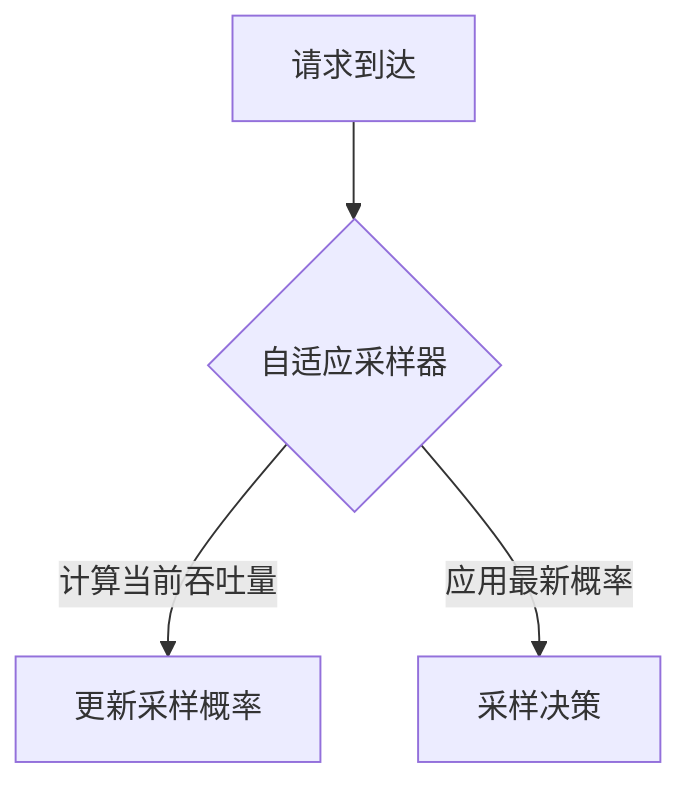

# 自适应采样

## 介绍

自适应采样是Jaeger中的一种高级采样策略，它能根据系统的实时负载和流量特征动态调整采样率。与固定采样率不同，自适应采样通过分析请求的吞吐量、错误率等指标，自动优化采样决策，从而在保证关键数据不丢失的同时，减少低价值数据的收集开销。

## 为什么需要自适应采样？

在分布式系统中，固定采样率（如"采样所有请求的10%"）可能导致以下问题：
1. **高流量时资源浪费**：大量重复请求可能被采样，消耗存储和计算资源。
2. **低流量时数据不足**：关键请求可能因采样率过低而被遗漏。
3. **无法区分优先级**：错误请求与正常请求被同等对待。

自适应采样通过动态调整解决了这些问题。

## 工作原理

Jaeger的自适应采样器包含两个核心组件：

1. **吞吐量计算器**：统计近期请求量
2. **概率计算器**：根据吞吐量动态计算采样概率



## 配置示例

以下是通过Jaeger客户端配置自适应采样的代码示例（以Go为例）：

```go
import (
    "github.com/uber/jaeger-client-go"
    "github.com/uber/jaeger-client-go/config"
)

func initTracer() (opentracing.Tracer, io.Closer) {
    cfg := config.Configuration{
        Sampler: &config.SamplerConfig{
            Type:  "adaptive",
            Param: 10, // 目标每秒采样数
            SamplingServerURL: "http://jaeger-collector:5778",
        },
    }
    return cfg.NewTracer()
}
```

**参数说明**：
- `Type: "adaptive"` 启用自适应采样
- `Param: 10` 表示目标每秒采样10条trace
- `SamplingServerURL` 是Jaeger收集器的端点

## 实际案例

### 电商平台场景

假设一个电商平台在以下时段的表现：
- **平日**：每秒100请求，采样率自动降至5%
- **大促**：每秒5000请求，采样率可能降至0.1%
- **故障时**：错误率升高，采样率自动提高至20%

:::tip 实际效果
系统在流量激增时自动降低采样率保护后端，而在出现异常时提高采样率确保问题可诊断。
:::

## 高级配置

可以通过YAML文件定义更复杂的自适应策略：

```yaml
sampling:
  adaptive:
    strategies:
      - service: "payment-service"
        defaultSamplingRate: 0.3
        minSamplingRate: 0.1
        maxSamplingRate: 0.8
        operation: "/charge"
        operationSamplingRate: 0.5
```

**策略解读**：
- 对`payment-service`服务设置基础采样率30%
- 保证采样率始终在10%-80%之间
- 特别关注`/charge`操作，采样率提高到50%

## 总结

自适应采样的关键优势：
- ✅ 动态适应流量变化
- ✅ 优先保证关键数据
- ✅ 降低系统资源消耗
- ✅ 无需人工干预调整

## 延伸学习

1. 在测试环境尝试对比固定采样与自适应采样的资源消耗差异
2. 模拟高低流量场景，观察Jaeger采样率的自动变化
3. 阅读Jaeger官方文档中的[自适应采样实现细节](https://jaegertracing.io/docs/latest/sampling/#adaptive-sampler)

:::caution 注意
自适应采样需要Jaeger收集器v1.20+版本支持，旧版本需升级后才能使用此功能。
:::