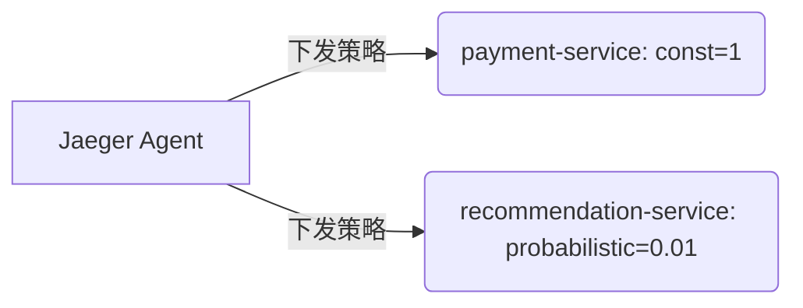

# 采样策略配置

## 介绍

在分布式系统中，追踪每一个请求的完整调用链可能会产生大量数据，导致存储和分析成本激增。Jaeger 通过**采样策略**（Sampling Strategy）来解决这一问题，它允许开发者按需控制哪些请求需要被追踪，哪些可以忽略。合理配置采样策略能够显著降低系统开销，同时保留关键数据。

采样策略的核心目标：
- **降低系统负载**：避免全量采集对性能的影响。
- **保留关键数据**：确保高优先级或异常请求的完整性。
- **动态调整**：支持根据流量或业务需求实时调整采样率。

## 采样策略类型

Jaeger 支持以下常见的采样策略：

1. **恒定采样（Constant Sampling）**  
   固定采样率（如 100% 或 1%），适用于测试环境或低流量场景。
2. **概率采样（Probabilistic Sampling）**  
   按概率随机采样（如 0.1%），适合生产环境。
3. **限流采样（Rate Limiting Sampling）**  
   限制每秒采样的请求数，防止突发流量压垮存储。
4. **自适应采样（Adaptive Sampling）**  
   根据系统负载动态调整采样率（需结合外部组件）。

## 配置示例

### 恒定采样配置
以下是一个 Jaeger 客户端配置恒定采样的代码示例（以 Go 为例）：

```go
import (
	"github.com/uber/jaeger-client-go/config"
)

func main() {
	cfg := config.Configuration{
		Sampler: &config.SamplerConfig{
			Type:  "const", // 恒定采样类型
			Param: 1,       // 1=全采样，0=不采样
		},
	}
	tracer, closer, _ := cfg.New("my-service")
	defer closer.Close()
}
```

**输入**：所有请求。<br />
**输出**：100% 的请求会被追踪。

### 概率采样配置
```go
cfg := config.Configuration{
	Sampler: &config.SamplerConfig{
		Type:  "probabilistic", // 概率采样类型
		Param: 0.1,             // 10% 的采样率
	},
}
```

## 动态策略与远程配置

在生产环境中，通常通过 Jaeger Agent 动态下发采样策略。以下是一个远程策略的 JSON 示例：

```json
{
  "service_strategies": [
    {
      "service": "order-service",
      "type": "probabilistic",
      "param": 0.5
    }
  ],
  "default_strategy": {
    "type": "probabilistic",
    "param": 0.1
  }
}
```

:::tip 动态策略的优势
- **无需重启服务**：策略更新实时生效。
- **按服务差异化**：为关键服务设置更高采样率。
:::

## 实际案例

### 电商系统场景
假设一个电商平台包含以下服务：
1. `payment-service`（支付服务）：需要 100% 采样以监控交易。
2. `recommendation-service`（推荐服务）：仅需 1% 采样。

配置如下：


## 总结

- **采样策略**是平衡系统开销与数据完整性的关键工具。
- 优先使用**动态远程配置**以适应生产环境变化。
- 根据业务重要性差异化配置采样率。

## 扩展练习
1. 在本地启动 Jaeger，尝试为不同服务配置概率采样。
2. 模拟高流量场景，观察限流采样的效果。

:::caution 注意
过低的采样率可能导致关键请求丢失，建议结合日志系统互补分析。
:::