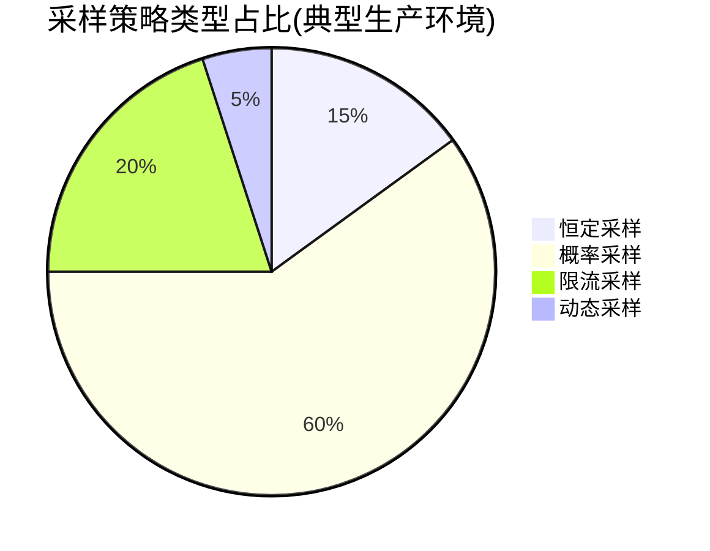
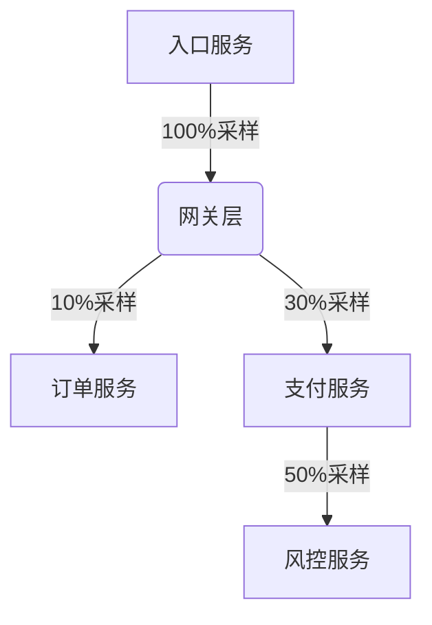

# 生产环境采样最佳实践

## 什么是采样？

在分布式追踪系统中，**采样(Sampling)** 是指决定是否记录特定请求追踪数据的机制。Jaeger通过采样策略控制收集的追踪数据量，避免因全量采集导致：

1. 存储成本激增
2. 网络带宽压力
3. 应用性能损耗

:::tip 为什么需要采样？
一个日活百万的电商系统，如果全量采集每次API调用，每天可能产生数十亿条Span数据！
:::

## Jaeger 采样策略类型

Jaeger支持四种基础采样策略：



### 1. 恒定采样(Constant Sampling)
```go
// 示例：Jaeger客户端配置(Go)
cfg := config.Configuration{
    Sampler: &config.SamplerConfig{
        Type:  "const",
        Param: 1, // 1=全采样，0=不采样
    },
}
```

| 参数值 | 行为           |
|--------|----------------|
| 1      | 采样所有请求   |
| 0      | 不采样任何请求 |

### 2. 概率采样(Probabilistic Sampling)
```java
// 示例：Java客户端配置
Configuration.SamplerConfiguration samplerConfig = new Configuration.SamplerConfiguration()
    .withType("probabilistic")
    .withParam(0.1); // 10%的采样率
```

### 3. 限流采样(Rate Limiting)
```python
# Python客户端示例
config = Config(
    config={
        'sampler': {
            'type': 'rateLimiting',
            'param': 100  # 每秒最多100条追踪
        },
    },
    service_name='payment-service'
)
```

### 4. 动态采样(Remote Sampling)
通过远程配置中心动态调整采样策略，下文将重点讲解。

## 生产环境最佳实践

### 策略选择原则

:::warning 重要决策因素
- **系统规模**：QPS超过1000建议使用概率采样
- **错误率**：错误请求应提高采样率
- **关键路径**：支付/订单等核心流程可全采样
:::

### 分层采样方案



### 动态采样配置示例

1. 创建采样策略配置文件 `sampling.json`：
```json
{
  "service_strategies": [
    {
      "service": "checkout-service",
      "type": "probabilistic",
      "param": 0.5
    },
    {
      "service": "recommendation-service",
      "type": "probabilistic",
      "param": 0.01
    }
  ],
  "default_strategy": {
    "type": "probabilistic",
    "param": 0.1
  }
}
```

2. 启动Jaeger Collector时加载策略：
```bash
jaeger-collector --sampling.strategies-file=sampling.json
```

### 异常情况处理

:::caution 特别注意
以下情况应提高采样率：
- HTTP状态码5XX
- 特定错误类型（如数据库连接失败）
- 延迟超过阈值（如>500ms）
:::

```go
// 自适应采样示例
func adaptiveSampler(ctx context.Context) bool {
    if isErrorResponse(ctx) {
        return true // 错误请求必采样
    }
    if latency > 300*time.Millisecond {
        return random.Float32() < 0.8 // 慢请求80%采样
    }
    return random.Float32() < 0.1 // 正常请求10%采样
}
```

## 真实案例：电商平台采样方案

**场景需求**：
- 日均订单量：50万
- 核心服务SLA：99.9%
- 存储预算：保留7天数据

**最终方案**：

| 服务类型       | 采样策略          | 参数     | 备注                  |
|----------------|-------------------|----------|-----------------------|
| 支付网关       | 限流              | 500 req/s | 峰值时平滑限制        |
| 订单服务       | 概率+动态调整     | 20%-50%  | 大促期间自动调高      |
| 商品推荐       | 概率              | 1%       | 非关键路径            |
| 风控服务       | 全采样            | 100%     | 合规要求              |

## 总结与练习

**关键要点**：
1. 没有"完美"的采样策略，需根据业务特点调整
2. 动态采样是生产环境的首选方案
3. 核心业务路径需要更高采样率

**练习建议**：
1. 在本地环境尝试配置多级采样策略
2. 使用Jaeger API查询当前生效的采样策略：
   ```bash
   curl http://jaeger-collector:5778/sampling?service=your-service
   ```
3. 模拟高错误率场景，观察采样策略效果

**延伸阅读**：
- Jaeger官方文档《Remote Sampling Configuration》
- 《Distributed Tracing in Practice》第5章
- OpenTelemetry采样规范