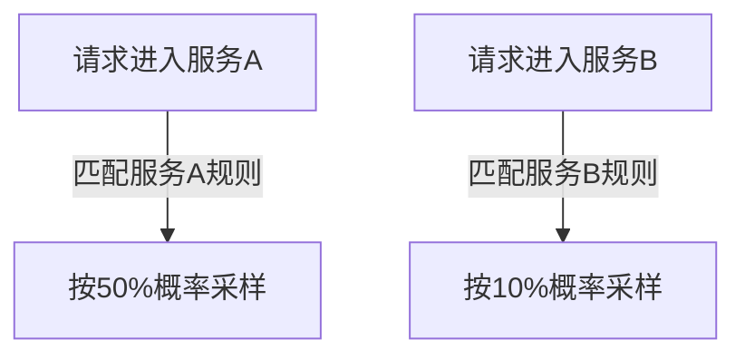

# 基于服务的采样

## 介绍

在分布式系统中，Jaeger的**基于服务的采样**（Service-Specific Sampling）允许为不同服务配置独立的采样率。这种策略解决了全局采样无法满足服务差异化需求的痛点，例如：

- 核心服务需要高采样率以捕获关键链路
- 高频低价值服务可降低采样率以减少存储开销

## 工作原理

Jaeger客户端会根据请求所属的服务名称，匹配预定义的采样规则。规则通常包含：

1. **服务名**：区分不同服务的标识符
2. **采样类型**：如概率采样（probabilistic）或限流采样（rate-limiting）
3. **采样参数**：如采样概率或每秒最大请求数



## 配置示例

### 基础配置

通过Jaeger客户端的配置文件定义采样策略（以YAML为例）：

```yaml
service_strategies:
  - service: payment-service
    type: probabilistic
    param: 0.8  # 80%采样率
  - service: notification-service
    type: probabilistic
    param: 0.1  # 10%采样率
default_strategy:
  type: probabilistic
  param: 0.5    # 默认50%采样率
```

:::tip 配置生效条件
配置需在服务启动时加载，动态更新通常需要重启服务或使用特定热加载机制
:::

### 代码示例（Go语言）

```go
import (
	"github.com/uber/jaeger-client-go/config"
)

func initTracer() (opentracing.Tracer, io.Closer, error) {
	cfg := config.Configuration{
		ServiceName: "shopping-cart",
		Sampler: &config.SamplerConfig{
			Type:  "probabilistic",
			Param: 0.3, // 30%采样率
		},
	}
	return cfg.NewTracer()
}
```

## 实际应用场景

### 电商平台案例

| 服务类型       | 采样率 | 理由                          |
|----------------|--------|-----------------------------|
| 订单服务       | 100%   | 涉及支付等关键业务需全量追踪     |
| 推荐引擎       | 20%    | 非核心链路可降低采样率          |
| 日志清洗服务   | 0.1%   | 仅需极少量采样用于监控基本可用性 |

:::caution 注意事项
1. 高采样率会显著增加存储成本
2. 采样率低于100%可能导致关键链路信息丢失
3. 不同服务间的调用关系需保持采样逻辑连贯
:::

## 高级配置技巧

### 动态策略加载

结合远程配置中心（如Consul）实现动态调整：

```python
# 伪代码示例
def update_sampling_strategy(service_name):
    strategy = consul.get(f"sampling/{service_name}")
    jaeger_client.update_strategy(
        service=service_name,
        type=strategy['type'],
        param=strategy['param']
    )
```

### 混合采样策略

可组合多种采样类型：

```yaml
service_strategies:
  - service: auth-service
    type: rate-limiting
    param: 10   # 每秒最多10条trace
  - service: inventory-service
    type: probabilistic
    param: 0.5
```

## 总结

关键要点：
- 基于服务的采样实现服务粒度的追踪控制
- 合理配置可平衡监控需求与系统开销
- 生产环境建议结合业务重要性制定采样策略

## 延伸学习

推荐练习：
1. 在本地环境为两个服务配置不同的采样率
2. 使用Jaeger UI观察不同服务的trace数量差异
3. 尝试动态修改采样率并观察效果变化

官方资源：
- [Jaeger官方文档 - 采样配置](https://www.jaegertracing.io/docs/latest/sampling/)
- [分布式追踪模式手册](https://microservices.io/patterns/observability/distributed-tracing.html)