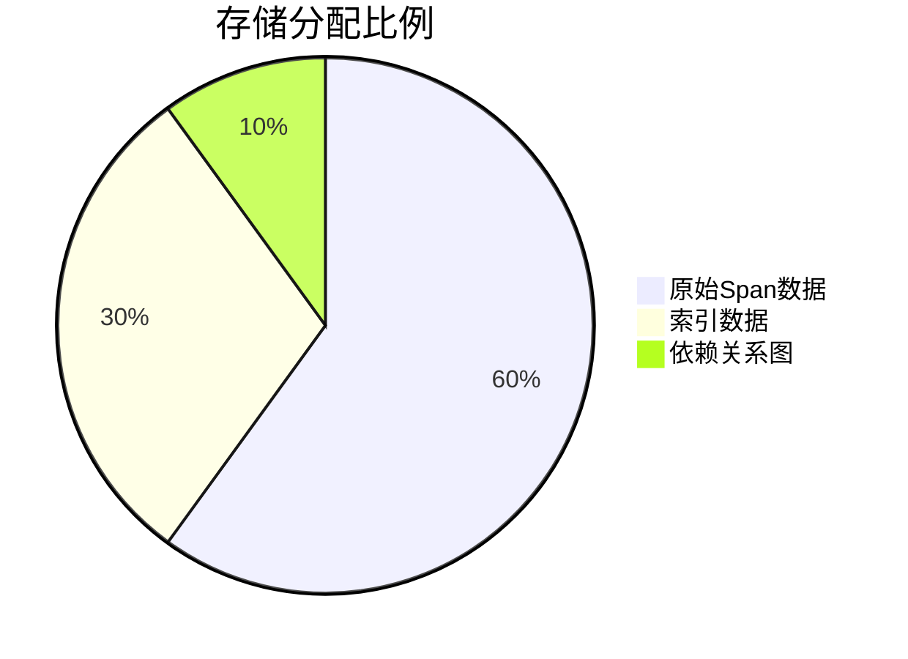

# 存储容量规划

## 介绍

存储容量规划是分布式系统运维中的关键环节，尤其对于Jaeger这类产生大量追踪数据的系统。合理的规划能避免资源浪费或性能瓶颈。本文将逐步介绍如何根据业务需求估算存储需求，并给出实际场景中的计算示例。

:::note 什么是容量规划？
通过分析数据增长模式、保留策略和系统性能，预先计算所需的存储资源。
:::

## 核心概念

### 1. 数据组成
Jaeger存储主要包含：
- **Span数据**：单个追踪记录的基本单元
- **依赖关系图**：服务间调用的拓扑数据
- **索引数据**：加速查询的元数据索引

### 2. 关键变量
| 变量          | 说明                          | 典型值              |
|---------------|-----------------------------|--------------------|
| Spans/sec     | 每秒产生的Span数量             | 100-10,000         |
| Span大小      | 单个Span的平均大小（字节）       | 1KB-10KB           |
| 保留周期      | 数据需要保存的天数              | 7-30天             |

## 计算方法

### 基础公式
```plaintext
总存储量 = Spans/sec × 秒/天 × 保留天数 × Span大小 × 压缩因子
```

假设：
- 压缩因子（如使用Cassandra）通常为0.3
- 每天86,400秒

#### 示例计算
```python
# 输入参数
spans_per_sec = 500
avg_span_size = 2  # KB
retention_days = 7
compression_factor = 0.3

# 计算每日数据量
daily = spans_per_sec * 86400 * (avg_span_size * 1024) / (1024**3)  # 转换为GB
compressed_daily = daily * compression_factor
total = compressed_daily * retention_days

print(f"所需存储总量: {total:.2f} GB")
```

**输出**：
```
所需存储总量: 54.43 GB
```

## 实战案例

### 电商平台场景
某促销活动期间：
- Span量激增至2000/sec
- Span平均大小3KB
- 需要保留14天数据



通过公式计算：
```
2000 × 86400 × 14 × 3KB × 0.3 ≈ 2.1TB
```

:::caution 注意峰值
实际规划应按峰值需求的120%计算，即约2.5TB
:::

## 优化策略

1. **采样率调整**：
   ```yaml
   # jaeger-agent配置
   sampling:
     strategies:
       - type: probabilistic
         param: 0.5  # 50%采样率
   ```

2. **分层存储**：
   - 热数据：保留7天，使用SSD存储
   - 冷数据：归档到对象存储

## 总结

关键步骤回顾：
1. 测量实际Span生产速率
2. 确定业务要求的保留周期
3. 应用公式计算基础需求
4. 增加20-30%缓冲空间
5. 实施监控和动态调整

## 扩展练习

1. 如果某服务Span量每月增长15%，如何建立自动扩容机制？
2. 尝试为你的测试环境编写一个存储预警脚本，当使用量超过80%时触发告警。

:::tip 进一步学习
- Jaeger官方文档的[存储后端指南](https://jaegertracing.io/docs/latest/deployment/#storage-backends)
- 《分布式系统观测性》第4章
:::