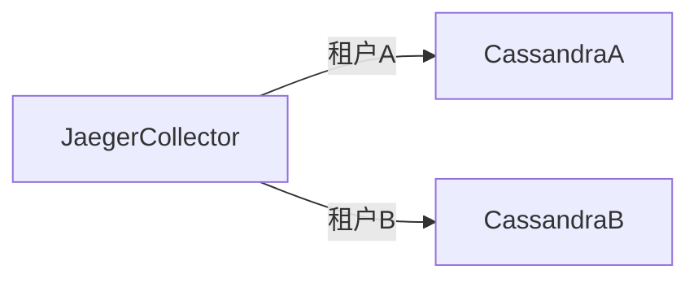

# 多租户存储配置

## 介绍

多租户（Multi-tenancy）是一种架构模式，允许单个服务实例为多个租户（如不同团队、客户或环境）提供服务，同时保持数据隔离。在Jaeger中，多租户存储配置使得不同租户的追踪数据可以独立存储和查询，避免数据混杂。

:::note 关键概念
- **租户（Tenant）**：逻辑隔离的数据所有者，通常对应一个团队或客户。
- **存储后端**：Jaeger支持Cassandra、Elasticsearch等存储后端，需为每个租户配置独立的数据源或命名空间。
:::

## 为什么需要多租户？

1. **数据隔离**：防止租户间意外访问敏感数据。
2. **资源分配**：可为不同租户分配独立的存储资源。
3. **成本核算**：按租户统计存储使用量。

## 基础配置示例

以下是一个通过环境变量配置多租户存储的示例（以Cassandra为例）：

```ini
# 租户A的Cassandra配置
STORAGE_TYPE=cassandra
CASSANDRA_SERVERS=tenantA-cassandra:9042
CASSANDRA_KEYSPACE=jaeger_tenantA

# 租户B的Cassandra配置（通过不同环境变量区分）
STORAGE_TYPE_2=cassandra
CASSANDRA_SERVERS_2=tenantB-cassandra:9042
CASSANDRA_KEYSPACE_2=jaeger_tenantB
```

## 实现方式详解

### 1. 独立存储后端
每个租户使用完全独立的数据库实例或集群。



### 2. 共享存储，隔离命名空间
同一存储集群中，通过不同命名空间（如Cassandra Keyspace）隔离数据。

```ini
# 租户A使用Keyspace 'jaeger_tenantA'
CASSANDRA_KEYSPACE=jaeger_tenantA

# 租户B使用Keyspace 'jaeger_tenantB'
CASSANDRA_KEYSPACE=jaeger_tenantB
```

### 3. 动态路由配置
通过请求头（如`X-Tenant-ID`）动态选择存储后端：

```go
// 伪代码示例：根据请求头路由存储
func GetStorage(tenant string) (Storage, error) {
    switch tenant {
    case "tenantA":
        return cassandraAStorage
    case "tenantB":
        return cassandraBStorage
    default:
        return nil, errors.New("unknown tenant")
    }
}
```

## 实际案例：电商平台的多租户追踪

**场景**：一个SaaS电商平台为不同商家（租户）提供服务，需隔离各商家的订单处理追踪数据。

1. **配置**：
   - 租户A（大型商家）：专用Elasticsearch集群
   - 租户B（中小商家）：共享Cassandra集群，独立Keyspace

2. **查询示例**：
   ```bash
   # 查询租户A的追踪数据（通过HTTP头指定租户）
   curl -H "X-Tenant-ID: tenantA" http://jaeger-query/api/traces?service=checkout
   ```

## 常见问题解决

:::caution 注意事项
1. **存储容量规划**：监控各租户的存储增长，避免单个租户耗尽资源。
2. **认证授权**：确保查询接口验证租户权限。
3. **性能隔离**：为关键租户配置独立的存储资源。
:::

## 总结

多租户存储配置是Jaeger在企业级场景中的关键能力，通过本文你学到了：
- 三种实现多租户隔离的方式
- 实际配置示例和代码片段
- 典型应用场景和注意事项

## 扩展练习

1. 在本地Docker环境中部署两个Cassandra实例，分别配置为`tenantA`和`tenantB`的存储后端。
2. 修改Jaeger Collector的启动脚本，支持通过环境变量切换租户配置。

## 附加资源

- [Jaeger官方文档：存储配置](https://jaegertracing.io/docs/latest/deployment/#storage-backends)
- [Cassandra多租户最佳实践](https://cassandra.apache.org/doc/latest/cassandra/operating/security.html#multi-tenancy)