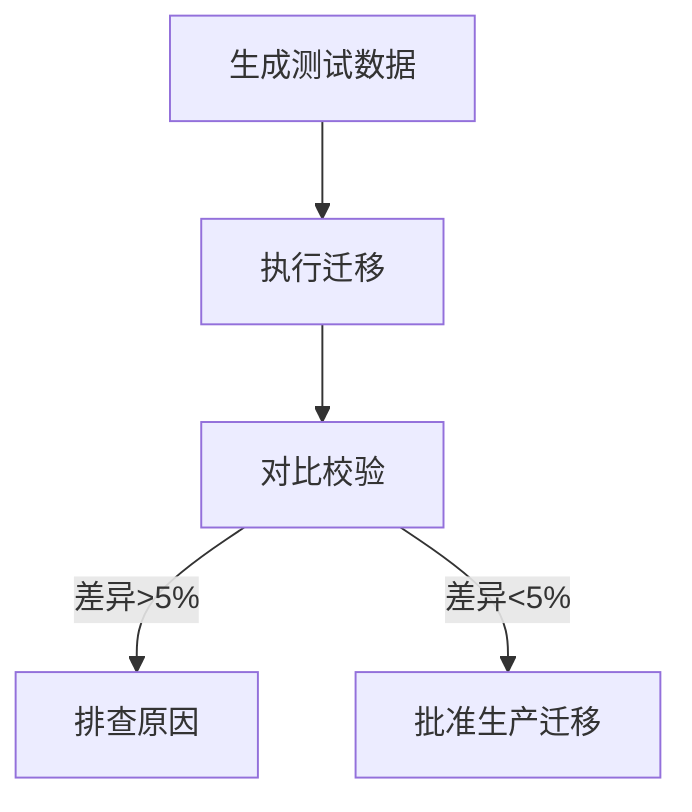

# Jaeger 存储迁移策略

## 介绍

存储迁移是将Jaeger的追踪数据从一种存储后端迁移到另一种的过程。当业务规模变化、成本优化或技术升级时，这种操作尤为常见。本文将从基础概念出发，逐步讲解迁移策略的核心要点。

:::note 为什么需要迁移？
- 从开发环境切换到生产环境
- 从内存存储迁移到持久化存储（如Elasticsearch）
- 跨云服务商的数据转移
```

## 迁移策略类型

### 1. 全量迁移
一次性将所有历史数据迁移到新存储，适合数据量小的场景。


### 2. 双写迁移
同时写入新旧存储，逐步验证新存储可靠性：
```go
// 示例双写逻辑（伪代码）
func writeSpan(span Span) {
    oldStorage.Write(span) // 写入旧存储
    newStorage.Write(span) // 写入新存储
}
```

### 3. 增量迁移
通过时间窗口分批迁移，适合大数据量：

```bash
# 使用jaeger-query的API导出特定时间范围数据
curl -X GET "http://jaeger-query:16686/api/traces?service=myapp&start=2023-01-01&end=2023-01-02"
```

## 实施步骤

### 阶段1：准备
1. 对比新旧存储特性
2. 评估数据量（使用 `jaeger-storage-plugin` 统计）
3. 创建回滚方案

### 阶段2：测试迁移


### 阶段3：生产迁移
:::warning 重要
- 选择业务低峰期操作
- 提前通知监控团队
- 准备终止开关（kill switch）
:::

## 真实案例

**电商平台迁移示例**：
1. 原存储：Cassandra（自托管）
2. 新存储：AWS OpenSearch
3. 策略：增量迁移+双写
4. 结果：
   - 迁移耗时：3周（2TB数据）
   - 错误率：`<0.1%`
   - 成本降低40%

## 常见问题

:::caution 数据不一致怎么办？
使用校验工具对比样本：
```python
def compare_trace(old, new):
    return old.trace_id == new.trace_id and old.spans.count == new.spans.count
```
:::

## 总结

关键要点：
- 小规模数据适合全量迁移
- 生产环境优先选择增量迁移
- 必须验证数据完整性

## 延伸练习

1. 使用Docker Compose搭建Jaeger+Cassandra环境
2. 编写脚本导出7天的追踪数据
3. 尝试将这些数据导入到Elasticsearch实例

## 附加资源

- [Jaeger官方迁移指南](https://jaegertracing.io/docs/latest/)
- `jaeger-migration-tool` 开源工具
- 《分布式追踪系统实践》第8章