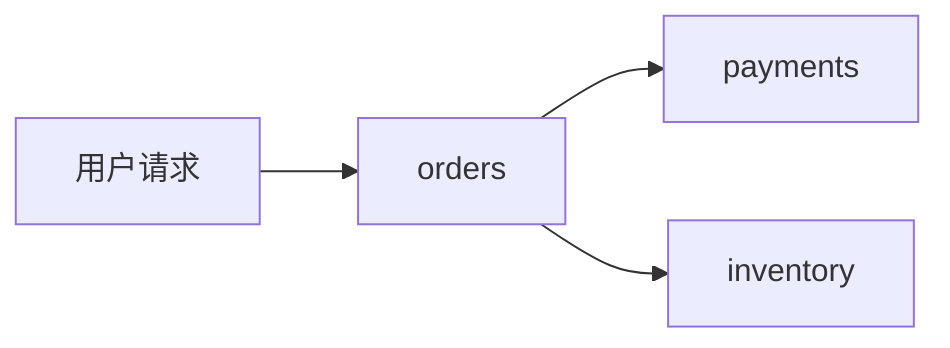

# Cassandra配置

## 介绍

在分布式追踪系统中，Jaeger需要一个可靠的存储后端来保存追踪数据。Cassandra是一个高度可扩展的分布式NoSQL数据库，常被用作Jaeger的存储选项。本指南将介绍如何为Jaeger配置Cassandra存储，适合初学者逐步学习。

:::note
**为什么选择Cassandra？**  
Cassandra具备高可用性、线性扩展能力和灵活的数据模型，非常适合存储和查询大量追踪数据。
:::

---

## 基础概念

### Cassandra与Jaeger的关系
Jaeger将追踪数据（spans）存储在Cassandra的表中，每个表对应不同类型的数据（如 traces、services）。Cassandra的分布式特性允许Jaeger处理高吞吐量的追踪数据。

### 关键配置参数
- `keyspace`: Cassandra中的逻辑数据库名称（类似关系型数据库的"database"）。
- `servers`: Cassandra集群节点地址列表。
- `replication_factor`: 数据副本数（影响容灾能力）。

---

## 配置步骤

### 1. 准备Cassandra环境
确保已安装Cassandra并创建了Jaeger所需的keyspace。以下是CQL（Cassandra Query Language）示例：

```sql
CREATE KEYSPACE jaeger_v1_datacenter1 
WITH replication = {'class': 'SimpleStrategy', 'replication_factor': 1};
```

:::caution
生产环境应使用`NetworkTopologyStrategy`并设置更高的`replication_factor`。
:::

### 2. Jaeger Collector配置
在Jaeger Collector的配置文件（如`jaeger-collector.yaml`）中添加Cassandra存储设置：

```yaml
storage:
  type: cassandra
  cassandra:
    servers: "cassandra1.example.com,cassandra2.example.com"
    keyspace: "jaeger_v1_datacenter1"
    local_dc: "datacenter1"
```

### 3. 验证连接
启动Jaeger Collector后，检查日志确认连接成功：
```plaintext
INFO: Connected to Cassandra cluster: Jaeger Cluster
```

---

## 实际案例

### 场景：电商微服务追踪
假设一个电商系统包含`orders`、`payments`和`inventory`服务。配置Cassandra存储后，Jaeger会将这些服务的调用关系存入Cassandra：



对应的追踪数据在Cassandra中会以如下形式存储（示例查询结果）：
```plaintext
trace_id                           | service_name | operation_name
-----------------------------------+--------------+---------------
a1b2c3d4e5f6                       | orders       | createOrder
a1b2c3d4e5f6                       | payments     | processPayment
```

---

## 高级配置

### 性能调优
- **批量写入大小**：调整`cassandra.batch-size`（默认10）以平衡吞吐量与延迟。
- **TTL设置**：通过`cassandra.write-ttl`自动清理旧数据。

### 多数据中心配置
```yaml
cassandra:
  servers: "cassandra-dc1.com,cassandra-dc2.com"
  local_dc: "dc1"
  replication:
    strategy: "NetworkTopologyStrategy"
    dc1: 3
    dc2: 2
```

---

## 总结

通过本指南，你学会了：
1. Cassandra作为Jaeger存储的核心概念
2. 基础配置步骤与验证方法
3. 实际应用场景与高级调优技巧

### 延伸练习
1. 尝试在Docker中部署Cassandra和Jaeger并完成配置
2. 模拟高负载场景，观察Cassandra的写入性能

### 附加资源
- [Cassandra官方文档](https://cassandra.apache.org/doc/latest/)
- [Jaeger存储设计](https://jaegertracing.io/docs/latest/deployment/#storage-backends)