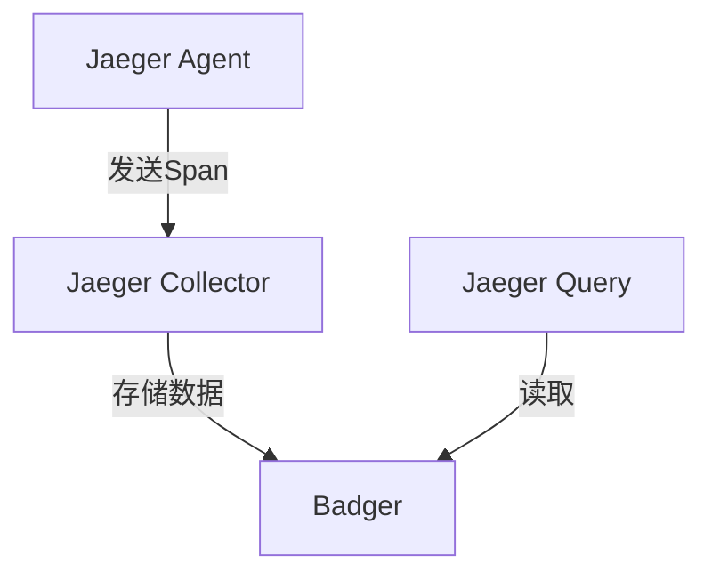

# Badger存储配置

## 简介

Badger是一个高性能的键值存储引擎，专为LSM树优化设计。在Jaeger中，Badger被用作本地存储后端，适用于单机部署或开发环境。与传统的存储方案相比，Badger提供了更低的延迟和更高的吞吐量。

:::note
Badger是纯Go实现的，无需外部依赖，适合需要嵌入式存储的场景。
:::

## 基础配置

### 启用Badger存储

在Jaeger的配置文件（通常是`jaeger.yaml`）中，通过以下配置启用Badger：

```yaml
storage:
  type: badger
  options:
    badger:
      directory: /data/jaeger/badger
      ephemeral: false
```

- `directory`: Badger数据文件的存储路径。
- `ephemeral`: 设为`true`时，数据仅保存在内存中（测试用途）。

### 关键参数说明

| 参数 | 默认值 | 描述 |
|------|--------|------|
| `ttl` | 72h | 数据自动清理周期 |
| `max-value-size` | 1MB | 单个值的大小限制 |
| `sync-writes` | false | 是否同步写入磁盘 |

## 代码示例

### 初始化Badger存储

以下Go代码展示了如何直接使用Badger：

```go
package main

import (
	"github.com/dgraph-io/badger/v3"
	"time"
)

func main() {
	opts := badger.DefaultOptions("/tmp/badger").
		WithSyncWrites(false).
		WithLogger(nil) // 禁用日志

	db, err := badger.Open(opts)
	if err != nil {
		panic(err)
	}
	defer db.Close()

	// 写入示例
	err = db.Update(func(txn *badger.Txn) error {
		return txn.Set([]byte("trace_id_123"), []byte("span_data"))
	})
}
```

**输入/输出说明**：
- 输入：键值对 `trace_id_123 -> span_data`
- 输出：数据持久化到`/tmp/badger`目录

## 实际案例

### 场景：开发环境跟踪存储

在本地开发Jaeger时，使用Badger可以：
1. 避免依赖分布式存储（如Elasticsearch）
2. 快速启动和测试追踪数据
3. 通过`ephemeral`模式实现每次重启清空数据



## 高级配置

### 性能调优

```yaml
badger:
  value-log-file-size: 1024 # MB
  num-compactors: 4        # 并发压缩任务数
  num-level-zero-tables: 5 # L0层最大表数量
```

:::warning
修改高级参数需要充分测试，不当配置可能导致性能下降！
:::

## 总结

Badger为Jaeger提供了：
- 简单的本地存储方案
- 高性能的读写能力
- 低运维成本

**推荐练习**：
1. 尝试在`ephemeral`模式下运行Jaeger并观察内存使用情况
2. 修改`ttl`参数测试数据自动清理功能

## 延伸阅读

- [Badger官方文档](https://dgraph.io/docs/badger/)
- [Jaeger存储后端对比](https://jaegertracing.io/docs/latest/deployment/#storage-backends)