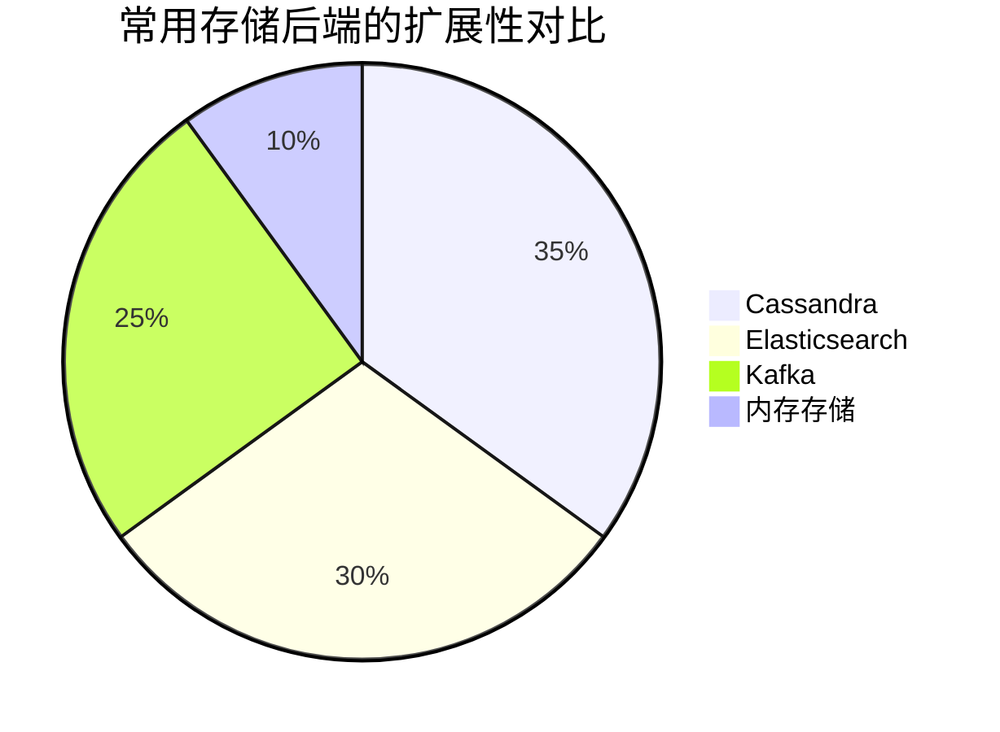
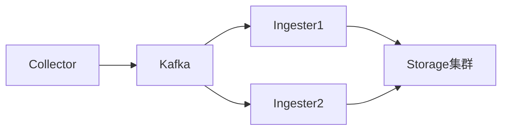

## 介绍

Jaeger作为分布式追踪系统，其存储扩展性直接影响系统处理高吞吐量追踪数据的能力。存储扩展性配置主要涉及两方面：**存储后端的选择**和**水平扩展策略**。本文将带你了解如何通过配置实现Jaeger存储层的弹性扩展。

:::note 关键概念
- **水平扩展**：通过增加节点数量（而非提升单节点性能）来提高系统容量
- **存储分片**：将数据分散到多个物理存储单元以平衡负载
:::

## 存储后端选项

Jaeger支持多种存储后端，扩展性能力各不相同：



## 配置示例

### 1. Cassandra分片配置

```yaml
# jaeger-config.yaml
storage:
  type: cassandra
  cassandra:
    servers: "cassandra1.example.com,cassandra2.example.com,cassandra3.example.com"
    keyspace: jaeger_v1_test
    replication-factor: 3
    consistency: LOCAL_QUORUM
```

参数说明：
- `replication-factor`: 数据副本数（建议生产环境≥3）
- `consistency`: 读写一致性级别

### 2. Elasticsearch索引模板

```json
PUT _template/jaeger
{
  "index_patterns": ["jaeger-*"],
  "settings": {
    "number_of_shards": 5,
    "number_of_replicas": 1
  }
}
```

## 扩展策略详解

### 水平扩展模式



关键配置点：
1. **Kafka缓冲层**：解耦收集与存储过程
2. **多Ingester实例**：并行消费Kafka消息
3. **存储分片**：按trace ID哈希分布数据

### 实际案例：电商平台配置

```yaml
# 生产环境配置示例
storage:
  type: elasticsearch
  es:
    server-urls: http://es1:9200,http://es2:9200,http://es3:9200
    index-prefix: jaeger
    bulk:
      size: 50
      workers: 10
      flush-interval: "200ms"
```

:::tip 性能调优建议
- 根据写入量调整 `bulk.size` 和 `bulk.workers`
- 监控 `bulk-queue` 指标避免堆积
:::

## 总结

存储扩展性配置要点：
1. 根据数据量选择合适后端（Cassandra适合高写入，ES适合复杂查询）
2. 通过分片和副本实现水平扩展
3. 使用Kafka缓冲写入压力

## 延伸学习

推荐练习：
1. 部署3节点Cassandra集群并测试不同`replication-factor`的影响
2. 使用JMeter模拟高负载追踪数据，观察ES分片分布情况

扩展阅读：
- Jaeger官方文档《Production Deployment》
- 《Designing Data-Intensive Applications》第5章