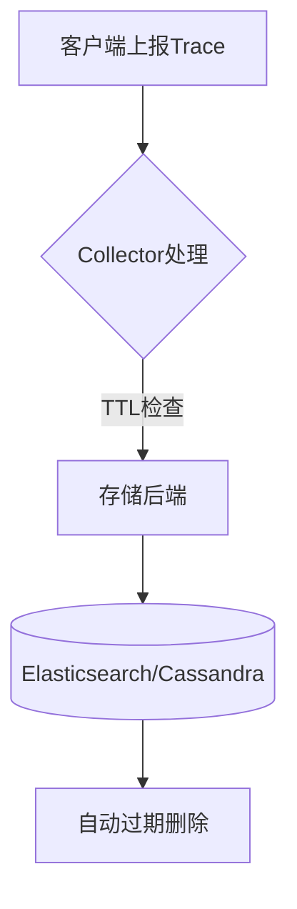

# 数据保留策略

## 介绍

在分布式追踪系统中，**数据保留策略**决定了追踪数据的存储时长。Jaeger作为流行的分布式追踪工具，需要合理配置数据保留参数以平衡存储成本与数据分析需求。本文将深入讲解Jaeger的存储保留机制及其实际应用。

:::note 为什么需要保留策略？
- 避免存储无限增长导致资源耗尽
- 满足合规性要求（如GDPR）
- 优化查询性能（数据量越小查询越快）
:::

## 核心配置参数

Jaeger主要通过以下参数控制数据保留：

### 1. 基于时间的保留

```yaml
# jaeger-collector-config.yaml
storage:
  elasticsearch:
    max-span-age: 72h  # 单个Span最大保留时间
  cassandra:
    ttl: 168h         # 整条Trace的存活时间(Time-To-Live)
```

### 2. 基于空间的保留

```yaml
# jaeger-query-config.yaml
query:
  max-clock-skew-adjustment: 1m
  max-num-spans: 100000  # 最大Span数量限制
```

## 工作原理图解



## 实际案例配置

### 案例1：开发环境配置

```yaml
# 开发环境保留7天数据
storage:
  elasticsearch:
    max-span-age: 168h
    index-prefix: "jaeger-dev"
```

### 案例2：生产环境金融系统

```yaml
# 金融系统保留30天合规数据
storage:
  cassandra:
    ttl: 720h
    keyspace: "jaeger_finance"
```

## 高级配置技巧

:::tip 动态调整策略
可以通过定期执行存储后端命令动态修改保留策略：

```bash
# Cassandra示例：修改现有表的TTL
ALTER TABLE jaeger.traces WITH default_time_to_live = 86400;
```
:::

## 常见问题解决

:::caution 数据提前消失？
检查以下配置是否冲突：
1. Collector的`max-span-age`
2. 存储后端的全局TTL设置
3. 查询服务的`max-num-spans`限制
:::

## 总结与练习

### 关键点总结
- 时间保留策略通过TTL机制实现
- 空间保留策略限制总数据量
- 不同环境需要差异化配置

### 动手练习
1. 在本地Jaeger实例中尝试修改`max-span-age`参数
2. 使用`curl`命令验证数据是否按预期过期：
```bash
curl -X GET "http://localhost:16686/api/traces?service=my-service"
```

### 扩展阅读
- Jaeger官方文档：Storage Backends
- Cassandra TTL机制详解
- Elasticsearch索引生命周期管理(ILM)