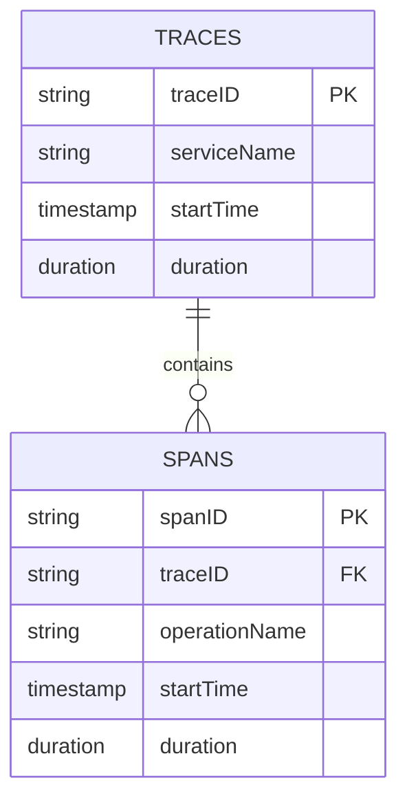

# 索引管理

## 介绍

索引是数据库系统中用于加速数据检索的数据结构。在Jaeger这样的分布式追踪系统中，索引管理尤为重要，因为它直接影响到查询性能。本文将介绍索引的基本概念、在Jaeger中的实现方式，以及如何优化索引以提高查询效率。

## 索引基础

索引类似于书籍的目录，它允许系统快速定位到特定数据，而不必扫描整个数据集。在Jaeger中，常见的索引字段包括：

- `traceID`
- `serviceName`
- `operationName`
- `tags`
- `duration`

## Jaeger 中的索引实现

Jaeger支持多种存储后端，每种后端的索引实现略有不同。以下是常见的存储后端及其索引特性：

### Elasticsearch索引

Elasticsearch使用倒排索引来实现快速全文搜索。在Jaeger中，你可以这样定义索引映射：

```json
{
  "mappings": {
    "properties": {
      "traceID": { "type": "keyword" },
      "serviceName": { "type": "text" },
      "tags": { "type": "nested" }
    }
  }
}
```

### Cassandra索引

Cassandra使用主键和二级索引来实现数据检索。创建表时定义主键：

```sql
CREATE TABLE jaeger.traces (
  trace_id uuid,
  service_name text,
  start_time bigint,
  PRIMARY KEY ((service_name), start_time, trace_id)
);
```

## 索引优化策略

### 选择合适的索引字段

:::tip
只为你经常查询的字段创建索引。过多的索引会降低写入性能并增加存储开销。
:::

### 复合索引

对于经常一起查询的字段，可以创建复合索引：

```sql
CREATE INDEX ON jaeger.traces (service_name, operation_name);
```

### 索引维护

定期维护索引可以提高查询性能：

1. 重建碎片化的索引
2. 删除未使用的索引
3. 监控索引使用情况

## 实际案例

假设我们有一个电商应用，需要追踪订单处理流程。我们可能这样设计索引：



常见查询场景：

1. 查找特定服务的慢速追踪：
```sql
SELECT * FROM traces 
WHERE serviceName = 'order-service' 
AND duration > 1000ms
ORDER BY startTime DESC;
```

2. 查找包含特定错误的追踪：
```sql
SELECT * FROM traces 
WHERE tags.error = 'true'
LIMIT 100;
```

## 总结

索引管理是Jaeger存储配置中的重要环节。合理的索引设计可以显著提高查询性能，而不当的索引则可能导致资源浪费。记住以下要点：

1. 只为高频查询字段创建索引
2. 考虑使用复合索引优化常见查询模式
3. 定期维护和监控索引性能

## 延伸学习

- 阅读Jaeger官方文档中的存储配置部分
- 尝试在不同存储后端上创建和优化索引
- 使用EXPLAIN分析查询执行计划

:::note 练习
1. 在你的Jaeger实例中创建一个新的索引并测试查询性能差异
2. 尝试找出并删除一个未使用的索引
3. 设计一个复合索引来优化你常见的查询模式
:::