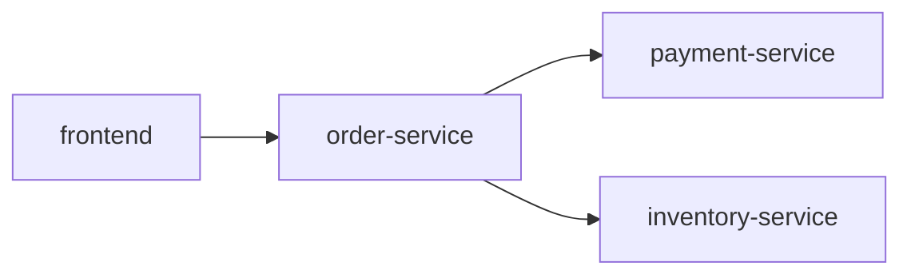

# Jaeger 查询与分析：查询接口使用

## 介绍

Jaeger是一个开源的分布式追踪系统，用于监控和排查微服务架构中的性能问题。查询接口是Jaeger的核心功能之一，允许用户通过UI或API检索追踪数据。本文将介绍如何通过Jaeger的Web界面和编程接口进行查询，并分析结果。

:::note
**关键术语**  
- **Trace（追踪）**：一个完整的请求链路，包含多个Span（子操作）。  
- **Span（跨度）**：单个操作（如HTTP请求、数据库查询）的记录。  
:::

---

## 基础查询操作

### 1. 通过Web界面查询
Jaeger UI提供了直观的搜索功能：
1. 打开Jaeger UI（通常为 `http://localhost:16686`）。  
2. 在搜索栏中填写以下条件（可选）：
   - **Service（服务）**：选择目标微服务（如 `frontend`）。  
   - **Operation（操作）**：筛选特定操作（如 `GET /api/users`）。  
   - **Tags（标签）**：按自定义标签过滤（如 `http.status_code=500`）。  
   - **Duration（耗时）**：设定耗时范围（如 `>1s`）。  

示例：查找耗时超过2秒的 `order-service` 请求：  
```plaintext
Service: order-service  
Duration: >2s  
```

### 2. 通过API查询
Jaeger提供HTTP API（默认端口 `16686`），以下是一个使用 `curl` 的示例：

```bash
curl -X GET "http://localhost:16686/api/traces?service=order-service&operation=processOrder&limit=10"
```

响应示例（JSON片段）：
```json
{
  "data": [
    {
      "traceID": "abc123",
      "spans": [
        {
          "operationName": "processOrder",
          "duration": 2500,
          "tags": [
            {"key": "http.status_code", "value": 200}
          ]
        }
      ]
    }
  ]
}
```

:::tip
使用 `jq` 工具格式化API响应：  
```bash
curl ... | jq '.data[0].spans[0].duration'
```
:::

---

## 高级查询技巧

### 1. 使用Tag过滤
Jaeger支持通过标签精准筛选追踪数据。例如，查找所有失败的请求：  
```plaintext
Tags: error=true  
```

### 2. 时间范围查询
通过API指定时间范围（Unix时间戳，单位微秒）：
```bash
curl "http://localhost:16686/api/traces?start=1625097600000000&end=1625184000000000"
```

### 3. 依赖关系分析
通过追踪数据生成服务依赖图（需集成Jaeger与Prometheus/Grafana）：



---

## 实际案例

### 场景：诊断高延迟订单
1. **问题**：用户反馈下单接口响应慢。  
2. **步骤**：
   - 在Jaeger UI中搜索 `service=order-service` 和 `operation=createOrder`。  
   - 按 `Duration` 排序，找到耗时最长的Trace。  
   - 展开Trace，发现 `payment-service` 的Span耗时占80%。  
3. **结论**：支付服务是瓶颈，需优化其数据库查询逻辑。

---

## 总结

- Jaeger的查询接口支持通过UI或API检索追踪数据。  
- 结合Tag、时间范围和耗时过滤能快速定位问题。  
- 实际应用中，可通过分析Trace依赖关系优化系统性能。  

### 下一步
- 练习：尝试用API查询包含 `error=true` 标签的Trace。  
- 扩展阅读：[Jaeger官方文档](https://www.jaegertracing.io/docs/)。