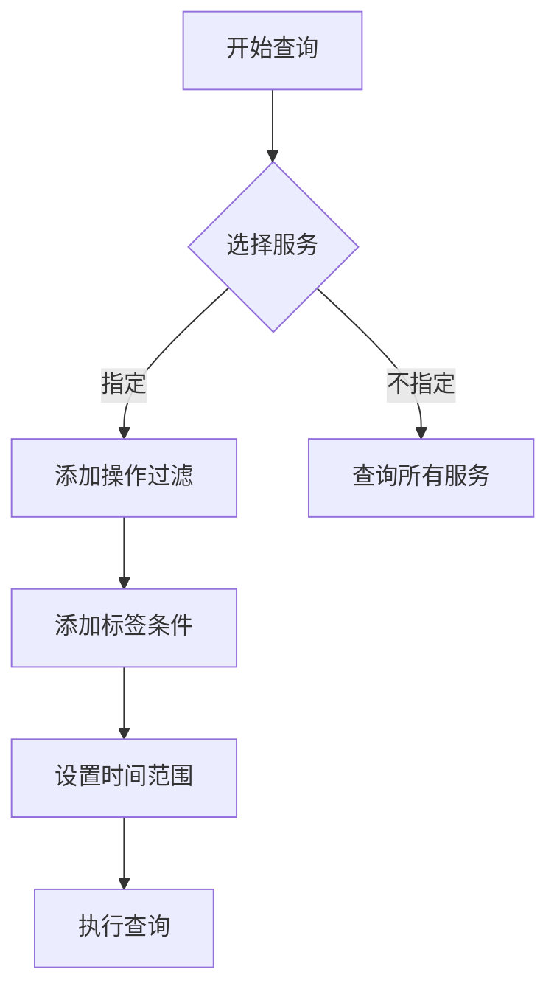

# Jaeger 查询与分析：基本查询语法

## 介绍

Jaeger是一个开源的分布式追踪系统，用于监控和排查微服务架构中的性能问题。查询功能是Jaeger的核心能力之一，它允许开发者通过特定语法快速定位追踪数据。本文将详细介绍Jaeger的基本查询语法，帮助初学者快速上手。

:::tip 为什么需要查询语法？
在复杂的分布式系统中，一次请求可能涉及数十个服务。查询语法能帮你从海量数据中精准过滤出目标追踪记录。
:::

## 基础查询结构

Jaeger的查询语法主要由以下部分组成：

1. **服务选择**：指定要查询的服务名称
2. **操作过滤**：筛选特定操作（endpoint）
3. **标签过滤**：通过键值对进一步细化
4. **时间范围**：限定查询的时间窗口

基本格式如下：
```
service="服务名" operation="操作名" tag_key="tag_value" start_time="..." end_time="..."
```

## 服务与操作查询

### 按服务查询

查询特定服务的所有追踪记录：
```
service="payment-service"
```

### 按操作查询

在指定服务中查询特定操作：
```
service="payment-service" operation="ProcessPayment"
```

:::note
操作名称通常是API端点或函数名，如 `GET /api/users`
:::

## 标签过滤

标签是附加在span上的键值对元数据，可用于精细过滤：

```
service="order-service" http.status_code="500"
```

支持多种比较运算符：
- 等于：`tag_key="value"`
- 不等于：`tag_key!="value"`
- 存在检查：`tag_key` (检查标签是否存在)
- 正则匹配：`tag_key=/regex/`

示例：
```
service="inventory" error="true" duration>2s
```

## 时间范围查询

Jaeger支持绝对时间和相对时间两种格式：

### 绝对时间
```
start_time="2023-07-20T09:00:00" end_time="2023-07-20T10:00:00"
```

### 相对时间
```
start_time=-1h  # 过去1小时
```

## 组合查询

通过逻辑运算符组合多个条件：

- AND（隐式，空格分隔）：`service="auth" http.method="POST"`
- OR：`service="auth" OR service="payment"`
- NOT：`service="auth" NOT user_id="123"`

:::caution 运算符优先级
NOT > AND > OR，建议使用括号明确优先级：`(A OR B) AND C`
:::

## 实际案例

### 案例1：查找失败请求
查询支付服务中所有失败的支付操作：
```
service="payment-service" operation="ProcessPayment" error="true"
```

### 案例2：查找慢查询
查找用户服务中响应时间超过1秒的请求：
```
service="user-service" duration>1s
```

### 案例3：多条件组合
查找过去30分钟内订单服务中状态码为500或400的请求：
```
service="order-service" (http.status_code="500" OR http.status_code="400") start_time=-30m
```

## 高级技巧

### 通配符搜索
```
operation=/^GET/  # 匹配所有GET开头的操作
```

### 追踪ID直接查询
```
trace_id="1a2b3c4d5e6f"
```



## 总结

Jaeger的查询语法提供了强大的数据过滤能力：
1. 通过服务名和操作名进行基础筛选
2. 使用标签实现精细过滤
3. 灵活的时间范围设置
4. 支持逻辑组合和高级匹配

## 延伸学习

- 尝试在Jaeger UI中实践上述查询示例
- 探索Jaeger的对比分析功能（Compare Traces）
- 学习使用Jaeger的依赖关系图分析服务调用链

:::warning 注意
查询性能受时间范围和数据量影响，生产环境中建议始终指定合理的时间范围。
:::