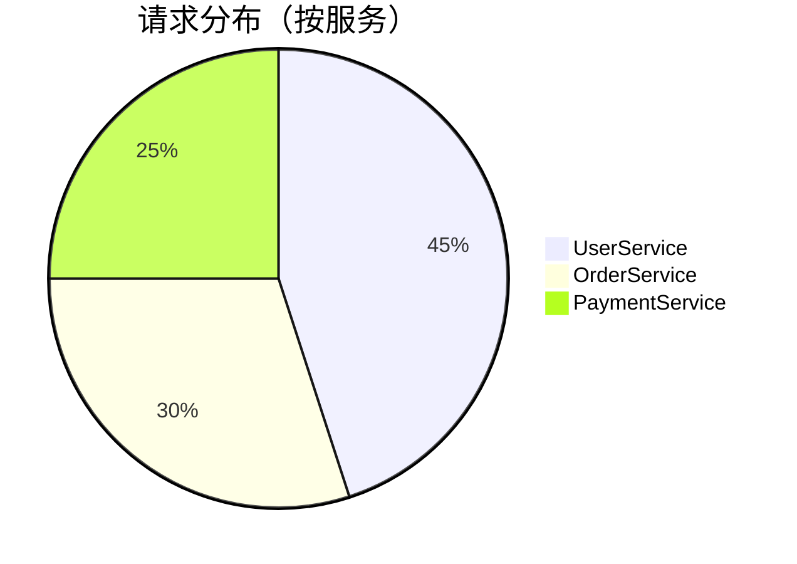
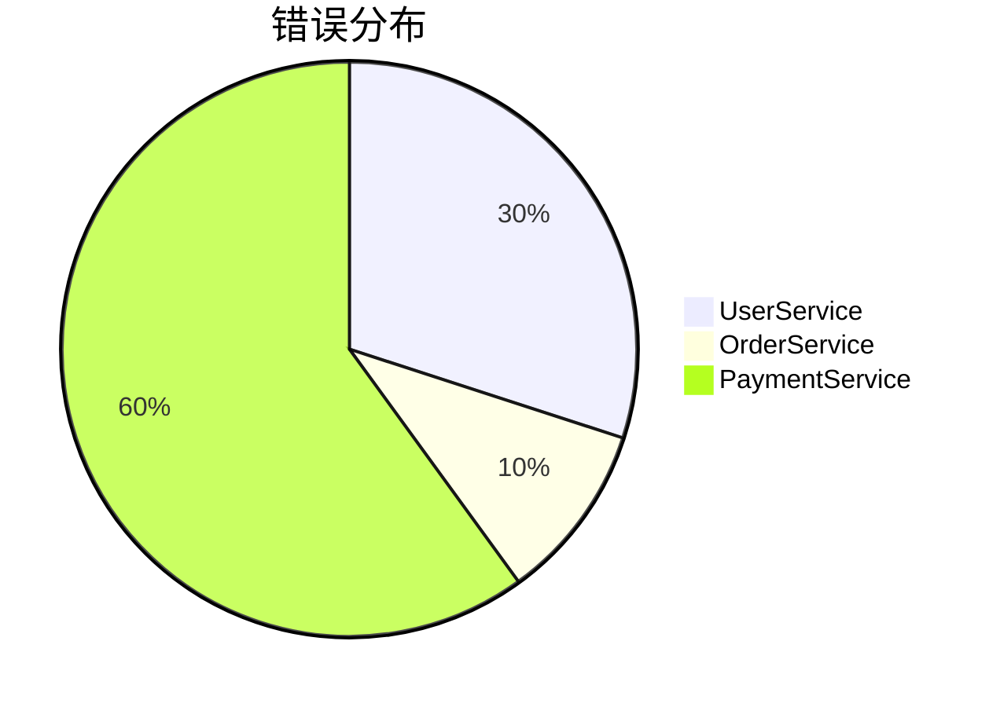

# 聚合分析

## 介绍

聚合分析是 Jaeger 中一项强大的功能，它允许您对追踪数据进行统计和分组，从而发现系统中的性能模式和异常。通过聚合分析，您可以快速识别高频操作、慢请求、错误率高的服务等问题，而无需逐个检查每条追踪记录。

对于初学者来说，理解聚合分析的概念和应用场景非常重要，因为它能帮助您从海量追踪数据中提取有价值的洞察。

## 基本概念

在 Jaeger 中，聚合分析主要基于以下几个维度：

1. **服务(Service)**：您的微服务系统中的各个组件
2. **操作(Operation)**：服务提供的具体功能或端点
3. **标签(Tags)**：追踪中附加的元数据
4. **持续时间(Duration)**：请求的响应时间
5. **结果状态**：请求是否成功完成

聚合分析就是对这些维度进行分组统计，计算如请求次数、平均延迟、错误率等指标。

## 如何使用聚合分析

### 1. 访问聚合视图

在 Jaeger UI 中，您可以通过以下步骤访问聚合分析功能：

1. 导航到"Search"页面
2. 设置您感兴趣的查询条件（如时间范围、服务名称等）
3. 点击"Analytics"标签

### 2. 理解聚合界面

聚合界面主要包含以下几个部分：

- **图表区域**：显示随时间变化的聚合数据
- **表格视图**：显示按不同维度分组的统计结果
- **过滤控件**：允许您进一步细化分析范围

### 3. 基本聚合操作

#### 按服务统计



#### 按操作统计延迟

```mermaid
bar
    title 平均延迟（按操作）
    x-axis 操作
    y-axis 毫秒
    "GetUser" : 120
    "CreateOrder" : 250
    "ProcessPayment" : 180
```

### 4. 高级聚合技巧

#### 组合维度分析

您可以组合多个维度进行分析，例如同时按服务和操作分组：

```json
// 示例聚合查询
{
  "groupBy": ["service", "operation"],
  "metrics": ["count", "avg(duration)"],
  "filter": "duration > 500ms"
}
```

#### 使用比较分析

Jaeger 允许您比较不同时间段的聚合结果，这对于识别性能退化特别有用：

1. 选择"Compare"模式
2. 设置两个不同的时间范围
3. 查看关键指标的变化

## 实际案例

### 案例1：识别性能瓶颈

假设您注意到系统整体响应时间变慢，可以通过以下步骤分析：

1. 按服务聚合，查看哪个服务的平均延迟增长最多
2. 在该服务中，按操作进一步细分
3. 过滤出延迟高于阈值的请求
4. 分析这些请求的共同特征（如特定参数值、调用模式）

### 案例2：监控错误率

要监控系统中的错误：

1. 添加 `error=true` 的过滤条件
2. 按服务聚合错误计数
3. 计算各服务的错误率（错误数/总请求数）
4. 对高错误率的服务进行深入分析



## 总结

聚合分析是 Jaeger 中极为有用的功能，它能够帮助您：

- 快速识别系统中的热点和瓶颈
- 发现异常模式（如突增的错误或延迟）
- 比较不同时间段的性能表现
- 基于数据做出优化决策

:::tip 最佳实践
1. 定期查看关键服务的聚合指标，建立性能基线
2. 为重要操作设置告警阈值（如错误率>1%）
3. 结合日志和其他监控工具进行综合分析
:::

## 进一步学习

要深入了解 Jaeger 的聚合分析功能，您可以：

1. 尝试对您自己的系统进行不同类型的聚合分析
2. 探索 Jaeger 的聚合API，了解如何以编程方式获取这些数据
3. 学习如何将聚合结果与其他监控系统（如Prometheus）集成

:::note 练习建议
1. 在您的测试环境中，模拟不同负载模式（如突发流量）
2. 使用聚合分析识别这些模式
3. 尝试找出模拟的性能问题和错误
:::

通过实践这些练习，您将更加熟练地掌握 Jaeger 的聚合分析功能，并能够将其应用于实际的生产环境监控中。