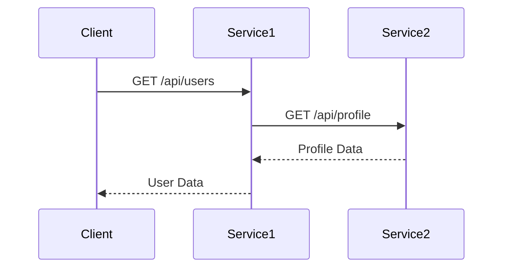

# Jaeger 查询API使用

## 介绍

Jaeger是一个开源的分布式追踪系统，用于监控和排查微服务架构中的性能问题。Jaeger提供了丰富的查询API，允许开发者以编程方式检索和分析追踪数据。本指南将介绍如何使用Jaeger的查询API，包括基本请求、参数配置和结果解析。

## 查询API基础

Jaeger的查询API通常通过HTTP端点暴露，支持RESTful风格的请求。以下是API的核心端点：

- `/api/traces`：检索追踪数据
- `/api/services`：列出所有已注册的服务
- `/api/operations`：列出特定服务的操作

### 基本请求示例

以下是一个简单的`curl`命令，用于查询特定时间范围内的追踪数据：

```bash
curl -X GET "http://localhost:16686/api/traces?service=my-service&start=1625097600000000&end=1625184000000000"
```

**参数说明：**
- `service`：要查询的服务名称
- `start`和`end`：时间戳（微秒级），定义查询的时间范围

## 分步指南

### 1. 查询服务列表

首先，你可能需要知道Jaeger中注册了哪些服务。可以通过以下API获取：

```bash
curl -X GET "http://localhost:16686/api/services"
```

**示例输出：**
```json
{
  "data": ["service1", "service2", "service3"],
  "total": 3,
  "limit": 0,
  "offset": 0,
  "errors": null
}
```

### 2. 查询特定服务的追踪

获取服务列表后，可以查询特定服务的追踪数据。例如，查询`service1`在过去1小时的追踪：

```bash
curl -X GET "http://localhost:16686/api/traces?service=service1&start=$(date -d '1 hour ago' +%s)000000&end=$(date +%s)000000"
```

### 3. 过滤和排序

Jaeger API支持多种过滤和排序参数：

- `operation`：过滤特定操作
- `tags`：按标签过滤（格式为`key=value`）
- `limit`：限制返回的追踪数量
- `lookback`：设置查询的时间范围（例如`1h`表示过去1小时）

**示例：**
```bash
curl -X GET "http://localhost:16686/api/traces?service=service1&operation=GET /api/users&tags=http.status_code=200&limit=10"
```

## 实际案例

### 场景：分析延迟问题

假设你发现`service1`的某个API端点响应时间变长，可以通过以下步骤分析：

1. 查询该端点的追踪数据：
   ```bash
   curl -X GET "http://localhost:16686/api/traces?service=service1&operation=GET /api/users&limit=5"
   ```

2. 分析返回的追踪数据，重点关注耗时较长的Span。

3. 使用标签进一步过滤，例如只查看状态码为500的请求：
   ```bash
   curl -X GET "http://localhost:16686/api/traces?service=service1&operation=GET /api/users&tags=http.status_code=500"
   ```

### 结果解析

API返回的追踪数据是JSON格式，包含以下关键字段：

- `traceID`：追踪的唯一标识符
- `spans`：组成追踪的所有Span
- `processes`：参与追踪的进程信息

以下是一个简化的响应示例：

```json
{
  "data": [
    {
      "traceID": "abc123",
      "spans": [
        {
          "spanID": "def456",
          "operationName": "GET /api/users",
          "startTime": 1625097600000000,
          "duration": 45000000,
          "tags": [
            {"key": "http.status_code", "value": 200}
          ]
        }
      ]
    }
  ]
}
```

## 高级用法

### 使用Mermaid可视化追踪

以下是一个Mermaid图表示例，展示如何可视化追踪数据：



### 批量查询

如果需要查询大量数据，可以使用分页参数`offset`和`limit`：

```bash
curl -X GET "http://localhost:16686/api/traces?service=service1&limit=100&offset=0"
```

## 总结

Jaeger的查询API提供了强大的功能，帮助开发者以编程方式检索和分析追踪数据。通过合理使用过滤、排序和分页参数，可以高效地排查性能问题。

:::tip 附加资源
- [Jaeger官方文档](https://www.jaegertracing.io/docs/)
- [OpenTracing标准](https://opentracing.io/)
:::

## 练习

1. 使用`/api/services`端点列出你环境中的所有服务。
2. 查询某个服务的追踪数据，并尝试使用`tags`参数过滤结果。
3. 分析一个追踪的Span，尝试找出耗时最长的操作。