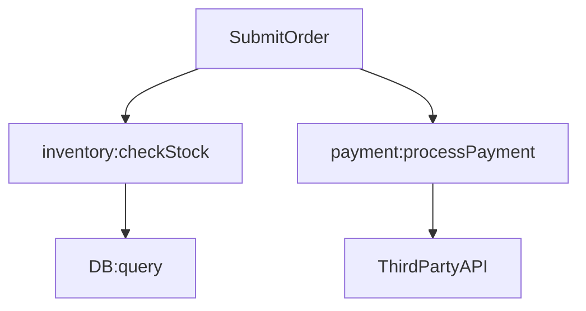

# 高级查询技巧

## 介绍

Jaeger 是一个开源的分布式追踪系统，用于监控和排查微服务架构中的性能问题。在掌握了基础查询功能后，学习**高级查询技巧**可以帮助你更精准地定位问题，提高分析效率。本文将介绍条件过滤、时间范围优化、标签组合查询等实用技巧，并通过实际案例演示它们的应用场景。

---

## 1. 条件过滤

Jaeger 支持通过条件过滤缩小查询范围，例如按服务名、操作名或标签筛选。以下是一些常用的过滤语法：

- **按服务名查询**：`service:<服务名>`
- **按操作名查询**：`operation:<操作名>`
- **按标签查询**：`tag.key=value`

### 示例：过滤错误请求
假设你想查找所有包含错误状态的请求，可以使用标签过滤：
```plaintext
tag.http.status_code=500
```
输出结果将仅显示状态码为 500 的追踪记录。

:::tip
标签过滤支持逻辑运算符，例如 `tag.key1=value1 AND tag.key2=value2`。
:::

---

## 2. 时间范围优化

默认情况下，Jaeger 查询会扫描所有时间范围内的数据，但这可能导致性能下降。通过以下方式优化时间范围：

- **固定时间窗口**：手动选择较小的查询区间（如 5 分钟）。
- **相对时间范围**：使用 `now-1h` 表示查询过去 1 小时的数据。

### 示例：查询最近 30 分钟的慢请求
```plaintext
operation:checkout AND duration>2s&start=now-30m&end=now
```
此查询会返回最近 30 分钟内耗时超过 2 秒的 `checkout` 操作。

---

## 3. 标签组合查询

通过组合多个标签，可以进一步细化查询条件。例如：
```plaintext
service:payment AND tag.http.method=POST AND tag.error=true
```
此查询会筛选出 `payment` 服务中所有失败的 POST 请求。

:::note
标签名称区分大小写！确保与代码中记录的标签完全一致。
:::

---

## 4. 实际案例：排查订单超时问题

### 场景描述
用户反馈订单提交偶尔超时，你需要分析哪些环节导致了延迟。

### 解决步骤
1. **筛选超时请求**：
   ```plaintext
   operation:SubmitOrder AND duration>5s
   ```
2. **检查依赖服务**：
   在追踪详情中展开耗时最长的 Span，查看其调用的下游服务（如 `inventory` 或 `payment`）。
3. **定位瓶颈**：
   使用 Jaeger 的依赖图功能，可视化服务间的调用延迟。



---

## 总结

- **条件过滤**：通过服务名、操作名或标签快速定位问题。
- **时间范围**：缩小查询窗口以提高性能。
- **标签组合**：利用多条件组合精准筛选数据。

## 练习
1. 尝试查询你的服务中所有耗时超过 1 秒的数据库调用。
2. 组合 `error=true` 和 `http.method=GET` 标签，找出失败的 GET 请求。

## 附加资源
- [Jaeger 官方文档](https://www.jaegertracing.io/docs/)
- 《分布式追踪实战》书籍（推荐章节：查询优化）