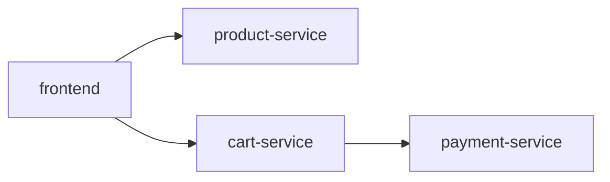

# 服务筛选

## 介绍

在分布式系统中，一个请求可能涉及多个服务的调用。Jaeger作为分布式追踪系统，可以帮助我们可视化这些调用链。但当系统中服务数量庞大时，如何快速找到你关心的服务追踪数据呢？这就是**服务筛选**的用武之地。

服务筛选是Jaeger查询界面的核心功能之一，它允许你：
- 从所有记录的服务中快速选择特定服务
- 查看该服务的所有追踪数据
- 进一步分析该服务的性能表现

## 基础用法

在Jaeger UI的查询页面，服务筛选通常位于页面顶部的下拉菜单中：

1. 打开Jaeger UI
2. 导航到"Search"页面
3. 在"Service"下拉菜单中选择你要查询的服务

:::note
如果你刚接触Jaeger，可能会发现下拉菜单中只有"jaeger-query"服务。这是因为你还没有配置其他服务的追踪数据上报。
:::

## 实际案例

假设我们有一个电商系统，包含以下服务：
- `frontend`：用户界面
- `product-service`：商品信息
- `cart-service`：购物车
- `payment-service`：支付处理



当用户报告支付缓慢时，你可以：

1. 在Jaeger中选择`payment-service`
2. 查看该服务的所有追踪
3. 按持续时间排序找出最慢的请求
4. 分析具体追踪找出瓶颈

## 高级筛选技巧

服务筛选可以与其他筛选条件结合使用：

1. **服务+操作筛选**：先选择服务，然后在该服务中选择特定操作（如HTTP端点）
   ```plaintext
   Service: payment-service
   Operation: /api/v1/charge
   ```

2. **服务+时间范围**：查看特定时间段内服务的表现
   ```plaintext
   Service: cart-service
   Time Range: Last 1 hour
   ```

3. **服务+标签筛选**：结合自定义标签进一步缩小范围
   ```plaintext
   Service: product-service
   Tags: http.status_code=500
   ```

## 代码示例

如果你使用Jaeger客户端库，可以通过代码指定服务名称：

```javascript
// Node.js示例
const { initTracer } = require('jaeger-client');

const config = {
  serviceName: 'payment-service', // 这里设置服务名称
  sampler: {
    type: 'const',
    param: 1,
  },
  reporter: {
    logSpans: true,
    agentHost: 'localhost',
  },
};
const tracer = initTracer(config);
```

## 常见问题

:::caution
**服务下拉菜单为空？**
- 确认你的应用是否正确配置了Jaeger客户端
- 检查Jaeger collector是否正常运行
- 确保服务名称在代码中正确设置
:::

:::tip
**最佳实践**
- 为每个微服务使用明确、唯一的名称
- 避免在服务名称中使用环境标识（如"-dev"、"-prod"），这可以通过标签来实现
- 服务名称应该简洁但具有描述性
:::

## 总结

服务筛选是Jaeger中最基础但强大的功能之一，它能帮助你：
- 快速定位特定服务的追踪数据
- 与其他筛选条件配合实现精准查询
- 识别服务性能问题

## 延伸学习

1. 尝试在你的开发环境中配置多个服务并观察Jaeger中的服务列表变化
2. 练习组合使用服务筛选和其他筛选条件
3. 研究如何在你的编程语言中配置Jaeger客户端和服务名称

通过掌握服务筛选，你已经迈出了成为分布式系统调试专家的第一步！