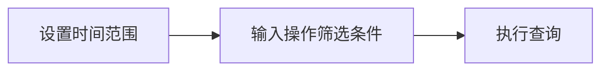

## 介绍

在 Jaeger 的分布式追踪系统中，**操作筛选**（Operation Filtering）是一种通过特定条件缩小追踪范围的技术。它允许你根据操作名称（如 HTTP 路由或 gRPC 方法）快速定位关键数据，尤其适用于微服务架构下的性能分析或故障排查。

## 基础语法

Jaeger 的操作筛选主要通过查询界面的搜索栏实现，支持以下基础语法：

1. **精确匹配**：直接输入操作名称（区分大小写）。  
   ```plaintext
   /api/users
   ```
2. **通配符匹配**：使用 `*` 匹配任意字符。  
   ```plaintext
   /api/*
   ```
3. **逻辑组合**：通过 `AND`、`OR`、`NOT` 组合条件。  
   ```plaintext
   /payment AND NOT /refund
   ```

:::tip
操作名称通常由代码中的 instrumentation 自动生成（如 OpenTelemetry 的 Span 名称），建议在代码中保持命名一致性。
:::

## 实际案例

### 案例 1：筛选特定 API 路由
假设你的电商服务包含以下操作：  
- `/api/products`  
- `/api/orders`  
- `/background/jobs`  

若要仅查询订单相关追踪，输入：  
```plaintext
/api/orders
```

### 案例 2：排除健康检查干扰
若健康检查端点 `/health` 产生大量无关追踪，可通过排除筛选：  
```plaintext
NOT /health
```

### 案例 3：组合条件
查询所有以 `/api` 开头但非用户相关的操作：  
```plaintext
/api* AND NOT /api/users
```

## 高级用法

### 正则表达式
部分 Jaeger 版本支持正则表达式（需确认后端配置）。例如匹配所有 `v1` 或 `v2` 版本的路由：  
```plaintext
/api/v[1-2]/.*
```

### 时间范围叠加
结合时间范围筛选（如最近 1 小时）可进一步提升查询效率：  


## 总结

操作筛选是 Jaeger 中高效分析追踪数据的基础技能，通过灵活组合条件可快速定位问题。关键点总结：
- 优先使用**精确匹配**减少噪声。
- 通配符适合模糊搜索，但可能影响性能。
- 结合时间范围和其他筛选条件（如标签）效果更佳。

## 延伸练习
1. 尝试在你的 Jaeger 实例中筛选出所有 `GET` 请求的操作。  
2. 设计一个组合条件，排除测试环境（如路径含 `/test/`）的追踪数据。

如需进一步学习，可参考 [Jaeger 官方文档](https://www.jaegertracing.io/docs/)中的“高级查询”章节。