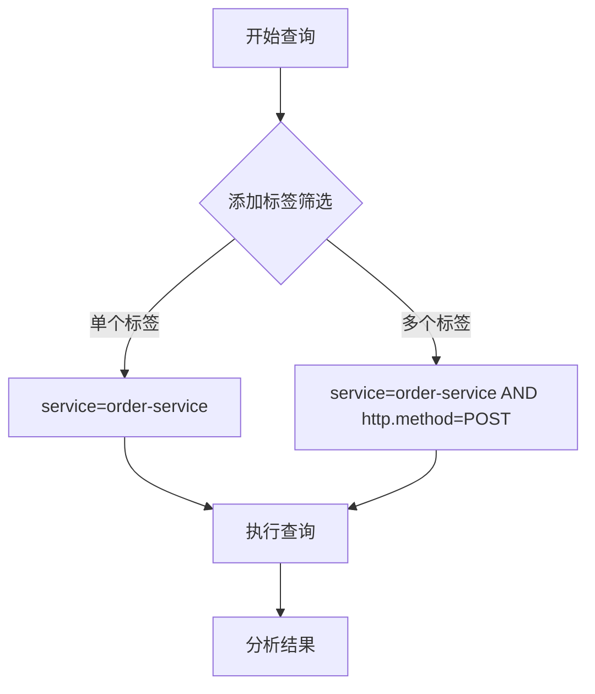

# 标签筛选

## 介绍

在分布式系统中，Jaeger是一个广泛使用的追踪工具，它帮助开发者监控和诊断复杂的微服务架构。标签筛选（Tag Filtering）是Jaeger查询功能的核心部分，允许你通过附加到追踪数据的键值对（标签）来精确查找特定的追踪记录。

标签可以包含各种信息，例如：
- HTTP状态码（如 `http.status_code=200`）
- 服务名称（如 `service=order-service`）
- 自定义业务标识（如 `order_id=12345`）

通过标签筛选，你可以快速定位到感兴趣的追踪数据，而无需手动浏览大量记录。

## 基本语法

在Jaeger的搜索界面中，标签筛选的语法遵循简单的键值格式：

```
<tag_key>=<tag_value>
```

例如，要查找所有由 `user-service` 处理的请求，可以使用：

```
service=user-service
```

### 操作符

除了精确匹配，Jaeger还支持以下操作符：

| 操作符 | 描述               | 示例                     |
|--------|--------------------|--------------------------|
| `=`    | 精确匹配           | `http.method=GET`        |
| `!=`   | 不等于             | `http.status_code!=500`  |
| `>`    | 大于（数值比较）   | `duration>100ms`         |
| `<`    | 小于（数值比较）   | `duration<1s`            |
| `>=`   | 大于等于           | `http.status_code>=400`  |
| `<=`   | 小于等于           | `latency<=200`           |
| `=~`   | 正则表达式匹配     | `error=~"timeout.*"`     |
| `!~`   | 正则表达式不匹配   | `path!~"/health.*"`      |

:::tip
对于包含空格或特殊字符的标签值，建议用引号包裹：`error="not found"`。
:::

## 实际案例

### 案例1：查找错误请求

假设你想查找所有失败的HTTP请求（状态码≥400）：

```
http.status_code>=400
```

### 案例2：组合筛选

你可以组合多个标签来缩小搜索范围。例如，查找 `order-service` 中所有耗时长于500毫秒的 `POST` 请求：

```
service=order-service AND http.method=POST AND duration>500ms
```

### 案例3：正则表达式匹配

查找所有路径包含 `/api/v1` 的请求：

```
path=~"/api/v1.*"
```

## 高级用法

### 逻辑操作符

Jaeger支持 `AND`、`OR` 和 `NOT` 逻辑操作符来构建复杂查询：

```
service=order-service AND (http.method=GET OR http.method=POST) NOT http.status_code=500
```

### 时间范围筛选

结合时间范围筛选可以进一步提高查询效率。例如，查找过去1小时内所有错误：

```
error=true AND startTime>now-1h
```



## 总结

标签筛选是Jaeger中最强大的查询功能之一，能帮助你：
- 快速定位特定服务或操作的追踪数据
- 过滤错误或性能瓶颈
- 通过组合条件实现精确搜索

## 练习建议

1. 尝试在你的Jaeger实例中查找所有耗时超过1秒的请求。
2. 组合服务名称和HTTP方法筛选特定类型的请求。
3. 使用正则表达式匹配包含特定关键词的错误信息。

## 附加资源

- [Jaeger官方文档：查询语法](https://www.jaegertracing.io/docs/latest/features/#search)
- [分布式追踪实战指南](https://example.com/tracing-guide)（虚构链接，替换为实际资源）