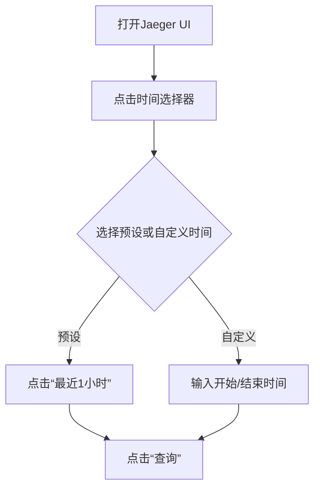

# 时间范围查询

## 介绍

在分布式系统的调试过程中，Jaeger的**时间范围查询**功能允许你根据特定的时间窗口筛选追踪数据。这对于分析特定时间段内的系统行为（如性能下降或错误激增）至关重要。本文将介绍时间范围查询的基本操作、语法及实际应用场景。

---

## 基础概念

Jaeger的时间范围查询通过以下两个参数定义：
1. **开始时间**：查询的起始时间点（UTC或本地时间）。
2. **结束时间**：查询的终止时间点。

:::note
时间格式通常支持：
- 绝对时间（如 `2023-10-01 14:00:00`）
- 相对时间（如 `now-1h` 表示当前时间往前推1小时）
:::

---

## 查询方法

### 1. 通过Jaeger UI操作
在Jaeger的Web界面中，时间范围选择器位于页面顶部：
1. 点击时间选择框。
2. 选择预设范围（如“最近15分钟”）或自定义输入时间。
3. 点击“查询”按钮执行筛选。



### 2. 通过API调用
Jaeger提供HTTP API以编程方式查询数据。以下示例使用 `curl` 查询最近30分钟的追踪数据：

```bash
curl -X GET "http://jaeger-host:16686/api/traces?start=<timestamp_start>&end=<timestamp_end>&service=my-service"
```

- 将 `<timestamp_start>` 和 `<timestamp_end>` 替换为Unix时间戳（单位：微秒）。
- 示例输出（JSON片段）：

```json
{
  "data": [
    {
      "traceID": "abc123",
      "spans": [
        {
          "operationName": "GET /api/data",
          "startTime": 1698762000000,
          "duration": 450
        }
      ]
    }
  ]
}
```

---

## 实际案例

### 场景：分析订单服务延迟
假设你的电商网站在 `2023-10-01 10:00` 到 `10:15` 期间出现订单提交延迟：
1. 在Jaeger UI中设置时间范围为 `2023-10-01 10:00:00` 至 `10:15:00`。
2. 筛选服务名称为 `order-service`。
3. 发现高延迟的追踪数据后，展开查看具体Span的耗时和错误信息。

:::tip
结合**标签筛选**（如 `http.status_code=500`）可以进一步缩小问题范围。
:::

---

## 总结

- 时间范围查询是Jaeger中定位时效性问题的核心功能。
- 支持UI交互和API调用两种方式。
- 实际应用中需结合其他筛选条件（如服务名称、标签）提高效率。

## 下一步

- **练习**：尝试查询你本地Jaeger实例中过去1小时的错误追踪。
- **扩展阅读**：
  - [Jaeger官方文档：查询语法](https://www.jaegertracing.io/docs/latest/features/#search)
  - 学习如何使用`tags`和`operationName`优化查询。