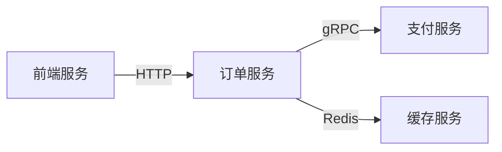

# 依赖分析

## 介绍

在分布式系统中，服务之间的依赖关系错综复杂。**依赖分析**（Dependency Analysis）是通过追踪工具（如Jaeger）可视化服务调用链，帮助开发者理解系统拓扑、定位性能瓶颈或故障源的技术。对于初学者而言，掌握依赖分析是优化微服务架构的第一步。

:::note 为什么需要依赖分析？
- 发现隐藏的服务调用路径
- 识别单点故障风险
- 优化不必要的跨服务调用
:::

## 基础概念

### 1. 服务依赖图
Jaeger将采集的Span数据聚合为**有向图**，其中：
- **节点**代表服务
- **边**代表调用关系（含调用频率/延迟指标）



### 2. 关键指标
分析依赖时需关注：
- **吞吐量**：单位时间调用次数
- **错误率**：失败调用占比
- **延迟分布**：P50/P95/P99延迟

## 实战演示

### 步骤1：生成测试数据
使用OpenTelemetry生成模拟调用链：

```python
# 模拟订单服务调用支付服务
from opentelemetry import trace
tracer = trace.get_tracer("order.service")

with tracer.start_as_current_span("process_order") as span:
    # 添加依赖标签
    span.set_attribute("dependency.service", "payment")
    span.set_attribute("call.type", "grpc")
    # 模拟业务逻辑
    print("调用支付服务...")
```

### 步骤2：Jaeger UI查看
1. 访问 `http://localhost:16686`
2. 在"Dependencies"标签页查看：
   - 服务矩阵（Service Matrix）
   - 火焰图（Flame Graph）

:::tip 观察技巧
点击特定边可查看：
- 平均延迟
- 请求量趋势
- 错误请求示例
:::

## 真实案例

### 电商系统优化
某电商平台发现**商品详情页加载缓慢**，通过Jaeger依赖分析发现：

1. **问题**：详情服务同时调用了
   - 库存服务（必需）
   - 推荐服务（非必需）
   - 评论服务（可异步加载）

2. **优化**：
   ```mermaid
   graph TD
     before[详情服务] -->|同步| 库存
     before -->|同步| 推荐
     before -->|同步| 评论
     after[详情服务] -->|同步| 库存
     after -->|异步| 推荐
     after -->|MQ| 评论
   ```
3. **结果**：P99延迟从1200ms降至400ms

## 总结

### 关键收获
- 依赖分析揭示系统真实拓扑
- 重点关注高频/高延迟调用边
- 结合业务上下文判断合理性

### 扩展练习
1. 在本地启动Jaeger，记录一个包含3个服务的调用链
2. 尝试找出其中可以优化的依赖关系
3. 使用Service Matrix对比优化前后指标

### 延伸阅读
- [Jaeger官方文档 - 依赖分析](https://www.jaegertracing.io/docs/latest/dependencies/)
- 《分布式系统观测：从理论到实践》第5章