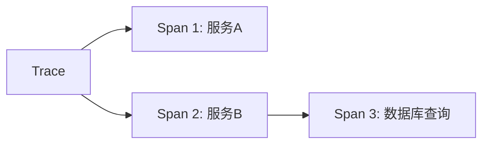
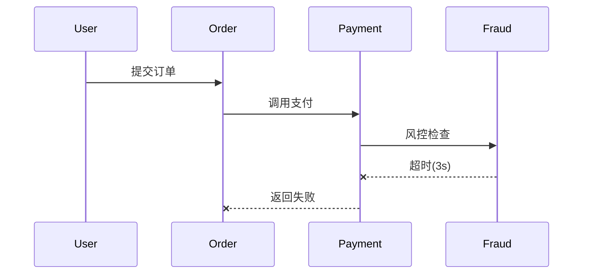

# 关联查询

## 介绍
关联查询（Correlation Query）是分布式追踪系统中的关键功能，它允许开发者通过特定条件（如Trace ID、标签等）将多个独立的追踪数据关联起来。在Jaeger中，这一功能能帮助您理解跨服务的请求流转路径，尤其适用于微服务架构下的故障排查和性能分析。

:::tip 为什么需要关联查询？
当用户请求在多个服务间跳转时，单个服务日志可能无法反映完整上下文。关联查询通过统一标识符将这些分散的日志串联成完整的"故事线"。
:::

## 核心概念

### 1. Trace与Span的关系


- **Trace**：代表一个完整的请求生命周期
- **Span**：Trace中的单个操作单元，携带`trace_id`作为关联标识

### 2. 常用关联字段
| 字段名       | 作用                          | 示例值                     |
|--------------|-----------------------------|---------------------------|
| `trace_id`   | 全局唯一追踪标识               | `5b7a3b2f1c4d6e8a`        |
| `span_id`    | 当前Span的唯一标识             | `a1b2c3d4e5f6`            |
| `references` | 指向父Span的链接（用于跨服务） | `{ trace_id: '...', ...}` |

## 实际操作

### 基础查询示例
在Jaeger UI的搜索栏输入以下条件查找相关Trace：
```json
{
  "service": "payment-service",
  "tags": {"error": "true"},
  "durationMin": "1s"
}
```

### 跨服务关联案例
假设订单系统出现超时，通过`trace_id`关联查询：
1. 在`order-service`中找到错误Trace ID：`5b7a3b2f1c4d6e8a`
2. 在搜索栏直接输入该ID，查看完整链路：

```text
order-service (500ms) → payment-service (2s!) → inventory-service (200ms)
```

:::warning 注意
确保所有服务都正确传递了`trace_id`上下文，否则关联会中断。常见问题：
- 未配置跨进程的上下文传播
- 异步调用未携带追踪信息
:::

## 高级技巧

### 使用标签过滤
通过业务标签进行二次筛选：
```sql
tag="order_id:12345" AND duration>2s
```

### 对比查询
比较成功与失败请求的差异：
1. 保存正常Trace为基准（`trace_id_A`）
2. 搜索异常Trace（`trace_id_B`）
3. 在对比视图中分析Span耗时差异

## 真实场景应用

**电商系统故障排查**：
1. 用户投诉支付失败
2. 通过`user_id:789`标签过滤
3. 发现链路卡在`payment-service → fraud-detection`
4. 进一步检查fraud-detection的日志，发现风控API超时



## 总结

关键要点：
- 关联查询依赖于正确的`trace_id`传播
- 组合使用标签、服务名、耗时等多维度过滤
- 通过对比分析定位性能瓶颈

## 扩展练习
1. 在本地Jaeger环境中模拟两个相互调用的服务
2. 故意制造一个跨服务错误
3. 尝试通过以下方式定位问题：
   - Trace ID直接查询
   - 业务标签过滤
   - 耗时排序

:::note 进一步学习
- Jaeger官方文档：分布式上下文传播
- OpenTelemetry的Baggage机制
- 分布式追踪的采样策略
:::