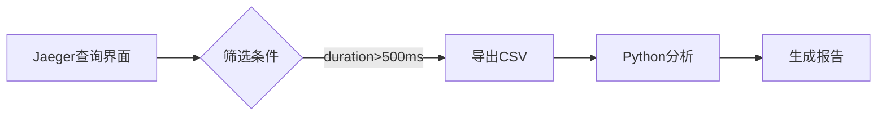

# 数据导出选项

## 介绍

在分布式系统调试中，Jaeger的追踪数据是宝贵的分析资源。通过**数据导出**功能，您可以将这些数据保存为结构化格式（如JSON或CSV），用于离线分析、报告生成或与其他工具集成。本指南将详细介绍Jaeger的导出选项及其实际应用。

## 支持的导出格式

Jaeger支持以下常见格式：
1. **JSON**：保留完整的追踪元数据，适合程序化处理。
2. **CSV**：表格形式，便于用Excel或数据分析工具处理。
3. **Trace Zipkin格式**：与其他追踪系统兼容。

:::tip
导出前请确保您有足够的存储空间，尤其是处理大量追踪数据时。
:::

## 如何导出数据

### 1. 通过Jaeger UI导出
在查询结果页面，点击**Export**按钮选择格式：

```json
// 示例：导出的JSON片段
{
  "traceID": "3a2a1b5c4d3e2f1a",
  "spans": [
    {
      "operationName": "HTTP GET /api",
      "startTime": "2023-05-01T12:00:00Z",
      "duration": 150
    }
  ]
}
```

### 2. 使用Jaeger API（编程方式）
通过Jaeger的HTTP API获取原始数据：

```bash
curl -X GET "http://jaeger-host:16686/api/traces/<traceID>" \
  -H "Accept: application/json" > trace.json
```

## 实际案例

### 场景：性能报告生成
1. 导出某服务的慢请求（>500ms）为CSV
2. 使用Python pandas分析：
```python
import pandas as pd
df = pd.read_csv('slow_requests.csv')
print(df.groupby('endpoint')['duration'].mean())
```



## 总结

通过数据导出，您可以：
- 长期保存重要追踪记录
- 与其他团队共享分析结果
- 集成到自定义监控流程中

## 延伸学习
- 尝试用`jq`工具处理导出的JSON：`jq '.spans[] | select(.duration > 100)' trace.json`
- 阅读[Jaeger官方文档](https://www.jaegertracing.io/docs/)中的API参考