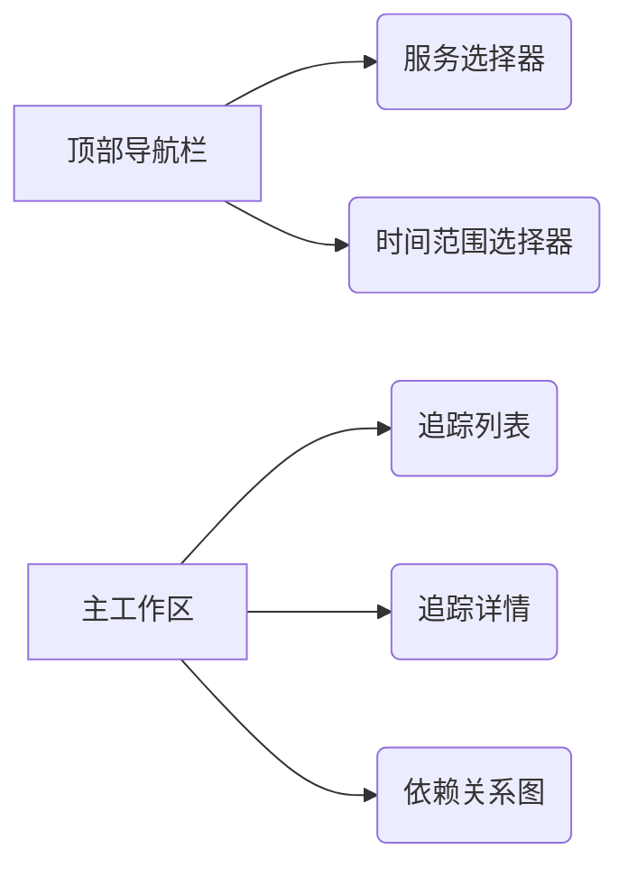
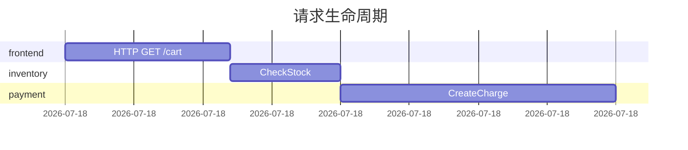
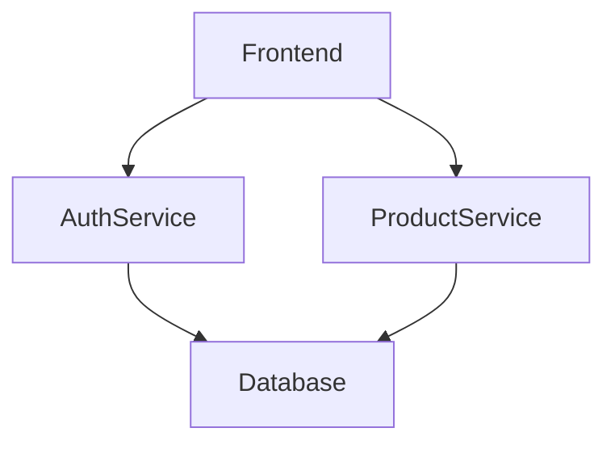

# Jaeger 可视化 - UI界面介绍

Jaeger是一个开源的分布式追踪系统，用于监控和排查微服务架构中的性能问题。其可视化界面提供了直观的数据展示和交互式分析功能，是开发者排查问题的关键工具。本文将详细介绍Jaeger UI的核心功能和操作方法。

## 界面概览

Jaeger UI主要由以下功能区域组成：



## 核心功能详解

### 1. 服务选择与时间范围

在界面顶部，您可以通过以下方式筛选数据：
- **服务下拉菜单**：选择要查看的微服务（如 `frontend`、`backend`）
- **时间选择器**：设置查询的时间范围（默认最近1小时）

:::tip 实践建议
尝试组合不同的服务和时间范围，观察不同负载情况下的追踪数据变化。
:::

### 2. 追踪列表视图

查询结果会以列表形式展示，包含关键信息：
```plaintext
| 时间戳          | 服务      | 操作名称       | 持续时间 | 错误标记 |
|-----------------|-----------|----------------|----------|----------|
| 2023-08-20 14:30 | frontend  | /checkout      | 450ms    | ✓        |
| 2023-08-20 14:29 | payment   | ProcessPayment | 320ms    |          |
```

点击任意行可展开追踪详情。

### 3. 追踪详情分析

单个追踪的详细视图包含以下关键部分：

#### 时间线视图（Timeline）


#### 标签信息
展示Span的元数据，例如：
```json
{
  "http.method": "GET",
  "http.status_code": 200,
  "component": "gin"
}
```

### 4. 依赖关系图

通过 `Dependencies` 标签页可以查看服务间调用关系：


## 实际案例分析

**场景**：用户报告结账流程缓慢

1. 在服务选择器中选择 `frontend` 和 `checkout-service`
2. 设置时间范围为问题发生时段
3. 在追踪列表中筛选错误标记（红色感叹号图标）
4. 分析异常追踪的时间线，发现：
   - 支付服务调用耗时占整个流程的70%
   - 多次出现HTTP 500错误

:::caution 注意
发现某个服务出现规律性延迟时，应检查该服务的资源监控指标（CPU/内存）和日志。
:::

## 高级功能

### 对比模式
选中两个追踪后，使用 `Compare` 按钮可以并排对比时间线差异。

### 系统架构验证
通过依赖关系图可以验证实际调用链路是否符合设计预期，特别适用于：
- 新服务上线验证
- 架构变更后的调用链检查

## 总结

Jaeger UI通过可视化方式将复杂的分布式追踪数据转化为直观的：
- 时间线图表
- 服务依赖拓扑
- 错误热点标记

这些功能帮助开发者快速定位性能瓶颈和异常根源。

## 延伸学习

建议下一步探索：
1. 在本地使用 `docker-compose` 启动Jaeger进行实验
2. 尝试集成到您的开发环境中（参考官方集成文档）
3. 结合Prometheus指标数据进行综合分析

:::note 练习任务
在测试环境中人为制造以下场景，然后使用Jaeger进行分析：
1. 在某个服务中添加200ms延迟
2. 模拟一个服务返回500错误
3. 观察这些异常如何在UI中展现
:::