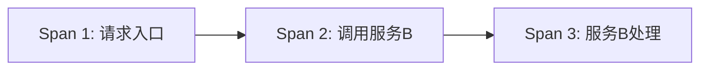

# 追踪视图详解

## 介绍

在现代分布式系统中，一个用户请求可能会跨越多个服务。Jaeger的**追踪视图**（Trace View）通过可视化请求的完整生命周期，帮助你理解请求的流转路径、各阶段的耗时以及潜在问题。本文将详细介绍Jaeger追踪视图的组成部分、如何解读数据，并通过实际案例演示其应用。

## 追踪视图的核心概念

### 1. 什么是追踪（Trace）？
一个**追踪**代表一个完整的请求流程，由多个**跨度（Span）**组成。每个跨度对应请求在某个服务中的操作，例如：
- 服务A接收请求（Span 1）
- 服务A调用服务B（Span 2）
- 服务B处理请求（Span 3）



### 2. 追踪视图的组成部分
Jaeger的追踪视图包含以下关键区域：
1. **时间轴**：水平展示所有跨度的开始时间和持续时间。
2. **跨度列表**：按层级展示所有跨度及其元数据（如服务名、操作名、耗时）。
3. **详情面板**：点击跨度后显示标签（Tags）、日志（Logs）等详细信息。

:::note
标签（Tags）是跨度的关键元数据，例如 `http.status_code=200`，而日志（Logs）记录特定时间点的事件，如错误信息。
:::

---

## 实际案例解析

### 案例：电商订单请求
假设用户下单时，请求依次经过以下服务：
1. `API Gateway`（入口）
2. `Order Service`（创建订单）
3. `Payment Service`（处理支付）

在Jaeger中，对应的追踪视图如下：

```mermaid
gantt
  title 订单请求追踪时间轴
  dateFormat X
  axisFormat %s
  section API Gateway
  网关处理 : 0, 3
  section Order Service
  订单创建 : 3, 5
  section Payment Service
  支付处理 : 5, 8
```



#### 关键观察点：
- **耗时分析**：支付处理耗时最长（3秒），可能需要优化。
- **错误标识**：如果某个跨度标记为红色（如`http.status_code=500`），说明该步骤失败。

---

## 如何解读跨度详情

点击任意跨度后，详情面板会显示类似以下信息：
```json
{
  "operation": "POST /payment",
  "duration": "3.2s",
  "tags": {
    "http.method": "POST",
    "http.status_code": "200"
  },
  "logs": [
    {
      "timestamp": "2023-01-01T12:00:03Z",
      "fields": { "event": "Payment processed" }
    }
  ]
}
```

:::tip
通过 `tags` 可以快速定位问题，例如：
- `error=true` 表示当前跨度发生了错误。
- `db.statement` 显示数据库查询语句，帮助分析慢查询。
:::

---

## 总结

Jaeger的追踪视图通过可视化请求链路，帮助你：
1. **定位瓶颈**：识别耗时最长的服务或操作。
2. **调试错误**：通过跨度的标签和日志快速定位异常。
3. **分析依赖**：理解服务间的调用关系。

### 下一步练习
1. 在你的Jaeger实例中，找一个真实追踪并尝试回答：
   - 哪个服务耗时最长？
   - 是否有错误跨度？错误标签是什么？
2. 使用 `tags` 过滤所有包含 `error=true` 的追踪。

### 附加资源
- [Jaeger官方文档：追踪视图](https://www.jaegertracing.io/docs/)
- 《分布式追踪：原理与实践》书籍（适合深入学习）