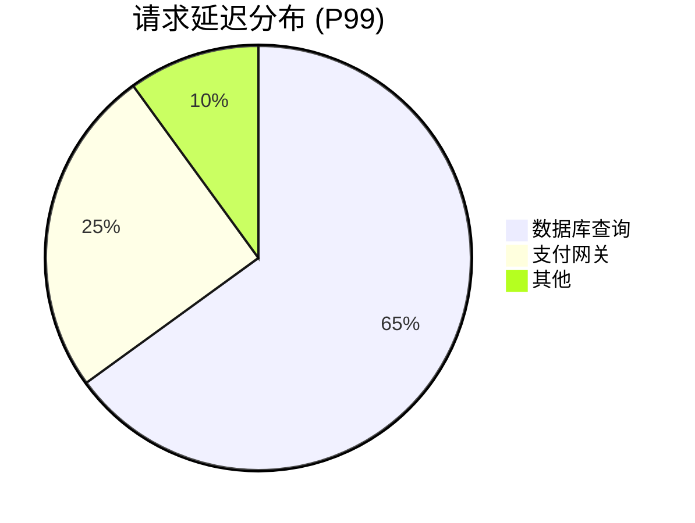

# Jaeger 可视化：关键指标呈现

## 介绍

在分布式系统中，Jaeger作为一款流行的追踪工具，能帮助开发者可视化请求的调用链路。但仅有调用链还不够——**关键指标**（如延迟、吞吐量、错误率）的呈现才是性能优化的核心。本教程将教你如何通过Jaeger的UI和API提取这些指标，并结合实际案例进行分析。

---

## 核心指标解析

Jaeger默认跟踪并展示以下关键指标：

1. **延迟（Latency）**：请求从发起到完成的时间，通常以百分位数（P50/P90/P99）呈现。
2. **吞吐量（Throughput）**：单位时间内处理的请求数（如QPS）。
3. **错误率（Error Rate）**：失败请求占总请求的比例。

:::tip
在Jaeger UI中，这些指标通常隐藏在**Trace详情页**的统计面板中，需要主动展开查看。
:::

---

## 指标获取方式

### 方法1：通过Jaeger UI直接查看
1. 打开一个Trace详情页。
2. 查找标有"Statistics"或"Metrics"的折叠面板。
3. 展开后可见类似如下的数据表：

```text
Duration (P50): 120ms
Duration (P99): 450ms
Requests/sec: 42
Error Rate: 0.8%
```

### 方法2：通过Jaeger API编程获取
使用Jaeger的查询API提取指标数据（示例为Python）：

```python
import requests

# 查询最近1小时的服务延迟指标
response = requests.get(
    "http://jaeger-query:16686/api/metrics",
    params={
        "service": "your-service",
        "metric": "latency",
        "groupByOperation": "true",
        "endTs": "now",
        "lookback": "1h"
    }
)
print(response.json())  # 输出包含P50/P90/P99延迟数据
```

---

## 实际案例：电商系统性能分析

假设一个电商网站的`/checkout`接口变慢，通过Jaeger分析发现：



通过指标可明确：
1. 数据库查询是主要瓶颈（占65%延迟）
2. 支付网关贡献25%延迟
3. 优化应优先聚焦数据库查询

:::caution
注意：Jaeger的指标是**采样数据**，可能与真实监控系统（如Prometheus）存在偏差。建议交叉验证。
:::

---

## 总结

关键指标呈现帮助你：
- 快速定位性能瓶颈
- 量化优化效果（如优化前后`P99`对比）
- 制定合理的SLA（如"`P99`延迟`<500ms`"）

---

## 延伸练习
1. 在Jaeger UI中找到一个高延迟Trace，记录其P90/P99值。
2. 尝试用API提取你服务的错误率指标。
3. 对比不同时间段的吞吐量变化，分析原因。

:::note
深入学习：推荐阅读Jaeger官方文档的[Metrics Analysis](https://www.jaegertracing.io/docs/)章节。
:::