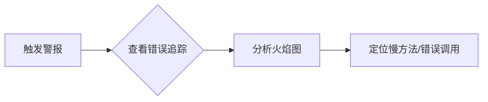

# 警报与异常可视化

## 介绍

在现代分布式系统中，快速识别和响应异常是保障服务可靠性的关键。Jaeger 作为一款流行的分布式追踪工具，不仅提供了请求链路的可视化能力，还支持通过**警报与异常可视化**功能主动发现潜在问题。本文将介绍如何在 Jaeger 中配置警报规则、解读异常指标，并通过实际案例展示其应用场景。

---

## 为什么需要警报与异常可视化？

分布式系统的复杂性使得人工监控变得困难。通过 Jaeger 的警报功能，您可以：
- **自动化监控**：定义规则自动检测异常（如高延迟或错误率激增）。
- **可视化异常**：通过图表直观展示问题发生的上下文。
- **快速定位根因**：结合追踪数据直接跳转到问题链路。

---

## 核心概念

### 1. 警报规则（Alerting Rules）
Jaeger 允许基于以下指标定义警报：
- **错误率**（Error Rate）：HTTP 500 或其他自定义错误的比例。
- **延迟百分位数**（Latency P99）：超过阈值的高延迟请求。
- **吞吐量变化**（Throughput Drop）：请求量突然下降。

#### 示例规则（YAML 格式）
```yaml
rules:
  - name: "High Error Rate"
    condition: "error_rate > 0.05"  # 错误率超过5%
    for: "5m"                      # 持续5分钟触发
    annotations:
      summary: "服务 {{ service }} 错误率过高"
```

### 2. 异常检测方法
Jaeger 支持两种异常检测模式：
- **静态阈值**：直接设定固定值（如 `latency > 500ms`）。
- **动态基线**：基于历史数据自动计算合理范围（需集成 Prometheus 等工具）。

---

## 实战演示

### 案例：电商订单服务异常
假设订单服务的错误率突然从 1% 上升到 10%，Jaeger 的警报流程如下：

1. **触发警报**：规则 `error_rate > 0.05` 被触发。
2. **可视化追踪**：在 Jaeger UI 中查看相关请求的火焰图。
3. **定位问题**：发现错误集中在 `payment_service` 的信用卡校验接口。

#### 关键代码片段
检查支付服务的错误日志：
```go
func ValidateCreditCard(cardNumber string) error {
    if len(cardNumber) != 16 {  // 实际业务中可能更复杂
        return errors.New("invalid card number")
    }
    return nil
}
```

:::tip
在 Jaeger UI 中，您可以通过 `Search` 页面的 `Errors Only` 筛选器快速过滤出所有错误追踪。
:::

---

## 配置步骤

### 1. 启用警报功能（Jaeger + Prometheus）
```yaml
# jaeger-config.yaml
alerting:
  enabled: true
  rules_file: "/etc/jaeger/alert_rules.yaml"
  prometheus:
    host: "http://prometheus:9090"
```

### 2. 定义警报规则
将规则文件挂载到 Jaeger 容器：
```bash
docker run -v ./alert_rules.yaml:/etc/jaeger/alert_rules.yaml jaeger
```

### 3. 查看警报
访问 `http://jaeger-address/alerts` 查看触发的警报列表。

---

## 可视化异常

Jaeger UI 提供以下视图帮助分析：
- **火焰图对比**：将正常与异常追踪叠加显示。
- **时序图表**：展示指标随时间的变化趋势。



---

## 总结

通过 Jaeger 的警报与异常可视化功能，您可以：
- 减少人工监控成本。
- 加速故障排查过程。
- 预防潜在的系统风险。

---

## 延伸学习

1. **练习**：在本地 Jaeger 实例中配置一个延迟警报规则。
2. **扩展阅读**：
   - [Jaeger 官方文档 - Alerting](https://jaegertracing.io/docs/latest/alerting/)
   - 《分布式系统观测：从追踪到警报》

:::caution
生产环境中建议结合日志（如 ELK）和指标系统（如 Prometheus）构建完整的可观测性体系。
:::