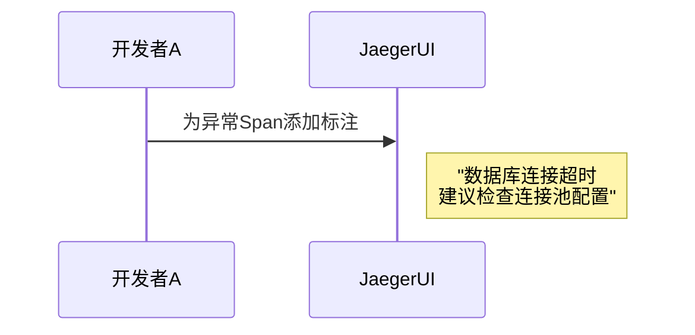

# 团队协作分享

## 介绍

在分布式系统中，Jaeger作为一款开源的端到端分布式追踪工具，能够帮助团队可视化请求链路、分析性能瓶颈。而**团队协作分享**则是通过Jaeger的共享功能，让开发、测试、运维等角色高效协作，快速定位问题。本文将介绍如何利用Jaeger的搜索、标注、共享功能实现团队协作。

:::note 适用场景
- 跨团队排查微服务调用链问题
- 分享关键请求的追踪数据用于代码审查
- 新人通过历史追踪数据学习系统架构
:::

---

## 核心功能

### 1. 搜索与过滤追踪数据
Jaeger提供灵活的搜索条件，团队可以通过服务名、操作名、标签等快速定位目标请求。

```json
// 示例：通过标签搜索耗时超过500ms的请求
{
  "service": "order-service",
  "tags": {"error": "true", "duration": ">500ms"}
}
```

### 2. 添加标注（Annotations）
团队成员可以为关键Span添加注释，记录排查过程中的发现。



---

## 实际案例

### 场景：订单支付超时问题
1. **发现问题**：测试团队在Jaeger中发现 `payment-service` 的 `process` 操作平均耗时2秒。
2. **协作排查**：
   - 开发团队添加标注：`"发现第三方支付API响应慢"`
   - 运维团队补充：`"网络监控显示跨机房延迟高"`
3. **解决方案**：团队决定将支付服务迁移到与API同机房。

:::tip 协作建议
- 使用标准化的标签格式（如 `team:frontend`）
- 定期归档重要追踪数据作为知识库
:::

---

## 代码示例

### 共享追踪链接
Jaeger支持生成永久链接供团队成员访问：

```javascript
// 前端集成示例：生成共享链接
function shareTrace(traceId) {
  const baseUrl = 'https://jaeger.example.com/trace';
  return `${baseUrl}/${traceId}?shared=true`;
}

// 输出示例：https://jaeger.example.com/trace/1a2b3c4d?shared=true
```

---

## 总结

通过Jaeger实现团队协作的关键步骤：
1. 使用标准化标签便于搜索
2. 通过标注记录分析过程
3. 分享永久链接进行异步协作
4. 定期复盘高频问题链路

---

## 扩展练习
1. 在本地Jaeger实例中尝试为某个追踪添加标注
2. 模拟团队场景：一人创建问题链路，另一人通过搜索功能定位
3. 探索Jaeger的对比功能（Compare Traces）

:::caution 注意事项
- 敏感数据需脱敏后再分享
- 生产环境建议配置访问权限控制
:::