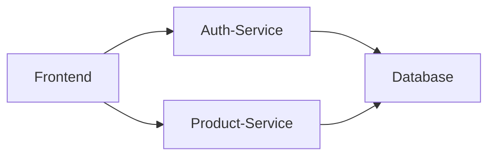
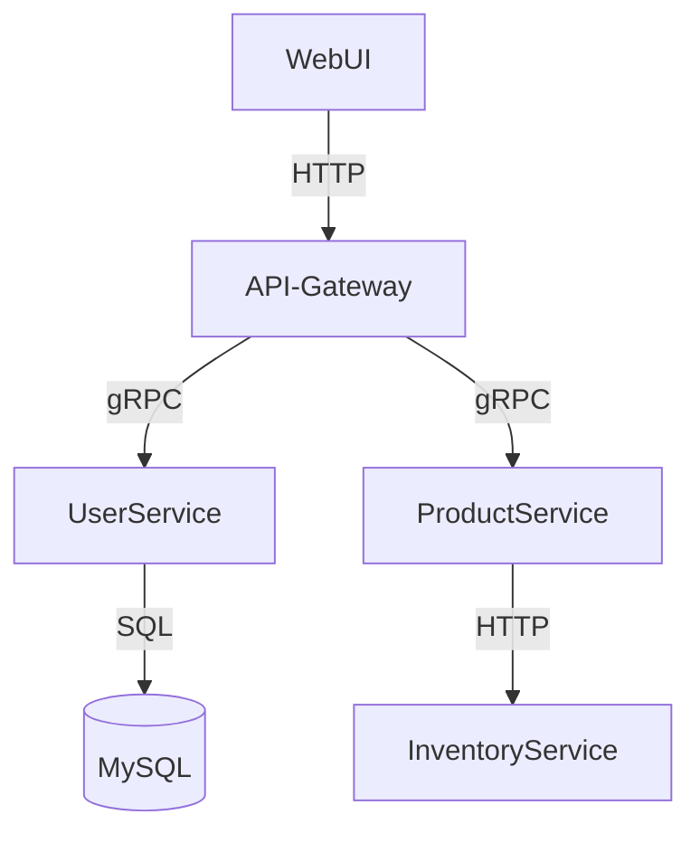

# 依赖图分析

## 介绍

在分布式系统中，服务之间的依赖关系往往错综复杂。**依赖图分析**通过可视化服务间的调用链路，帮助开发者快速理解系统架构、定位性能瓶颈或故障点。Jaeger作为流行的分布式追踪工具，提供了直观的依赖图（Dependency Graph）功能，将抽象的服务调用转化为图形化展示。

## 基础概念

依赖图由以下元素组成：
1. **节点（Node）**：代表一个独立服务（如`user-service`或`payment-service`）。
2. **边（Edge）**：表示服务间的调用关系，箭头方向即调用方向。
3. **权重**：边的粗细或颜色可能反映调用频率或延迟。



## 如何在Jaeger中查看依赖图

1. 打开Jaeger UI，进入`Dependencies`选项卡。
2. 选择时间范围（如最近1小时）。
3. 系统会自动生成动态依赖图。

:::tip
如果依赖图为空，请确保：
- 服务已正确上报追踪数据
- 时间范围选择合理
:::

## 实际案例分析

假设我们有一个电商系统，其依赖图如下：



通过该图可发现：
- `API-Gateway`是核心枢纽
- `ProductService`依赖外部的`InventoryService`
- 所有用户数据最终存入`MySQL`

## 代码示例：生成追踪数据

以下是一个Python服务的示例，使用OpenTelemetry生成追踪数据：

```python
from opentelemetry import trace
from opentelemetry.sdk.trace import TracerProvider
from opentelemetry.sdk.trace.export import BatchSpanProcessor
from opentelemetry.exporter.jaeger.thrift import JaegerExporter

# 初始化追踪
provider = TracerProvider()
jaeger_exporter = JaegerExporter(
    agent_host_name="localhost",
    agent_port=6831,
)
provider.add_span_processor(BatchSpanProcessor(jaeger_exporter))
trace.set_tracer_provider(provider)

# 创建跨服务调用
tracer = trace.get_tracer(__name__)
with tracer.start_as_current_span("process_order") as span:
    span.set_attribute("service", "order-service")
    # 调用其他服务...
```

## 依赖图的典型应用场景

1. **架构审查**：新成员快速理解系统结构
2. **故障排查**：当`PaymentService`失败时，发现它调用了有问题的`FraudDetectionService`
3. **性能优化**：识别高频调用链路（如`A → B → C → D`的深嵌套）

:::warning 注意
依赖图展示的是**实际发生的调用**，而非设计文档中的理想状态。可能会发现意外的依赖关系！
:::

## 总结

通过Jaeger的依赖图分析，你可以：
- 可视化服务间实时交互
- 识别单点故障风险
- 验证架构变更效果

## 扩展练习

1. 在本地部署Jaeger，上报两个相互调用的服务数据
2. 尝试找出图中最长的调用链路
3. 思考：如果`ServiceA`调用`ServiceB`，而`ServiceB`又回调`ServiceA`，图中会如何显示？

## 附加资源

- [Jaeger官方文档 - 依赖分析](https://www.jaegertracing.io/docs/latest/dependencies/)
- 《分布式系统观测：可观测性实践指南》第5章