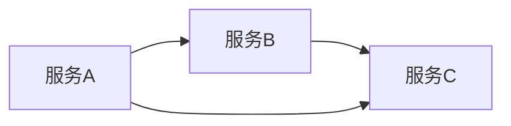
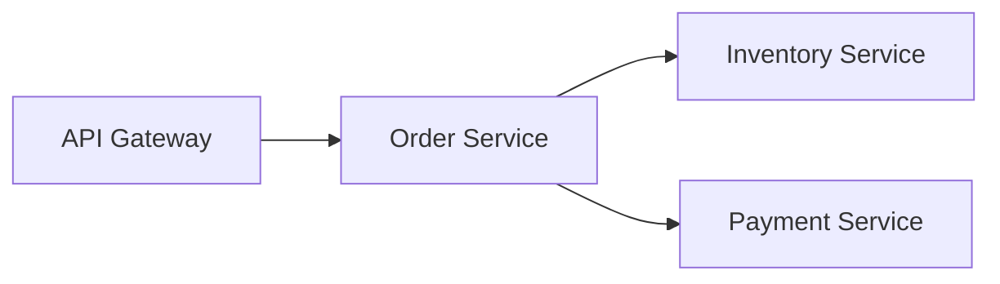

# DAG视图理解

## 介绍

在分布式系统的监控和调试中，**DAG（有向无环图）视图**是一种强大的可视化工具，它能清晰地展示服务之间的调用关系和依赖。Jaeger作为流行的分布式追踪系统，提供了DAG视图功能，帮助开发者直观地理解复杂的调用链路。

DAG视图通过节点（服务）和边（调用关系）的组合，避免了循环依赖的混乱，特别适合分析微服务架构中的调用链。本文将逐步介绍DAG视图的核心概念、实际应用和操作方法。

---

## 基础概念

### 什么是DAG？
- **有向**：边（箭头）有明确方向，表示调用从A到B。
- **无环**：不允许循环调用（如A→B→C→A），否则会导致无限递归。
- **图**：由节点（服务）和边（RPC/HTTP调用等）组成的拓扑结构。



### DAG视图的作用
1. **快速定位瓶颈**：识别高延迟的调用边。
2. **发现异常依赖**：如非预期的跨服务调用。
3. **优化架构**：减少冗余调用或循环依赖。

---

## 在Jaeger中使用DAG视图

### 步骤1：打开追踪数据
在Jaeger UI中选择一个追踪记录，点击 **"DAG"** 选项卡（通常在"Trace Timeline"旁边）。

### 步骤2：解读图表
- **节点**：显示服务名称和耗时比例。
- **边**：显示调用耗时和状态码（如HTTP 200/500）。
- **颜色**：红色边可能表示错误或高延迟。

:::tip
悬停节点或边可查看详细指标，如请求量、P99延迟等。
:::

---

## 实际案例

### 场景：电商订单流程
假设一个订单请求依次调用以下服务：
1. `API Gateway` → `Order Service`（创建订单）
2. `Order Service` → `Inventory Service`（扣减库存）
3. `Order Service` → `Payment Service`（处理支付）

在Jaeger中的DAG视图如下：


**发现问题**：若 `Inventory Service` 节点显示红色且耗时占比高，可能表明库存数据库查询需要优化。

---

## 代码示例（模拟追踪数据）

以下是一个OpenTelemetry生成的模拟追踪数据片段，展示如何关联到DAG视图：

```python
from opentelemetry import trace
from opentelemetry.sdk.trace import TracerProvider

provider = TracerProvider()
trace.set_tracer_provider(provider)

tracer = trace.get_tracer("order.process")

with tracer.start_as_current_span("API Gateway") as gateway_span:
    with tracer.start_as_current_span("Order Service", parent=gateway_span) as order_span:
        with tracer.start_as_current_span("Inventory Service", parent=order_span):
            pass  # 模拟库存调用
        with tracer.start_as_current_span("Payment Service", parent=order_span):
            pass  # 模拟支付调用
```

**输出效果**：在Jaeger中会生成与前述案例相同的DAG结构。

---

## 总结

DAG视图通过图形化展示服务调用链路，显著提升了分布式系统的可观测性。关键要点：
1. 节点和边的含义及颜色编码。
2. 如何通过DAG快速定位性能问题。
3. 结合实际业务场景分析依赖关系。

### 延伸练习
1. 在Jaeger中找一个真实追踪，尝试用DAG视图分析关键路径。
2. 思考：如果发现 `A→B→A` 的循环调用，该如何重构？

### 附加资源
- [Jaeger官方文档：DAG视图](https://www.jaegertracing.io/docs/1.0/ui/#dag-view)
- 《分布式系统观测：DAG与拓扑分析》- O'Reilly