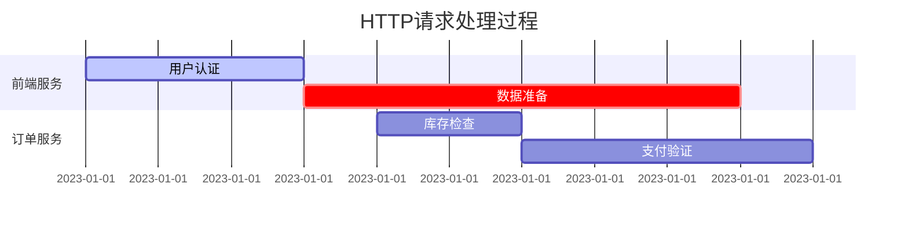

# 时间轴分析

## 介绍

时间轴分析（Timeline Analysis）是分布式系统调试中的核心工具，它通过可视化请求在多个服务间的流转过程，帮助开发者快速定位性能瓶颈或错误源头。在Jaeger中，时间轴以直观的横条图形式展示，每个跨服务的操作（Span）会标注其开始时间、持续时间和层级关系。

:::tip 为什么需要时间轴？
- 发现高延迟的调用链环节
- 验证异步任务是否按预期并行执行
- 识别不合理的串行调用模式
:::

## 基础概念

### Span时间轴

Jaeger中的每个Span代表一个独立的工作单元，其时间轴包含以下关键信息：



### 关键时间指标

1. **Duration**：Span从开始到结束的总时间
2. **Self Time**：排除子Span后的实际处理时间
3. **Clock Skew**：跨服务器的时间同步差异

## 实战分析

### 案例：电商下单流程

假设用户下单后出现响应缓慢，我们通过Jaeger捕获到以下Trace：

```json
{
  "traceID": "3a4b5c6d",
  "spans": [
    {
      "spanID": "a1",
      "operationName": "checkout",
      "startTime": 1620000000000,
      "duration": 1200,
      "references": []
    },
    {
      "spanID": "a2",
      "operationName": "inventory_check",
      "startTime": 1620000000100,
      "duration": 800,
      "references": [{ "refType": "CHILD_OF", "traceID": "3a4b5c6d", "spanID": "a1" }]
    }
  ]
}
```

在Jaeger UI中会显示：

1. 主Span（checkout）总耗时1200ms
2. 子Span（inventory_check）耗时800ms
3. 计算得主Span自身处理时间：1200 - 800 = 400ms

:::caution 常见问题
如果发现多个Span完全串行且无重叠，可能表明：
- 未正确使用异步调用
- 存在不必要的同步等待
:::

## 高级技巧

### 并行化识别

健康的时间轴应显示多个Span的时间段存在重叠：

```mermaid
gantt
    title 优化后的并行调用
    section 服务A
    主请求 :a1, 2023-01-01T10:00:00, 500ms
    section 服务B
    子调用1 :a2, 2023-01-01T10:00:100, 200ms
    section 服务C
    子调用2 :a3, 2023-01-01T10:00:100, 300ms
```

### 时钟偏移修正

当发现子Span的开始时间早于父Span时：

```python
# 在Jaeger查询中使用时钟偏移校正
query = {
  "operation": "checkout",
  "adjustClockSkew": True  # 自动修正时间偏差
}
```

## 总结

时间轴分析能帮助你：
✓ 可视化微服务调用路径
✓ 量化每个环节的时间消耗
✓ 识别非预期的串行/同步操作

**延伸练习**：
1. 在本地Jaeger中导入示例Trace数据
2. 尝试计算三个嵌套Span的总耗时和自耗时
3. 找出时间轴上完全重叠的Span组

**推荐资源**：
- Jaeger官方文档《Trace Analysis》
- 《Distributed Systems Observability》Chapter 4