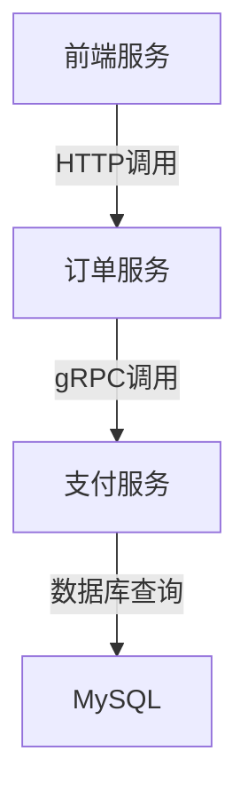

# 服务性能视图

## 介绍

在现代分布式系统中，服务性能监控是确保系统稳定性和高效性的关键。Jaeger作为一个开源的分布式追踪系统，提供了强大的**服务性能视图**功能，帮助开发者直观地理解服务间的调用关系、延迟分布以及潜在的性能瓶颈。本文将带你逐步探索Jaeger的服务性能视图，并通过实际案例展示其应用场景。

## 什么是服务性能视图？

服务性能视图是Jaeger提供的一种可视化工具，用于展示服务的调用链路、响应时间、错误率等关键指标。它通过图表和统计数据，帮助你快速定位性能问题，例如：
- 高延迟的服务调用
- 频繁出现的错误请求
- 服务间的依赖关系

## 核心功能

### 1. 服务依赖图
Jaeger的服务依赖图展示了系统中各服务之间的调用关系。以下是一个简单的Mermaid图表示例：



:::tip
依赖图能帮助你发现不必要的服务调用或循环依赖，从而优化架构设计。
:::

### 2. 延迟分布直方图
Jaeger会将请求的延迟分布以直方图形式展示。例如：
- 50%的请求在100ms内完成
- 95%的请求在500ms内完成
- 最慢的1%请求超过1s

### 3. 错误率统计
服务性能视图还会标记出失败请求的比例和具体原因（如HTTP 500错误或超时）。

---

## 实际操作示例

### 场景：分析电商系统的订单流程
假设你的电商系统中，用户抱怨“下单慢”。以下是使用Jaeger排查的步骤：

1. **打开Jaeger UI**，选择“Service Performance”视图。
2. 在服务列表中选择`order-service`。
3. 查看延迟分布，发现95%的请求延迟在200ms以内，但少量请求超过2s。
4. 点击“Trace”按钮，筛选高延迟的请求，发现它们都调用了`payment-service`。
5. 进一步分析`payment-service`的性能视图，发现其数据库查询是瓶颈。

:::note
实际代码中，你可以通过Jaeger的客户端库（如`jaeger-client`）手动标记关键操作：
```javascript
const span = tracer.startSpan('process_payment');
// 业务逻辑...
span.finish();
```
:::

---

## 真实案例

### 案例：优化社交媒体应用的Feed加载
某社交平台发现Feed加载时间从平均500ms上升到了1.2s。通过Jaeger的服务性能视图，团队发现：
1. 主要延迟来自`user-profile-service`的缓存未命中。
2. 次级问题是`friend-service`的批量查询效率低下。

优化方案：
- 为`user-profile-service`增加二级缓存。
- 重构`friend-service`的查询为并行模式。

优化后，Feed加载时间降低至600ms。

---

## 总结

Jaeger的服务性能视图是分析和优化分布式系统性能的利器。通过它，你可以：
- 可视化服务依赖关系
- 定位高延迟或高错误率的服务
- 基于数据制定优化策略

## 下一步

1. **动手练习**：在你的测试环境中部署Jaeger，追踪一个简单微服务的性能。
2. **扩展阅读**：
   - Jaeger官方文档中的[高级查询技巧](https://www.jaegertracing.io/docs/)
   - 《分布式系统观测性》第三章（性能分析工具对比）

:::caution
生产环境中使用Jaeger时，注意采样率的设置，避免因数据量过大影响系统性能。
:::