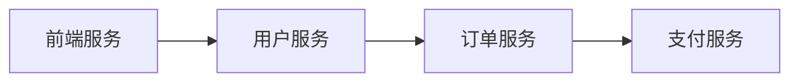
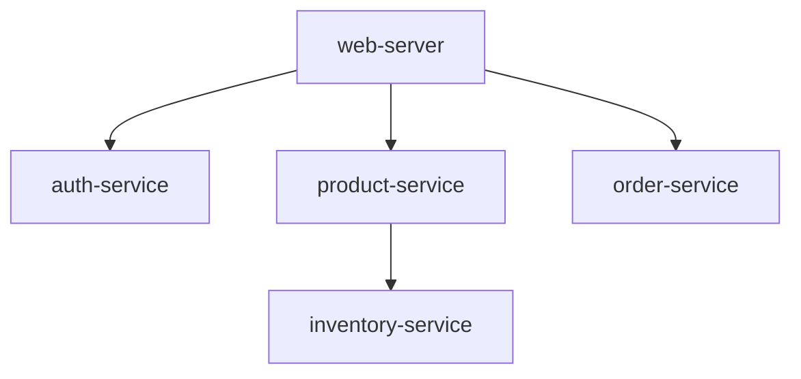

# 系统拓扑图

## 介绍

系统拓扑图（System Topology）是分布式系统监控中的重要工具，它通过图形化的方式展示服务之间的调用关系和依赖。在Jaeger中，拓扑图基于追踪数据自动生成，帮助开发者直观理解系统的整体架构和流量走向。

:::tip 为什么需要拓扑图？
- **可视化依赖**：快速发现服务间的层级关系
- **故障定位**：识别异常调用链路
- **性能分析**：发现高延迟的通信路径
:::

## 基础概念

### 节点与边



- **节点**：代表系统中的独立服务（如上图的`前端服务`）
- **边**：表示服务间的调用关系，箭头方向即调用方向

### 关键指标

Jaeger拓扑图中常见的可视化元素：
- 节点大小：反映请求量或错误率
- 边颜色/粗细：表示延迟或吞吐量
- 状态标识：健康（绿色）/警告（黄色）/错误（红色）

## 实战案例

### 场景：电商系统拓扑分析

假设我们有一个包含以下服务的电商系统：
1. `web-server`：处理用户请求
2. `auth-service`：负责认证
3. `product-service`：商品信息
4. `inventory-service`：库存管理

通过Jaeger收集的追踪数据，自动生成的拓扑图可能如下：



### 异常识别示例

当`inventory-service`出现高延迟时，拓扑图会显示：
- `product-service`到`inventory-service`的边变为红色
- 鼠标悬停可查看具体延迟数值

## 代码示例

虽然拓扑图是自动生成的，但我们可以通过Jaeger API获取拓扑数据：

```javascript
// 示例：查询拓扑数据
const response = await fetch('http://jaeger-query/api/topology', {
  method: 'POST',
  headers: { 'Content-Type': 'application/json' },
  body: JSON.stringify({
    start: '2023-01-01T00:00:00Z',
    end: '2023-01-02T00:00:00Z'
  })
});

// 响应数据结构示例
{
  "nodes": [
    { "id": "web-server", "type": "service" },
    { "id": "auth-service", "type": "service" }
  ],
  "edges": [
    { "source": "web-server", "target": "auth-service", "callCount": 1200 }
  ]
}
```

## 最佳实践

1. **时间范围选择**：
   - 高峰期分析：选择业务高峰时段
   - 故障排查：聚焦异常发生时间段

2. **过滤技巧**：
   - 按服务类型过滤
   - 隐藏健康节点（使用Jaeger UI的筛选功能）

3. **关联分析**：
   - 结合具体追踪数据查看问题链路
   - 对比历史拓扑发现架构变化

## 总结

系统拓扑图是理解分布式系统架构的"地图"，通过Jaeger的可视化功能，开发者可以：
- 快速掌握服务依赖关系
- 识别系统瓶颈
- 监控架构健康状态

:::note 延伸学习
1. 尝试在Jaeger中对比不同时间段的拓扑变化
2. 结合具体追踪数据，分析拓扑图中的异常边
3. 使用`jaeger-client`手动上报特定拓扑信息
:::