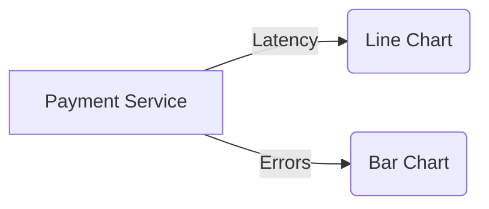

# 自定义仪表板

## 介绍

Jaeger是一个开源的分布式追踪系统，用于监控和排查微服务架构中的问题。通过**自定义仪表板**，你可以更灵活地可视化追踪数据，聚焦关键指标（如延迟、错误率等），从而快速定位性能瓶颈。本教程将指导你逐步创建和管理自定义仪表板。

---

## 为什么需要自定义仪表板？

默认的Jaeger界面提供了基础的搜索和追踪详情功能，但在实际场景中，你可能需要：
- 聚合特定服务的性能指标。
- 对比不同时间段的延迟变化。
- 监控高频错误的端点。

自定义仪表板允许你通过配置图表和筛选条件，实现这些高级需求。

---

## 基础概念

### 1. 数据源
Jaeger的仪表板依赖以下数据：
- **追踪数据（Traces）**：单个请求在分布式系统中的调用链。
- **指标（Metrics）**：如`请求耗时`、`错误次数`等。

### 2. 仪表板组件
一个仪表板通常包含：
- **图表（Graphs）**：折线图、柱状图等。
- **筛选器（Filters）**：按服务、时间范围等筛选数据。
- **统计面板（Stats Panels）**：显示关键指标的汇总。

---

## 创建自定义仪表板

### 步骤1：访问Jaeger UI
打开Jaeger的Web界面（通常为`http://localhost:16686`），进入`Monitor`或`Dashboards`选项卡（取决于版本）。

### 步骤2：新建仪表板
点击`Create Dashboard`，输入名称（例如`Service Performance`）和描述。

### 步骤3：添加图表
以下是一个监控服务延迟的示例配置：

```json
{
  "title": "API Latency (ms)",
  "query": {
    "service": "payment-service",
    "operation": "POST /charge",
    "metrics": ["duration"]
  },
  "type": "line"
}
```

:::note
- `query.service`：指定要监控的服务名。
- `metrics`：选择要展示的指标类型（如`duration`、`error_count`）。
:::

### 步骤4：配置筛选器
添加一个时间范围筛选器，限制数据为最近24小时：

```json
{
  "type": "time_range",
  "default": "last_24h"
}
```

---

## 实际案例

### 场景：电商平台的支付服务监控
假设你想监控`payment-service`的以下指标：
1. 平均延迟。
2. 错误率（HTTP 5xx响应占比）。

#### 仪表板配置
```json
{
  "title": "Payment Service Health",
  "panels": [
    {
      "title": "Average Latency",
      "query": {
        "service": "payment-service",
        "metrics": ["duration"]
      },
      "type": "line"
    },
    {
      "title": "Error Rate",
      "query": {
        "service": "payment-service",
        "metrics": ["error_count"],
        "group_by": ["status_code"]
      },
      "type": "bar"
    }
  ]
}
```

#### 预期效果


---

## 高级功能

### 1. 自定义Prometheus指标
如果Jaeger与Prometheus集成，可以直接查询PromQL：
```json
{
  "query": "rate(payment_service_errors_total[5m])",
  "type": "line"
}
```

### 2. 共享仪表板
导出仪表板的JSON配置，供团队其他成员导入使用。

---

## 总结

通过自定义仪表板，你可以：
- 聚焦关键服务的性能指标。
- 快速识别异常模式（如延迟突增）。
- 与团队共享监控视图。

---

## 练习与资源

### 练习
1. 创建一个仪表板，监控你的服务的`99th百分位延迟`。
2. 添加一个筛选器，仅显示`GET`请求的追踪数据。

### 资源
- [Jaeger官方文档](https://www.jaegertracing.io/docs/)
- [PromQL查询指南](https://prometheus.io/docs/prometheus/latest/querying/basics/)