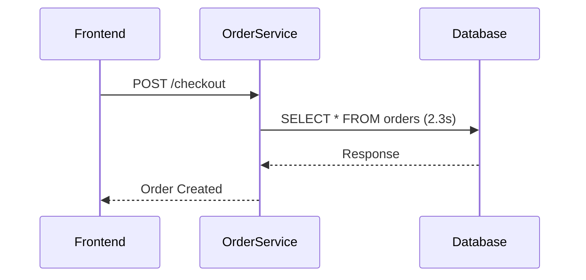
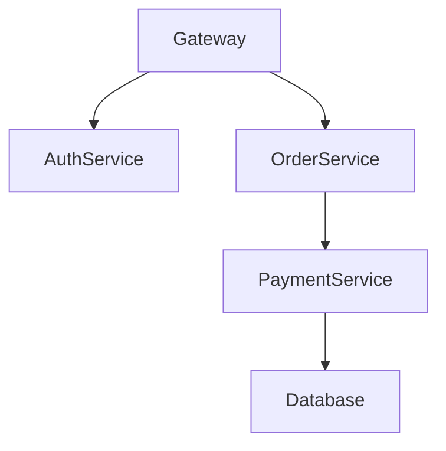

# Jaeger 可视化最佳实践

## 介绍

Jaeger是一个开源的分布式追踪系统，用于监控和排查微服务架构中的性能问题。可视化是Jaeger的核心功能之一，它能将复杂的调用链路转化为直观的图形界面。本文将介绍如何通过最佳实践提升Jaeger的可视化效果，帮助开发者快速定位问题。

:::tip 关键概念
- **Trace（追踪）**：一个完整的请求链路，包含多个Span。
- **Span（跨度）**：代表一个操作单元，包含开始时间、持续时间和标签。
:::

---

## 1. 优化Trace展示

### 使用时间轴缩放
Jaeger默认展示完整Trace的时间轴。通过以下操作提升可读性：
1. 点击时间轴上的 **+/-** 按钮缩放视图。
2. 拖动时间轴选择特定区间。


### 折叠重复调用
对于高频调用的服务（如数据库查询），启用 **"Collapse"** 功能：
```json
// 在Jaeger UI的配置中设置
{
  "collapsePatterns": ["/api/db/query.*"]
}
```

---

## 2. 高效使用标签（Tags）

### 关键标签标记
为Span添加有意义的标签，例如：
```go
span.SetTag("http.method", "GET")
span.SetTag("http.status_code", 200)
span.SetTag("error", true)  // 标记错误
```

### 标签筛选技巧
在Jaeger搜索栏中使用标签语法：
- `http.status_code>=500` 查找错误请求
- `component=redis` 过滤特定组件

:::warning 注意
避免过度使用标签，建议每个Span的标签不超过10个。
:::

---

## 3. 实战案例：电商订单追踪

### 场景描述
用户下单后出现延迟，需分析`/checkout`接口的调用链路。

### 操作步骤
1. 搜索包含`operation=/checkout`的Trace
2. 按持续时间排序，找到最慢的请求
3. 展开Span发现数据库查询耗时占比80%
4. 通过`db.statement`标签定位到未优化的SQL



---

## 4. 高级技巧

### 对比模式
选中两个Trace，点击 **"Compare"** 按钮分析差异：
- 红色标注耗时增加的Span
- 绿色标注优化后的Span

### 服务依赖图
通过 **"Dependencies"** 标签页查看服务间调用关系：


---

## 总结

| 最佳实践              | 效果                     |
|-----------------------|--------------------------|
| 合理缩放时间轴        | 聚焦关键路径             |
| 规范标签命名          | 快速过滤问题Span         |
| 使用对比模式          | 定位性能退化             |

:::note 扩展练习
1. 在本地环境中模拟一个慢请求，尝试通过Jaeger定位瓶颈
2. 为你的服务添加3个业务相关标签（如`user_type=vip`）
:::

**进一步学习**：
- [Jaeger官方文档](https://www.jaegertracing.io/docs/)
- 《分布式追踪实战》第5章