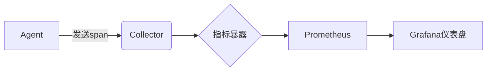

# Jaeger 内部指标

## 介绍

Jaeger作为分布式追踪系统，不仅追踪应用程序的请求流，还通过**内部指标**监控自身的运行状态。这些指标帮助运维人员了解Jaeger组件的健康状态、性能瓶颈和潜在问题。本文将深入解析Jaeger内部指标体系，展示如何利用它们进行系统监控。

:::tip 关键概念
内部指标是Jaeger组件（如Collector、Agent、Query）运行时生成的性能数据，通常通过Prometheus等工具暴露和收集。
:::

## 核心指标分类

Jaeger内部指标主要分为以下几类：

### 1. 处理吞吐量指标
```plaintext
jaeger_collector_spans_received_total
jaeger_collector_traces_received_total
```

### 2. 存储操作指标
```plaintext
jaeger_span_writer_records_total
jaeger_dependencies_written_total
```

### 3. 性能指标
```plaintext
jaeger_collector_save_latency_seconds
jaeger_query_latency_seconds
```

## 指标收集实战

### 配置Prometheus抓取指标

在Jaeger配置文件中启用Prometheus端点：

```yaml
metrics:
  backend: prometheus
  http-route: /metrics
  prometheus:
    namespace: jaeger
```

### 示例指标分析

观察Collector的吞吐量变化：


## 真实案例：诊断性能问题

某电商平台发现追踪数据延迟，通过以下指标定位问题：

1. `jaeger_collector_queue_latency` 显示高延迟
2. `jaeger_storage_spans_written` 速率下降
3. 最终发现是存储层Cassandra节点过载

:::warning 注意
指标异常通常需要结合多个相关指标共同分析，避免单一指标误判。
:::

## 总结与练习

### 关键要点
- Jaeger内部指标反映系统健康状态
- 主要包含吞吐量、存储和性能三类指标
- 通常与Prometheus+Grafana集成使用

### 动手练习
1. 部署Jaeger时启用Prometheus指标
2. 编写Grafana仪表盘监控`spans_received_total`
3. 模拟高负载观察指标变化规律

### 扩展阅读
- Jaeger官方文档的Monitoring章节
- Prometheus指标类型详解
- 分布式系统监控最佳实践