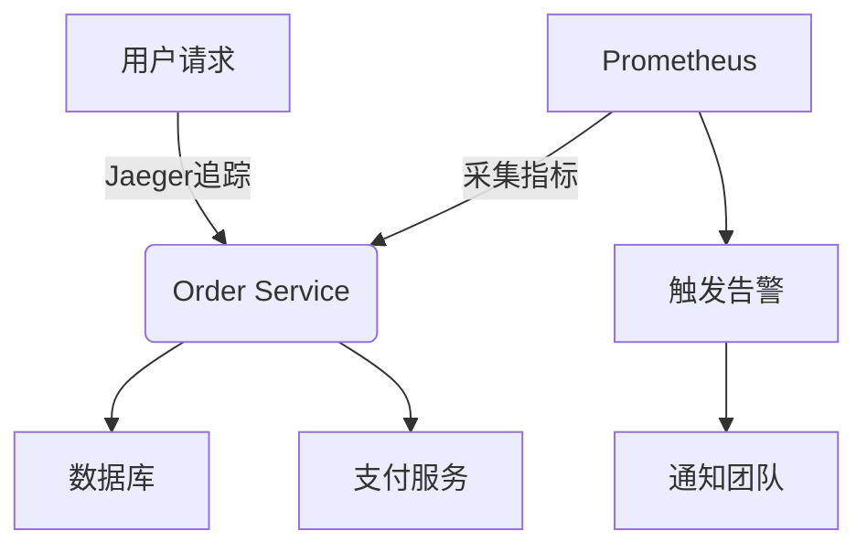

# Prometheus集成

## 介绍

在现代微服务架构中，监控分布式系统的性能至关重要。Jaeger作为分布式追踪系统，能够帮助开发者理解请求在服务间的流转情况，而Prometheus则是监控指标的黄金标准。通过将两者集成，可以实现：

1. 将Jaeger的span和trace数据转化为可监控的指标
2. 在Prometheus中设置基于追踪数据的告警规则
3. 通过Grafana可视化追踪指标

:::tip 为什么需要集成？
单独使用Jaeger时，你只能查看单个请求的追踪数据。而与Prometheus集成后，你能看到全局的性能趋势，比如"过去5分钟有多少请求延迟超过500ms"。
:::

## 基础概念

### Jaeger 指标类型

Jaeger默认会暴露以下Prometheus格式的指标：

- **请求计数**：`jaeger_tracer_requests_total`
- **延迟分布**：`jaeger_tracer_latency_bucket`
- **错误计数**：`jaeger_tracer_errors_total`

### Prometheus数据模型

Prometheus使用四类核心指标：

```text
<metric name>{<label name>=<label value>, ...} <metric value>
```

例如一个Jaeger指标的完整形式：
```text
jaeger_tracer_requests_total{service="order-service", endpoint="/checkout"} 42
```

## 配置集成

### 步骤1：启用Jaeger的Prometheus端点

在Jaeger Collector配置中添加以下设置（以docker-compose为例）：

```yaml
version: '3'
services:
  jaeger-collector:
    image: jaegertracing/jaeger-collector
    command: [
      "--metrics-backend=prometheus",
      "--prometheus.http-server-port=14269"
    ]
    ports:
      - "14269:14269"
```

### 步骤2：配置Prometheus抓取

在Prometheus的`prometheus.yml`中添加job：

```yaml
scrape_configs:
  - job_name: 'jaeger'
    scrape_interval: 15s
    static_configs:
      - targets: ['jaeger-collector:14269']
```

### 步骤3：验证指标

启动服务后，访问Prometheus的Graph界面，输入`jaeger_`前缀应该能看到相关指标：

```text
jaeger_tracer_started_spans_total{service="web-api"} 1024
jaeger_tracer_traces_sampled_total{service="payment-service"} 768
```

## 实际案例：监控订单处理延迟

假设我们需要监控电商系统中订单处理的P99延迟：

### 1. 定义Prometheus告警规则

创建`jaeger.rules.yml`文件：

```yaml
groups:
- name: jaeger.rules
  rules:
  - alert: HighOrderProcessingLatency
    expr: histogram_quantile(0.99, sum(rate(jaeger_tracer_latency_bucket{service="order-service", endpoint="/process"}[5m])) by (le)) > 1
    for: 10m
    labels:
      severity: critical
    annotations:
      summary: "High latency in order processing"
      description: "P99 latency for /process is {{ $value }}s"
```

### 2. 可视化指标

在Grafana中创建面板，使用以下PromQL查询：

```text
histogram_quantile(0.99, 
  sum(rate(jaeger_tracer_latency_bucket{service="order-service"}[5m])) 
by (le, endpoint)
```



## 高级技巧

### 自定义业务指标

除了默认指标，你可以在代码中记录业务特定的span标签，它们会自动转为Prometheus标签：

```go
span := tracer.StartSpan("process_order")
span.SetTag("order.value", 99.99)  // 自动转为 label_order_value
span.Finish()
```

### 指标基数控制

:::caution 标签爆炸
过多的唯一标签组合会导致Prometheus性能问题。避免使用高基数字段（如用户ID）作为标签。
:::

## 总结

通过本文你学会了：

✓ Jaeger与Prometheus集成的核心价值<br />
✓ 如何配置基础的数据采集<br />
✓ 编写基于追踪指标的告警规则<br />
✓ 实际电商系统的监控案例实现

## 延伸学习

1. 官方文档：
   - [Jaeger Prometheus Metrics](https://www.jaegertracing.io/docs/1.35/monitoring/)
   - [Prometheus Histograms](https://prometheus.io/docs/practices/histograms/)

2. 实践练习：
   - 尝试为你的服务设置一个"错误率超过5%"的告警
   - 在Grafana中创建延迟热力图(Heatmap)面板

3. 进阶话题：
   - 使用OpenTelemetry Collector替代直接集成
   - 将指标与日志、追踪进行关联分析